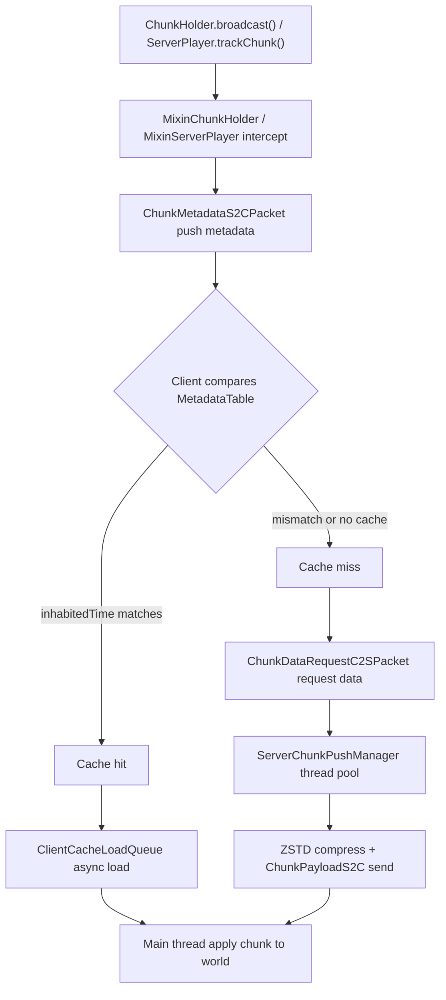

# Hassium

**Hassium** · High-performance chunk compression and client-side caching  
A Minecraft 1.20.1 mod for dedicated servers and clients. Replaces vanilla Zlib with ZSTD to reduce world save size and chunk transfer bandwidth.

ZSTD compression · Client chunk cache · Metadata push · Custom network channel · Forge / Fabric multiloader

**English** · [简体中文](README.md)

> Repository: [github.com/limuqy/Hassium](https://github.com/limuqy/Hassium)


---

## Features

| Capability | Description | Status |
| --- | --- | --- |
| **Region-compatible storage** | Keeps the outer `.mca` structure; wraps ZSTD-compressed data in `HassiumEnvelope` | ✅ Done |
| **ZSTD compression** | Replaces vanilla Zlib; supports dictionary training; ~6:1 to 9:1 compression ratio | ✅ Done |
| **Client chunk cache** | Writes unloaded chunks to local Region files; LRU and hotness-based eviction | ✅ Done |
| **Metadata push** | Server pushes chunk `inhabitedTime`; client compares and skips redundant transfers | ✅ Done |
| **Async loading** | `ServerChunkPushManager` / `ClientCacheLoadQueue` thread pools for non-blocking I/O | ✅ Done |
| **Network compression** | Custom-channel ZSTD with context reuse, magicless mode, and packet aggregation | ✅ Done |
| **1.20.5+ migration path** | Abstraction for compression scheme `127` upgrade | ⚠️ Abstracted |
| **Forge E2E validation** | Compiles; runtime validation pending | ⚠️ Pending |

---

## Supported Versions

| Minecraft | Java | Fabric | Forge |
| --- | --- | --- | --- |
| 1.20.1 | 17 | ✅ | ✅ (compiles; runtime validation pending) |

**Dependencies:**

- Fabric Loader: `0.16.9`
- Fabric API: `0.92.1+1.20.1`
- Forge: `47.2.30`
- Mixin: `0.8.5`

> Current mod version: `1.0.0-beta`

---

## Project Status & Disclaimer

- Currently in **Beta**; APIs and config keys may change.
- **Storage is disabled by default** (`storage.enabled = false`). **Back up your world** before enabling it.
- End-to-end validation has been done mainly on **Fabric**; Forge compiles but runtime validation is still in progress.
- Clients without Hassium can connect by default (`compat.requireClientMod = false`).
- Global packet compression (`globalPacketCompression`) is **disabled by default** due to double-compression conflicts with vanilla Zlib. Do not enable unless you understand the risks.

---

## Installation

1. Download the JAR for your loader from [Releases](https://github.com/limuqy/Hassium/releases).
2. Place the JAR in the `mods/` folder on the client or server.
3. Start the game/server; the mod auto-generates `config/hassium/hassium.json`.

**Dependencies:**

- **Fabric**: Fabric API for the matching MC version is required.
- **Forge**: No additional dependencies.

> Install Hassium on both server and client for network compression and chunk cache negotiation.

---

## Quick Start

### Default Behavior (No Extra Config)

After installation, these features are **enabled by default**:

- **Network compression**: When both sides have Hassium, chunk data is sent over custom `hassium:*` channels with ZSTD compression.
- **Client cache**: Unloaded chunks are saved locally; on reconnect, metadata is compared and cache hits skip redundant downloads.

### Enabling Save Compression (Optional, High Risk)

Edit `config/hassium/hassium.json`:

```json
{
  "storage": {
    "enabled": true,
    "mode": "mirror"
  }
}
```

**Storage modes:**

| Mode | Description |
| --- | --- |
| `readonly_vanilla` | Read vanilla data only; do not write Hassium format |
| `mirror` | Mirror mode: keep vanilla data and write Hassium extended format (**recommended**) |
| `hassium_only` | Write Hassium format only (verify compatibility first) |

> ⚠️ Back up your world completely before enabling storage.

---

## Configuration

Config file: `config/hassium/hassium.json`

### Storage

| Key | Default | Description |
| --- | --- | --- |
| `storage.enabled` | `false` | Enable Region-compatible extended storage |
| `storage.mode` | `mirror` | Storage mode (see table above) |
| `storage.zstdLevel` | `9` | ZSTD compression level (1–22) |
| `storage.zstdDictionaryId` | `hassium-dictionary` | Dictionary ID |
| `storage.verifyChecksum` | `true` | Enable CRC32C checksum verification |
| `storage.writeVanillaBackup` | `true` | Keep vanilla backup copies |

### Client Cache

| Key | Default | Description |
| --- | --- | --- |
| `clientCache.enabled` | `true` | Enable client-side chunk cache |
| `clientCache.maxSizeMb` | `2048` | Max cache size (MB) |
| `clientCache.maxAgeDays` | `30` | Max cache retention (days) |
| `clientCache.renderRadius` | `24` | Cache render radius (chunks) |
| `clientCache.serverAuthoritativeRadius` | `10` | Server-authoritative sync radius (chunks) |
| `clientCache.hotScoreThreshold` | `0.3` | Hotness threshold; below = cold chunk |

### Network

| Key | Default | Description |
| --- | --- | --- |
| `network.enabled` | `true` | Enable Hassium custom channel compression (hassium:* channels) |
| `network.compressionAlgorithm` | `hassium:zstd` | Compression algorithm |
| `network.compressionLevel` | `3` | Compression level |
| `network.minPacketSize` | `1024` | Minimum packet size to compress (bytes) |
| `network.maxChunksPerTick` | `10` | Max chunks sent per player per tick |
| `network.serverChunkPushThreads` | `8` | Server chunk push thread count |
| `network.clientChunkLoadThreads` | `10` | Client chunk load thread count |
| `network.globalPacketCompression` | `true` | Global packet compression (ZSTD replaces vanilla Zlib) |
| `network.enablePacketAggregation` | `true` | Packet aggregation (batch small packets before compressing) |

### Compatibility

| Key | Default | Description |
| --- | --- | --- |
| `compat.requireClientMod` | `false` | Require clients to install the mod |
| `compat.autoDowngradeOnError` | `true` | Fall back to vanilla protocol on error |

---

## How It Works

### Chunk Cache & Transfer Flow



### HassiumEnvelope Format

Compressed chunk data uses an envelope with the `HSM1` magic header:

```
├── magic: "HSM1" (4 bytes)
├── storageFormatVersion: uint16
├── algorithmId: namespaced string
├── dictionaryId: nullable string
├── uncompressedLength: int32
├── compressedLength: int32
├── chunkRevision: int64
├── lastModifiedGameTime: int64 (inhabitedTime)
├── lastSavedUnixTime: int64
├── checksum: uint64 (CRC32C)
└── compressedData: byte[] (ZSTD)
```

### Distance-Based Scheduling

`ServerChunkPushManager` uses a priority queue sorted by distance from the player; closer chunks are sent first:

```
priority = sqrt((chunkX - playerChunkX)² + (chunkZ - playerChunkZ)²)
```

---

## Building from Source

**Requirements:** JDK 17+, Gradle Wrapper included.

```bash
# First build or if decompile artifacts are missing
./gradlew common:decompile

# Build all platforms
./gradlew build

# Fabric / Forge only
./gradlew fabric:build
./gradlew forge:build

# Compile check (run after common/ changes)
./gradlew common:compileJava
./gradlew fabric:compileJava
./gradlew forge:compileJava

# Development
./gradlew fabric:runClient
./gradlew fabric:runServer
./gradlew forge:runClient
./gradlew forge:runServer
```

### Tests & Benchmarks

```bash
# Unit tests
./gradlew common:test

# Quick compression benchmark (Zlib vs ZSTD)
./gradlew common:runJava -PmainClass=io.github.limuqy.mc.hassium.benchmark.CompressionBenchmark

# Dictionary training (real world save, recommended)
./gradlew common:runJava -PmainClass=io.github.limuqy.mc.hassium.benchmark.DictionaryTrainer -Pargs="--world,C:/path/to/world/region"
```

On Windows, you can also use batch scripts in the project root: `run-tests.bat`, `run-benchmark-quick.bat`, `run-benchmark-full.bat`, `run-dictionary-trainer-world.bat`. See [README-TESTING.md](README-TESTING.md) for details.

### Project Layout

```
Hassium/
├── common/       # Loader-agnostic logic (storage, compression, cache, network, Mixins)
├── fabric/       # Fabric entrypoint and network registration
├── forge/        # Forge entrypoint and network registration
├── buildSrc/     # Gradle multiloader build plugins
└── docs/         # Requirements, architecture, and development docs
```

---

## Documentation

| Document | Description |
| --- | --- |
| [docs/hassium-requirements.md](docs/hassium-requirements.md) | Feature requirements and implementation status |
| [docs/hassium-development.md](docs/hassium-development.md) | Detailed architecture design |
| [docs/chunk-cache-refactor.md](docs/chunk-cache-refactor.md) | Chunk cache system refactor |
| [docs/chunk-preload-optimization.md](docs/chunk-preload-optimization.md) | Chunk preload optimization |
| [docs/client-cache-eviction.md](docs/client-cache-eviction.md) | Client cache eviction strategy |
| [docs/hassium-network-optimization.md](docs/hassium-network-optimization.md) | Network compression optimization notes |
| [README-TESTING.md](README-TESTING.md) | Testing and benchmark tool guide |
| [CLAUDE.md](CLAUDE.md) | Project overview and dev guide |
| [AGENTS.md](AGENTS.md) | AI agent development guidelines |

---

## Known Limitations & Roadmap

| Item | Description |
| --- | --- |
| Forge runtime validation | Compiles; E2E testing pending |
| Global packet compression | Double-compression conflict with vanilla Zlib; disabled by default |
| Compact header | `enableCompactHeader` implementation needs fixes; disabled by default |
| renderOnly extended render | Skeleton exists; pending stable cache loop |
| Dynamic thread pools | Auto-adjust thread count by queue depth |
| Preload optimization | Preload chunks along player movement direction |
| Compatibility testing | More mods and environments |
| Stats command | `/hassium stats` for compression ratio and cache hit rate |

---

## License

This project is licensed under the [GNU General Public License v3.0 or later](LICENSE).

---

## Author

**[limuqy](https://github.com/limuqy)** — GitHub

Questions and suggestions are welcome in [Issues](https://github.com/limuqy/Hassium/issues).
