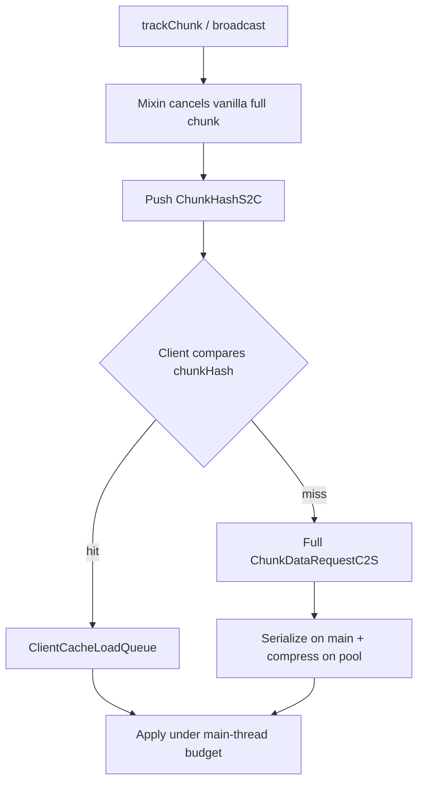

# Hassium

<p align="center">
  
</p>

**Hassium** — high-performance chunk compression and client-side caching for Minecraft.  
Smaller world saves and bandwidth than vanilla, local chunk reuse, and smoother joins. Supports Fabric / Forge / NeoForge across Minecraft 1.20.1–1.21.11.

[简体中文](README.md) · **English**

> Repository: [github.com/limuqy/Hassium](https://github.com/limuqy/Hassium)


---

## Features

| Feature | Description |
| --- | --- |
| **Efficient storage** | Higher-ratio world chunk compression for smaller saves; keeps vanilla Region (`.mca`) layout |
| **Network compression** | More efficient compression for chunks and packets — less bandwidth and wait time |
| **Chunk cache** | Loaded chunks are kept locally; revisiting an area prefers the cache instead of full downloads |
| **Light stripping** | Server can omit light data; the client recomputes lighting locally to save more bandwidth |
| **Smooth loading** | Caps main-thread work during join and view expansion to reduce hitch spikes |
| **Client-friendly** | Clients without the mod can connect by default; install on both sides for full compression and cache benefits |
| **Traffic metrics** | `/hassium stats` (server) and `/hassiumc stats` (client) to inspect compression and cache results |

---

## Support matrix

| Minecraft | Fabric | Forge | NeoForge |
| --- | --- | --- | --- |
| 1.20.1 | ✅ | ✅ | ✅ |
| 1.20.2–1.20.4 | ✅ | — | ✅ |
| 1.20.5–1.20.6 | ✅ | ✅ (1.20.6 only) | ✅ |
| 1.21.1–1.21.11 | ✅ | — | ✅ |

See [`docs/version-segments.md`](docs/version-segments.md) for the nine adaptation segments.

---

## Install

1. Download the loader-specific JAR from [Releases](https://github.com/limuqy/Hassium/releases).
2. Place it in `mods/` on client and/or server.
3. Config is created at `config/hassium/hassium.json`.

**Dependencies:** Fabric needs Fabric API; Forge / NeoForge have no required extras. Install on both sides for negotiated compression and caching.

---

## Defaults

Enabled by default:

- Hassium channel compression and global packet compression
- Client chunk cache
- **World storage compression** (`storage.enabled = true`)

> Storage rewrites on-disk chunk payloads. **Back up worlds** before first use. Vanilla clients can connect by default (`compat.requireClientMod = false`).

---

## Config (summary)

File: `config/hassium/hassium.json`

| Key | Default | Notes |
| --- | --- | --- |
| `storage.enabled` | `true` | World ZSTD (**back up first**) |
| `clientCache.enabled` | `true` | Client cache |
| `network.enabled` | `true` | Custom channels |
| `network.globalPacketCompression` | `true` | Global ZSTD |
| `network.maxChunksPerTick` | `10` | Per-player serialize cap per server tick |
| `network.mainThreadChunkBudgetMs` | `3` | Client apply budget per frame (ms) |
| `network.metricsEnabled` | `true` | Metrics |
| `debug.*` | `false` | Category debug logs (quiet by default) |

Full reference: [`docs/architecture.md`](docs/architecture.md).

---

## Commands

| Command | Description |
| --- | --- |
| `/hassium stats` | Server stats (OP 2) |
| `/hassium metrics on\|off` | Toggle metrics |
| `/hassium stats reset` | Reset counters |
| `/hassiumc stats` | Client stats |

---

## How it works



Details: [`docs/chunk-cache.md`](docs/chunk-cache.md).

---

## Build from source

JDK 17+ (newer MC versions may need a higher JDK — see `versionProperties`).

```bash
./gradlew build
./gradlew build "-Pmc_ver=1.21.1"   # quote -Pmc_ver in PowerShell
./gradlew :fabric:runClient
./gradlew :forge:runServer
```

Developer entry points: [`CLAUDE.md`](CLAUDE.md), [`AGENTS.md`](AGENTS.md).

---

## Docs

| Doc | Content |
| --- | --- |
| [`docs/architecture.md`](docs/architecture.md) | Architecture, storage, config, logging, commands |
| [`docs/chunk-cache.md`](docs/chunk-cache.md) | Cache push & join pipeline |
| [`docs/version-segments.md`](docs/version-segments.md) | Multi-version segments |

---

## License

[GPL-3.0-or-later](LICENSE)
