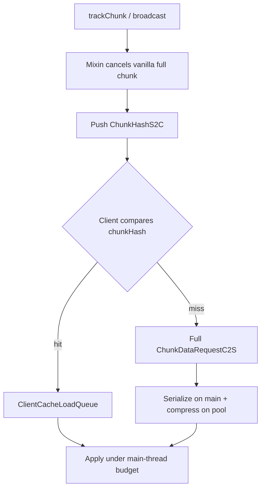

# Hassium

<p align="center">
  
</p>

**Hassium** — high-performance chunk compression and client-side caching for Minecraft.  
Smaller world saves and bandwidth than vanilla, local chunk reuse, and smoother joins. Supports Fabric / Forge / NeoForge across Minecraft 1.20.1–1.21.11.

[简体中文](README.md) · **English**

> Repository: [github.com/limuqy/Hassium](https://github.com/limuqy/Hassium)
> User documentation: [GitHub Wiki](https://github.com/limuqy/Hassium/wiki/Home-en) · [简体中文 Wiki](https://github.com/limuqy/Hassium/wiki)


[](https://www.curseforge.com/minecraft/mc-mods/hassium)

---

## Features

| Feature | Description |
| --- | --- |
| **Efficient storage** | Higher-ratio world chunk compression for smaller saves; keeps vanilla Region (`.mca`) layout |
| **Network compression** | More efficient compression for chunks and packets — less bandwidth and wait time |
| **Chunk cache** | Loaded chunks are kept locally; revisiting an area prefers the cache instead of full downloads |
| **Section delta** | On cache mismatch, fetch only changed sections (`sectionDelta`) instead of the whole chunk |
| **Beyond-view render** | When client RD exceeds server view distance (multiplayer), fill the outer ring from local cache (render-only; no out-of-range server requests) |
| **World export** | `/hassiumc export` writes the local cache as a vanilla Anvil singleplayer world |
| **Light stripping** | Server can omit light data; the client recomputes lighting locally to save more bandwidth |
| **Light cache** | Light data is cached after first recompute; cache hits apply pre-computed lighting directly, skipping expensive recomputation |
| **Control failover** | On TCP-control stall or drop, auto-reconnect via candidate endpoints with warm cache and hidden disconnect screen (data-plane failover) |
| **Weighted routing** | Multiple UDP/KCP endpoints carry the data plane by weighted round-robin; control plane stays on vanilla TCP |
| **Smooth loading** | Caps main-thread work during join and view expansion to reduce hitch spikes |
| **Client-friendly** | Clients without the mod can connect by default; install on both sides for full compression and cache benefits |
| **Traffic metrics** | `/hassium stats` (server) and `/hassiumc stats` (client) to inspect compression and cache results |

---

## Support matrix

| Minecraft | Fabric | Forge | NeoForge |
| --- | --- | --- | --- |
| 1.20.1 | ✅ | ✅ | ✅ |
| 1.20.2–1.20.4 | ✅ | — | ✅ |
| 1.20.5–1.20.6 | ✅ | ✅ (1.20.6 only) | ✅ |
| 1.21.1–1.21.11 | ✅ | — | ✅ |

See [`docs/version-segments.md`](docs/version-segments.md) for the nine adaptation segments.

---

## Install

1. Download the loader-specific JAR from [Releases](https://github.com/limuqy/Hassium/releases).
2. Place it in `mods/` on client and/or server.
3. Config is created at `config/hassium/hassium-client.toml` and `config/hassium/hassium-server.toml` (Fabric: Mod Menu + Cloth; Forge/NeoForge: Cloth from the mods list, or edit toml).

**Dependencies:** Fabric needs Fabric API; Forge / NeoForge have no required extras. Install on both sides for negotiated compression and caching.

---

## Defaults

Enabled by default:

- Hassium channel compression and global packet compression
- Client chunk cache
- **World storage compression** (`storage.enabled = true`)

> Storage rewrites on-disk chunk payloads. **Back up worlds** before first use. Vanilla clients can connect by default (`compat.requireClientMod = false`).

---

## Config (summary)

Files: `config/hassium/hassium-client.toml`, `config/hassium/hassium-server.toml`

| Key | Default | Notes |
| --- | --- | --- |
| `storage.enabled` | `true` | World ZSTD (**back up first**) |
| `clientCache.enabled` | `true` | Client cache |
| `clientCache.sectionDeltaEnabled` | `true` | Section delta on cache mismatch |
| `clientCache.lightCacheEnabled` | `true` | Light cache (hits skip recomputation) |
| `clientCache.viewDistanceExtensionEnabled` | `true` | Beyond-view render (multiplayer; exclusive with Bobby) |
| `clientCache.maxRenderDistance` | `32` | Beyond-view / effective RD cap (2–64) |
| `clientCache.ovdUnloadDelaySecs` | `5` | Delay unload after leaving beyond-view ring (s; 0=sync) |
| `network.enabled` | `true` | Custom channels |
| `network.globalPacketCompression` | `true` | Global ZSTD |
| `network.maxChunksPerTick` | `32` | Per-player serialize cap per server tick |
| `clientCache.mainThreadChunkBudgetMs` | `15` | Client apply budget per frame (ms) |
| `network.metricsEnabled` | `false` | Metrics collection (off by default; auto-enabled during self-checks) |
| `network.dataPlane.enabled` | `false` | UDP/KCP data plane, control failover, and weighted routing; off by default, configure reachable endpoints and verify the six self-check markers in order before enabling |
| `network.dataPlane.controlStallMs` | `6000` | How long TCP control can stall before triggering `FailoverRequest` |
| `debug.*` | `false` | Category debug logs (quiet by default) |

Full reference: [`docs/architecture.md`](docs/architecture.md).

---

## Commands

| Command | Description |
| --- | --- |
| `/hassium stats` | Server stats (OP 2) |
| `/hassium metrics on\|off` | Toggle metrics |
| `/hassium stats reset` | Reset counters |
| `/hassiumc stats` | Client stats (cache / beyond-view) |
| `/hassiumc export [<serverIp>] [seed]` | Export local cache to a vanilla Anvil world under `saves/` |

---

## How it works


```mermaid
flowchart TD
    trigger["trackChunk / broadcast"]
    mixin["Mixin cancels vanilla full chunk"]
    hash["Push ChunkHashS2C"]
    compare{"Client compares chunkHash"}
    hit["ClientCacheLoadQueue"]
    miss["Full ChunkDataRequestC2S"]
    push["Serialize on main + compress on pool"]
    apply["Apply under main-thread budget"]

    trigger --> mixin --> hash --> compare
    compare -->|hit| hit --> apply
    compare -->|miss| miss --> push --> apply
```

Details: [`docs/chunk-cache.md`](docs/chunk-cache.md).

---

## Build from source

JDK 17+ (newer MC versions may need a higher JDK — see `versionProperties`).

```bash
./gradlew build
./gradlew build "-Pmc_ver=1.21.1"   # quote -Pmc_ver in PowerShell
./gradlew :fabric:runClient
./gradlew :forge:runServer
```

Developer entry points: [`CLAUDE.md`](CLAUDE.md), [`AGENTS.md`](AGENTS.md).

---
## User documentation

For installation, every configuration option, commands, feature guides, compatibility, and diagnostics, see the [GitHub Wiki](https://github.com/limuqy/Hassium/wiki/Home-en).

| Page | Content |
| --- | --- |
| [Installation](https://github.com/limuqy/Hassium/wiki/Installation-en) | Download, dependencies, and loader notes |
| [Configuration](https://github.com/limuqy/Hassium/wiki/Configuration-en) | Complete option reference and GUI paths |
| [Commands](https://github.com/limuqy/Hassium/wiki/Commands-en) | `/hassium` and `/hassiumc` reference |
| [Features](https://github.com/limuqy/Hassium/wiki/Features-en) | Cache, section delta, light optimization, and more |
| [Beyond-view render](https://github.com/limuqy/Hassium/wiki/Beyond-View-Render-en) · [World export](https://github.com/limuqy/Hassium/wiki/World-Export-en) | Guides for both client features |
| [Compatibility](https://github.com/limuqy/Hassium/wiki/Compatibility-en) · [Troubleshooting](https://github.com/limuqy/Hassium/wiki/Troubleshooting-en) | Coexistence with other mods and diagnostic paths |
| [Data Plane and Failover](https://github.com/limuqy/Hassium/wiki/Data-Plane-and-Failover-en) | Server operations for UDP/KCP data plane |

---


## Developer documentation

| Doc | Content |
| --- | --- |
| [`docs/architecture.md`](docs/architecture.md) | Architecture, storage, config, logging, commands |
| [`docs/chunk-cache.md`](docs/chunk-cache.md) | Cache push, beyond-view summary, disk NBT, export |
| [`docs/ovd.md`](docs/ovd.md) | Beyond-view render implementation |
| [`docs/disk-nbt-cache.md`](docs/disk-nbt-cache.md) | Disk NBT cache, Live-Unload, section delta |
| [`docs/version-segments.md`](docs/version-segments.md) | Multi-version segments |
| [`docs/mod-compat.md`](docs/mod-compat.md) | Multi-mod compatibility & config escapes |

---

## License

[GPL-3.0-or-later](LICENSE)
