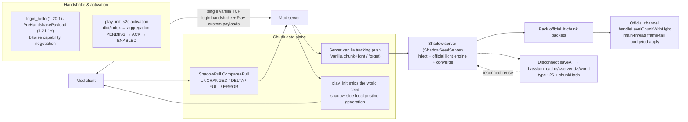

# Hassium

<p align="center">
  
</p>

**Hassium** — high-performance chunk compression and client-side chunk storage for Minecraft, providing **efficient compression, network optimization, chunk cache, local generation, and lighting optimization**.
Smaller world saves and bandwidth than vanilla, local chunk reuse, and smoother joins. Supports Fabric / Forge / NeoForge across Minecraft 1.20.1–1.21.11.

[简体中文](README.md) · **English**

> Repository: [github.com/limuqy/Hassium](https://github.com/limuqy/Hassium)
> User documentation: [GitHub Wiki](https://github.com/limuqy/Hassium/wiki/Home-en) · [简体中文 Wiki](https://github.com/limuqy/Hassium/wiki)


[](https://www.curseforge.com/minecraft/mc-mods/hassium)
[](https://modrinth.com/mod/hassium-limuqy)

---

## Features

| Category | Feature | Description |
| --- | --- | --- |
| **Efficient compression** | Storage compression | World chunks are ZSTD-compressed on disk for significantly smaller saves; keeps the vanilla Region (`.mca`) layout |
| | Channel compression | On-wire compression lowers bandwidth and download waits; never touches the vanilla compression layer, no cross-mod conflicts |
| **Network optimization** | Smooth push | Chunks are rate-limited per tick and encode/compress work is offloaded; joins and view expansion never stall the main thread |
| | Entity optimization | Distance-tiered rates, hotspot density throttle, packet-budget backpressure, and phase stagger; replication-only — vanilla clients can join |
| **Chunk cache** | World save | Chunks you visit are saved to a local cache automatically; saved on disconnect, reused on reconnect — no full re-download |
| | Section delta | On stale cache only changed blocks or whole sections are fetched instead of the whole chunk |
| | Local generation | With both sides on the same version, unexplored terrain is generated locally to save bandwidth; **enabling on the server sends the world seed to clients** |
| | Beyond-view render | When client render distance exceeds server view distance, the outer ring is backfilled from locally cached terrain; **render-only, never requested from the server**; mutually exclusive with Bobby |
| | Heat eviction | Over-capacity caches are cleaned by region heat automatically |
| | World export | `/hassiumc export` copies the local cache into a standalone save directory |
| **Lighting optimization** | Unified lighting | An in-process engine computes chunk lighting and packs it back; the main thread is no longer occupied by lighting on load; auto-degrades on startup failure |
| | Light stripping | The server may strip light data to save bandwidth; the client computes and writes it back |
| | Light cache | Computed lighting is saved with the chunk and reused on reconnect, skipping recomputation |
| **Utilities** | Traffic monitoring | `/hassium stats` (server) and `/hassiumc stats` (client) show compression and cache effectiveness |

Vanilla clients can join by default (`compat.requireClientMod = false`); install on both sides for full compression and caching.

---

## Support matrix

| Minecraft | Fabric | Forge | NeoForge |
| --- | --- | --- | --- |
| 1.20.1 | ✅ | ✅ | — |
| 1.21.1 | ✅ | ✅ | ✅ |
| 1.21.2 | ✅ | — | ✅ |
| 1.21.3–1.21.10 | ✅ | ✅ | ✅ |
| 1.21.11 | ✅ | — | ✅ |

Forge supports 1.20.1 / 1.21.1 / 1.21.3–1.21.10 (no upstream Forge userdev for 1.21.2; **sunset from 1.21.11** — use NeoForge there). **No separate NeoForge build for 1.20.1**: NeoForge 47.x natively loads Forge mods, so NeoForge users install the Forge build. Full anchor matrix: [`docs/version-segments.md`](docs/version-segments.md).

---

## Installation

1. Download the JAR for your loader from [Releases](https://github.com/limuqy/Hassium/releases).
2. Drop it into the client or server `mods/`.
3. On first launch the mod generates `config/hassium/hassium-client.toml` and `config/hassium/hassium-server.toml` (Fabric: Mod Menu + Cloth; Forge/NeoForge: Cloth screen from the mod list, or edit the toml directly).

**Dependencies:** Fabric API on Fabric (Cloth is jiJ'd); no extra prerequisites on Forge / NeoForge. Install on both sides for negotiated compression and caching.

---

## Default behavior

Enabled by default:

- Channel compression / packet aggregation + smooth chunk push
- Entity optimization (distance tiers / hotspot throttle / packet-budget backpressure / phase stagger; applies to vanilla clients too)
- World save (visit chunks land in the local cache; saved on disconnect, reused on reconnect)
- Unified lighting (in-process chunk lighting; the main thread is no longer occupied by lighting on load)

> Storage compression (`storage.enabled`) is **off** by default and dedicated-server only; enabling rewrites the chunk save format — **back up your world first**. Vanilla clients can join by default (`compat.requireClientMod = false`).

---

## Configuration summary

Files: `config/hassium/hassium-client.toml`, `config/hassium/hassium-server.toml` (Fabric: the file matching the physical side wins; Forge/NeoForge registers both specs but only the physical side's applies). Key-set source of truth: `ConfigSchema`.

| Key | Default | Description |
| --- | --- | --- |
| `chunk.enabled` | `true` | Whether to enable the chunk-core cache |
| `chunk.sectionDeltaEnabled` | `true` | Enable section delta (server-side planning + client-side apply) |
| `chunk.seedGenEnabled` | `false` | Enable SeedGen (local pristine chunks; both sides same version; default off). Server enablement sends the world seed |
| `chunk.viewDistanceExtensionEnabled` | `true` | Beyond-view render OVD (shadow dual-window: local fill when clientRD > serverVD) |
| `chunk.maxRenderDistance` | `16` | Max effective client render distance for OVD |
| `chunk.mainThreadChunkBudgetMs` | `15` | Main-thread apply budget in ms |
| `chunk.maxChunksPerFrame` | `6` | Per-tick cache-read production cap (shadow enqueue + shadow disk); consume is time-budget only |
| `chunk.maxSizeMb` | `4096` | Max cache size in MB (shadow-world disk cap; excess triggers heat eviction) |
| `chunk.hotScoreThreshold` | `0.3` | Heat-score threshold (below = cold region file; preferred for eviction) |
| `chunk.cleanupIntervalTicks` | `6000` | Cleanup check interval in ticks |
| `chunk.lightStrip` | `true` | Enable light stripping |
| `storage.enabled` | `false` | Enable save compression (default off; chunk cache unaffected) |
| `storage.zstdLevel` | `3` | Storage ZSTD compression level |
| `master.enabled` | `true` | Enable server network channel (compression/aggregation/chunk push/entity optimization) |
| `master.enabledOnLan` | `false` | Enable Hassium network features for remote LAN players on an Open-to-LAN host (handshake/aggregation/push/lightStrip). Default off; host local memory connection stays vanilla; storage remains dedicated-only |
| `master.maxChunksPerTick` | `5` | Per-player per-tick chunk send cap: Pull FULL/DELTA completions + vanilla whole-chunk path (≈ value×20/s at full tick) |
| `master.enablePacketAggregation` | `true` | Enable packet aggregation |
| `master.aggregationMaxWaitTimeMs` | `50` | Flush watchdog: force flush if none happened for this many ms (tick-end flush is primary; covers main-thread stalls) |
| `master.aggregationMaxSize` | `262144` | Aggregation max size (bytes) |
| `master.compressionLevel` | `3` | Private-channel ZSTD level |
| `master.compressionBlacklist` | `[]` | Third-party packet IDs excluded from compression / aggregation (default empty). Hassium control-plane and private channels are always hard-coded excluded; editing this list does not affect them |
| `master.entityTieredUpdateEnabled` | `true` | Enable distance-tiered entity updates (entities further away are updated less often). Enabled by default; turning it off disables only the distance tables — density, pressure and smooth-push remain independent |
| `master.entityTierIntervals` | `"3,4,6,10"` | Entity update interval in ticks for the four distance tiers, comma-separated, ordered near/mid/far/edge (tier boundaries at 25%/50%/75% of the tracking range). Default 3,4,6,10. Values must be non-decreasing; 0 or blank means default |
| `master.entityItemTierIntervals` | `"2,4,8,16"` | Update interval in ticks for dropped items and experience orbs across the same four tiers, default 2,4,8,16. Raise these values when many items are on the ground; keep the near value at 3 ticks or lower so items next to the player still move smoothly |
| `master.entityDensityThrottleEnabled` | `true` | Enable hotspot throttling: when too many entities pile up in one chunk, their update interval is stretched further. Enabled by default |
| `master.entityDensityTierCounts` | `"10,20,32,64"` | Per-tier hotspot threshold: once the number of active entities in the entity's own chunk reaches this value, that tier's interval is multiplied by the matching factor. Comma-separated, near/mid/far/edge; default 10,20,32,64 |
| `master.entityDensityTierFactors` | `"1.5,2.0,3.0,4.0"` | Per-tier hotspot multiplier applied once the threshold above is reached, comma-separated, near/mid/far/edge; default 1.5,2.0,3.0,4.0 (1.0 means no change). Decimals allowed; values below 1 are treated as 1 |
| `master.entityMaxThrottleFactor` | `5` | Upper bound on the product of the hotspot factor and the pressure factor (default 5). Raise it to throttle harder in crowded areas |
| `master.entityFrameBudgetPerPlayer` | `256` | Expected entity update packets per player per tick (default 256). When a player keeps exceeding it, entities in their view are updated less often to avoid lag; 0 = no automatic limit |
| `master.entitySmoothPushEnabled` | `true` | Entity smooth push: entities sharing the same update interval are phase-staggered by UUID so total volume over an interval is unchanged but the per-tick spike is flattened. Enabled by default |
| `compat.requireClientMod` | `false` | Require the Hassium client mod |
| `compat.autoDowngradeOnError` | `true` | Auto-downgrade on error |
| `debug.*` | mostly `false` | Categorized debug logging (quiet by default; `networkMetricsAutoReset` defaults to `true`) |

Descriptions match the TOML comments (from `ConfigSchema`). Full key reference: [Configuration](https://github.com/limuqy/Hassium/wiki/Configuration-en) and the [config audit](docs/config-audit.md).

---

## Commands

| Command | Description |
| --- | --- |
| `/hassium stats` | Server statistics (OP 2) |
| `/hassium stats reset` | Reset counters |
| `/hassium stats toggle` | Toggle stats |
| `/hassium metrics on\|off` | Toggle metrics |
| `/hassiumc stats` | Client statistics (cache hits / lighting / savings) |
| `/hassiumc export [<serverIP>] [seed]` | Copy the shadow `world` into `hassium_exports/<cacheId>` (`level.dat` written by the shadow server); you can also copy that folder into `saves/` |

---

## How it works (diagram)


```mermaid
flowchart LR
    client["Mod client"] <-->|"single vanilla TCP<br/>login handshake + Play custom payloads"| server["Mod server"]
    subgraph Handshake & activation
        hs["login_hello (1.20.1) /<br/>PreHandshakePayload (1.21.1+)<br/>bitwise capability negotiation"]
        act["play_init_s2c activation<br/>dict/index → aggregation PENDING → ACK → ENABLED"]
    end
    subgraph Chunk data plane
        push["Server vanilla tracking push<br/>(vanilla chunk+light / forget)"]
        pull["ShadowPull Compare+Pull<br/>UNCHANGED / DELTA / FULL / ERROR"]
        seed["play_init ships the world seed<br/>shadow-side local pristine generation"]
    end
    shadow["Shadow server (ShadowSeedServer)<br/>inject + official light engine + converge"]
    pack["Pack official lit chunk packets"]
    apply["Official channel handleLevelChunkWithLight<br/>main-thread frame-tail budgeted apply"]
    save["Disconnect saveAll → hassium_cache/&lt;serverId&gt;/world<br/>type 126 + chunkHash"]

    server --> push --> shadow
    client --> pull --> server
    server --> seed --> client
    shadow --> pack --> apply
    shadow -.-> save
    save -.->|"reconnect reuse"| shadow
```

Details: [`docs/architecture.md`](docs/architecture.md).

---

## Building from source

Requires JDK 17+ (newer targets may need a higher Java; see the matching `versionProperties`).

```bash
./gradlew build
./gradlew build "-Pmc_ver=1.21.1"   # quote -Pmc_ver in PowerShell
./gradlew :fabric:runClient
./gradlew :forge:runServer
```

Developer entry point: [`AGENTS.md`](AGENTS.md).

---
## User documentation

Installation, full configuration, commands, features, compatibility, and troubleshooting: [GitHub Wiki](https://github.com/limuqy/Hassium/wiki/Home-en).

| Page | Content |
| --- | --- |
| [Installation](https://github.com/limuqy/Hassium/wiki/Installation-en) | Download, prerequisites, loader differences |
| [Configuration](https://github.com/limuqy/Hassium/wiki/Configuration-en) | Full key reference and GUI paths |
| [Commands](https://github.com/limuqy/Hassium/wiki/Commands-en) | `/hassium` and `/hassiumc` reference |
| [Features](https://github.com/limuqy/Hassium/wiki/Features-en) | Cache, section delta, lighting details |
| [World Export](https://github.com/limuqy/Hassium/wiki/World-Export-en) | Exporting the client cache as a save |
| [Compatibility](https://github.com/limuqy/Hassium/wiki/Compatibility-en) · [Troubleshooting](https://github.com/limuqy/Hassium/wiki/Troubleshooting-en) | Coexistence with other mods and diagnostics |


---

## Developer documentation

| Doc | Content |
| --- | --- |
| [`docs/architecture.md`](docs/architecture.md) | Capabilities & scenarios, direct-connection topology, module architecture, client data flow, storage format, config, logging, commands |
| [`docs/chunk-cache.md`](docs/chunk-cache.md) | Cache push (unified ShadowPull Compare+Pull), disk NBT (§11), export (§12) |
| [`docs/client-chunk-light-flow.md`](docs/client-chunk-light-flow.md) | Client receive → apply → lighting full chain |
| [`docs/chunk-load-optimization.md`](docs/chunk-load-optimization.md) | Join/reconnect load paths and rate anchors |
| [`docs/version-segments.md`](docs/version-segments.md) | Multi-version segments |
| [`docs/mod-compat.md`](docs/mod-compat.md) | Multi-mod compatibility & config escapes |
| [`docs/config-audit.md`](docs/config-audit.md) | Config key audit |
| [`docs/runtime-smoke-test.md`](docs/runtime-smoke-test.md) | Runtime smoke tests (L0–L2, PROBE, scenario engine) |

---

## License

[GPL-3.0-or-later](LICENSE)
