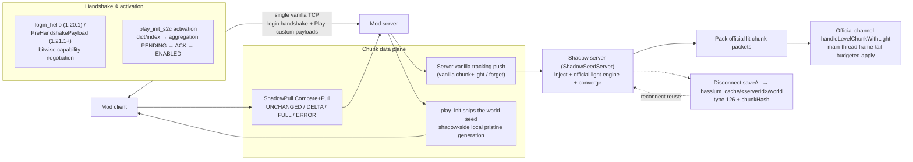

# Hassium

<p align="center">
  
</p>

**Hassium** — high-performance chunk compression and client-side chunk storage for Minecraft, providing **efficient compression, network optimization, chunk cache, local generation, and lighting optimization**.
Smaller world saves and bandwidth than vanilla, local chunk reuse, and smoother joins. Supports Fabric / Forge / NeoForge across Minecraft 1.20.1–1.21.11.

[简体中文](README.md) · **English**

> Repository: [github.com/limuqy/Hassium](https://github.com/limuqy/Hassium)
> User documentation: [GitHub Wiki](https://github.com/limuqy/Hassium/wiki/Home-en) · [简体中文 Wiki](https://github.com/limuqy/Hassium/wiki)


[](https://www.curseforge.com/minecraft/mc-mods/hassium)

---

## Features

| Category | Feature | Description |
| --- | --- | --- |
| **Efficient compression** | Storage compression | World chunk ZSTD on disk (type 126) for smaller saves; keeps vanilla Region (`.mca`) layout |
| | Channel compression | Dictionary ZSTD inside aggregated packets + chunk-push native compression; never touches the vanilla compression layer, no cross-mod pipeline conflicts |
| **Network optimization** | Smooth push | Per-player per-tick Pull completion cap (`master.maxChunksPerTick`, ≈ cap×20/s at full tick) + backgrounded encode/compress; joins never saturate the main thread |
| | Login-phase capability handshake | `hassium:login_hello` login query on 1.20.1, config-stage `PreHandshakePayload` on 1.21.1+; bitwise capability negotiation with no timeout dependency and zero interference for vanilla clients |
| | Pull mode | After negotiation the server stops pushing full chunks; chunk data is fetched by the unified Compare+Pull driven by the client shadow virtual player's vanilla tracking (`ShadowPull`: UNCHANGED / DELTA / FULL / ERROR) |
| **Chunk cache** | Shadow-world saving | Join chunks are lit and saved into a vanilla save dir (`hassium_cache/<serverId>/world`) by an in-process shadow server (full MinecraftServer); saved on disconnect, reused on reconnect |
| | Section delta | On stale cache only changed blocks are sent (`SectionDelta`); whole section next, whole chunk beyond that |
| | Capacity/heat eviction | `heat.idx` tracks heat per region file; over-capacity regions are deleted whole-file (`ShadowCacheEviction`) |
| | World export | `/hassiumc export` copies the shadow world into an export save (`hassium_exports/<cacheId>`; keeps type 126 + chunkHash; vanilla translation pending) |
| **Local generation** | SeedGen | With both sides on the same version and the gate open, the server sends the world seed during Play activation (`play_init_s2c`); the client's shadow tracking then runs vanilla worldgen locally for pristine chunks, and results are authority-checked via compare-pull before delivery. **Enabling the server switch sends the world seed to clients — equivalent to leaking the server seed** |
| **Beyond-view render** | OVD (shadow dual-window) | When the client RD exceeds the server view distance, the ring beyond it is backfilled from terrain the shadow server already has locally (injected/disk); **render-only, never simulated**, and never requested from the server; mutually exclusive with Bobby |
| **Lighting** | Hassium engine | On join an in-process shadow server takes over **world saving (cache) + chunk lighting + packing official chunk packets** (returned over the official channel); the client no longer computes lighting; auto-degrades on startup failure |
| | Light stripping | The server may strip light to save bandwidth (`chunk.lightStrip`); the shadow server computes lighting and packs it back |
| **Utilities** | Traffic monitoring | `/hassium stats` (server) and `/hassiumc stats` (client) show compression and cache effectiveness |

Vanilla clients can join by default (`compat.requireClientMod = false`); install on both sides for full compression and caching.

---

## Support matrix

| Minecraft | Fabric | Forge | NeoForge |
| --- | --- | --- | --- |
| 1.20.1 | ✅ | ✅ | — |
| 1.21.1 | ✅ | ✅ | ✅ |
| 1.21.2 | ✅ | — | ✅ |
| 1.21.3–1.21.10 | ✅ | ✅ | ✅ |
| 1.21.11 | ✅ | — | ✅ |

Forge supports 1.20.1 / 1.21.1 / 1.21.3–1.21.10 (no upstream Forge userdev for 1.21.2; **sunset from 1.21.11** — use NeoForge there). **No separate NeoForge build for 1.20.1**: NeoForge 47.x natively loads Forge mods, so NeoForge users install the Forge build. Full anchor matrix: [`docs/version-segments.md`](docs/version-segments.md).

---

## Installation

1. Download the JAR for your loader from [Releases](https://github.com/limuqy/Hassium/releases).
2. Drop it into the client or server `mods/`.
3. On first launch the mod generates `config/hassium/hassium-client.toml` and `config/hassium/hassium-server.toml` (Fabric: Mod Menu + Cloth; Forge/NeoForge: Cloth screen from the mod list, or edit the toml directly).

**Dependencies:** Fabric API on Fabric (Cloth is jiJ'd); no extra prerequisites on Forge / NeoForge. Install on both sides for negotiated compression and caching.

---

## Default behavior

Enabled by default:

- Login-phase handshake + Play-phase aggregation/dictionary compression channel
- Shadow-world saving (join chunks land in `hassium_cache/<serverId>/world`; saved on disconnect, reused on reconnect)
- In-process shadow server computing lighting (Hassium engine)

> Storage compression (`storage.enabled`) is **off** by default and dedicated-server only; enabling rewrites the chunk save format — **back up your world first**. Vanilla clients can join by default (`compat.requireClientMod = false`).

---

## Configuration summary

Files: `config/hassium/hassium-client.toml`, `config/hassium/hassium-server.toml` (Fabric: the file matching the physical side wins; Forge/NeoForge registers both specs but only the physical side's applies). Key-set source of truth: `ConfigSchema`.

| Key | Default | Description |
| --- | --- | --- |
| `chunk.enabled` | `true` | Chunk-core master switch (shadow-world saving/lighting/cache/Pull mode; off = vanilla path everywhere) |
| `chunk.sectionDeltaEnabled` | `true` | Section delta (server-side planning + client-side apply) |
| `chunk.seedGenEnabled` | `false` | SeedGen local generation (both sides same version; **server enablement leaks the world seed**) |
| `chunk.viewDistanceExtensionEnabled` | `true` | Beyond-view render OVD (shadow dual-window; requires `chunk.enabled`; mutually exclusive with Bobby) |
| `chunk.maxRenderDistance` | `16` | OVD max effective clientRD (2–64) |
| `chunk.mainThreadChunkBudgetMs` | `15` | Client per-frame apply budget (ms) |
| `chunk.maxChunksPerFrame` | `6` | Per-tick cache-read production cap (shadow enqueue + shadow disk) |
| `chunk.maxSizeMb` | `4096` | Cache size cap (MB; excess triggers heat eviction) |
| `chunk.hotScoreThreshold` | `0.3` | Heat-score threshold (below = cold region, evicted first) |
| `chunk.cleanupIntervalTicks` | `6000` | Cleanup check interval (ticks) |
| `chunk.lightStrip` | `true` | Server light stripping (shadow server computes lighting) |
| `storage.enabled` | `false` | World-save ZSTD (off by default; dedicated server only, back up first) |
| `storage.zstdLevel` | `3` | Storage ZSTD level |
| `master.enabled` | `true` | Server network-channel master switch (gate for login handshake/aggregation) |
| `master.maxChunksPerTick` | `5` | Per-player per-tick Pull FULL/DELTA completion cap (≈ cap×20/s at full tick) |
| `master.enablePacketAggregation` | `true` | Packet aggregation |
| `master.aggregationMaxWaitTimeMs` | `50` | Aggregation max wait (ms; ACK timeout 5s auto-downgrades to direct send) |
| `master.aggregationMaxSize` | `262144` | Aggregation max size (bytes) |
| `master.compressionLevel` | `3` | Private-channel ZSTD level |
| `master.compressionBlacklist` | control-plane keys | Compression/aggregation blacklist (control plane bypasses the aggregation buffer) |
| `compat.requireClientMod` | `false` | Allow mod-less clients (true = kick when login handshake fails) |
| `compat.autoDowngradeOnError` | `true` | Auto-downgrade on error |
| `debug.*` | mostly `false` | Categorized debug logging (quiet by default; hot paths use `DebugLogger`; `networkMetricsAutoReset` defaults to `true`) |

Full reference: [`docs/architecture.md`](docs/architecture.md) and the [config audit](docs/config-audit.md).

---

## Commands

| Command | Description |
| --- | --- |
| `/hassium stats` | Server statistics (OP 2) |
| `/hassium stats reset` | Reset counters |
| `/hassium stats toggle` | Toggle stats |
| `/hassium metrics on\|off` | Toggle metrics |
| `/hassiumc stats` | Client statistics (cache hits / lighting / savings) |
| `/hassiumc export [<serverIP>] [seed]` | Copy the shadow `world` into `hassium_exports/<cacheId>` (`level.dat` written by the shadow server); you can also copy that folder into `saves/` |

---

## How it works (diagram)


```mermaid
flowchart LR
    client["Mod client"] <-->|"single vanilla TCP<br/>login handshake + Play custom payloads"| server["Mod server"]
    subgraph Handshake & activation
        hs["login_hello (1.20.1) /<br/>PreHandshakePayload (1.21.1+)<br/>bitwise capability negotiation"]
        act["play_init_s2c activation<br/>dict/index → aggregation PENDING → ACK → ENABLED"]
    end
    subgraph Chunk data plane
        push["Server vanilla tracking push<br/>(vanilla chunk+light / forget)"]
        pull["ShadowPull Compare+Pull<br/>UNCHANGED / DELTA / FULL / ERROR"]
        seed["play_init ships the world seed<br/>shadow-side local pristine generation"]
    end
    shadow["Shadow server (ShadowSeedServer)<br/>inject + official light engine + converge"]
    pack["Pack official lit chunk packets"]
    apply["Official channel handleLevelChunkWithLight<br/>main-thread frame-tail budgeted apply"]
    save["Disconnect saveAll → hassium_cache/&lt;serverId&gt;/world<br/>type 126 + chunkHash"]

    server --> push --> shadow
    client --> pull --> server
    server --> seed --> client
    shadow --> pack --> apply
    shadow -.-> save
    save -.->|"reconnect reuse"| shadow
```

Details: [`docs/architecture.md`](docs/architecture.md).

---

## Building from source

Requires JDK 17+ (newer targets may need a higher Java; see the matching `versionProperties`).

```bash
./gradlew build
./gradlew build "-Pmc_ver=1.21.1"   # quote -Pmc_ver in PowerShell
./gradlew :fabric:runClient
./gradlew :forge:runServer
```

Developer entry point: [`AGENTS.md`](AGENTS.md).

---
## User documentation

Installation, full configuration, commands, features, compatibility, and troubleshooting: [GitHub Wiki](https://github.com/limuqy/Hassium/wiki/Home-en).

| Page | Content |
| --- | --- |
| [Installation](https://github.com/limuqy/Hassium/wiki/Installation-en) | Download, prerequisites, loader differences |
| [Configuration](https://github.com/limuqy/Hassium/wiki/Configuration-en) | Full key reference and GUI paths |
| [Commands](https://github.com/limuqy/Hassium/wiki/Commands-en) | `/hassium` and `/hassiumc` reference |
| [Features](https://github.com/limuqy/Hassium/wiki/Features-en) | Cache, section delta, lighting details |
| [World Export](https://github.com/limuqy/Hassium/wiki/World-Export-en) | Exporting the client cache as a save |
| [Compatibility](https://github.com/limuqy/Hassium/wiki/Compatibility-en) · [Troubleshooting](https://github.com/limuqy/Hassium/wiki/Troubleshooting-en) | Coexistence with other mods and diagnostics |


---

## Developer documentation

| Doc | Content |
| --- | --- |
| [`docs/architecture.md`](docs/architecture.md) | Capabilities & scenarios, direct-connection topology, module architecture, client data flow, storage format, config, logging, commands |
| [`docs/chunk-cache.md`](docs/chunk-cache.md) | Cache push (unified ShadowPull Compare+Pull), disk NBT (§11), export (§12) |
| [`docs/client-chunk-light-flow.md`](docs/client-chunk-light-flow.md) | Client receive → apply → lighting full chain |
| [`docs/chunk-load-optimization.md`](docs/chunk-load-optimization.md) | Join/reconnect load paths and rate anchors |
| [`docs/version-segments.md`](docs/version-segments.md) | Multi-version segments |
| [`docs/mod-compat.md`](docs/mod-compat.md) | Multi-mod compatibility & config escapes |
| [`docs/config-audit.md`](docs/config-audit.md) | Config key audit |
| [`docs/runtime-smoke-test.md`](docs/runtime-smoke-test.md) | Runtime smoke tests (L0–L3, PROBE, scenario engine) |

---

## License

[GPL-3.0-or-later](LICENSE)
