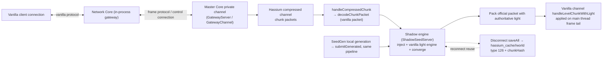

# Hassium

<p align="center">
  
</p>

**Hassium** — high-performance chunk compression and client-side chunk storage for Minecraft, providing **efficient compression, network optimization, chunk cache, local generation, beyond-view rendering, and lighting optimization**.  
Smaller world saves and bandwidth than vanilla, local chunk reuse, and smoother joins. Supports Fabric / Forge / NeoForge across Minecraft 1.20.1–1.21.11.

[简体中文](README.md) · **English**

> Repository: [github.com/limuqy/Hassium](https://github.com/limuqy/Hassium)
> User documentation: [GitHub Wiki](https://github.com/limuqy/Hassium/wiki/Home-en) · [简体中文 Wiki](https://github.com/limuqy/Hassium/wiki)


[](https://www.curseforge.com/minecraft/mc-mods/hassium)

---

## Features

| Category | Feature | Description |
| --- | --- | --- |
| **Efficient compression** | Storage compression | World chunk ZSTD on disk (type 126) for smaller saves; keeps vanilla Region (`.mca`) layout |
| | Network compression | More efficient compression for chunks and packets (custom channels + global pipeline + packet aggregation) — less bandwidth and wait time |
| **Network optimization** | Smooth push | Per-player per-tick submit cap (`master.maxChunksPerTick`, ≈ cap×20/s at full tick) + main-thread serialization cap with background encoding; join and view expansion never saturate the main thread |
| | In-process gateway | Client-side in-process gateway (Network Core): vanilla client ↔ Network Core ↔ Master Core private channel; PLAY-phase traffic is routed through the gateway, the shell connection stays keep-alive only |
| | Seamless migration / L1 load balancing | On master-core silent-failure timeout (`master.migrationFaultTimeoutMs`), the L1 migration engine switches the gateway with a warm cache — seamless migration; multiple gateways balanced via L1 load balancing |
| | UDP data plane | UDP/KCP bulk carrier for the gateway ↔ master-core channel (`dataplane.enabled`, off by default; control plane stays on vanilla TCP) |
| **Chunk cache** | Shadow world save | Every chunk you visit is saved by the shadow engine (full MinecraftServer) into a vanilla-format save (`hassium_cache/<serverId>/world`, type 126 + chunkHash); saved on disconnect, reused on reconnect |
| | Section delta | On cache mismatch (MISMATCH), fetch only changed sections (`sectionDelta`) and merge locally instead of the whole chunk |
| | Local generation (SeedGen) | For pristine (never-generated) chunks the server sends a tiny seed + position reference instead of chunk data; the client generates locally with the same seed — zero transfer. Falls back to full transfer on failure/timeout |
| | **Beyond-view render** | When client RD exceeds server view distance (multiplayer), fill the outer ring from local cache (render-only; no out-of-range server requests); incompatible with Bobby |
| | World export | `/hassiumc export` copies the shadow-side world directory wholesale to `hassium_exports/<cacheId>` (keeps the type 126 + chunkHash format; vanilla translation is planned later) |
| **Lighting optimization** | Hassium engine | Master switch for non-network features (default on): an in-process shadow server (full MinecraftServer) owns world saving (cache) + chunk lighting + official chunk packet packing, delivered back over the vanilla channel; degrades automatically on startup failure |
| | Light stripping | Server can strip light data; the Hassium engine (shadow side) computes lighting centrally and packs it back |
| | Light cache | Shadow-side lighting is saved with the chunk (type 126 + chunkHash); reconnects reuse it, skipping recomputation |
| | Parallel light engine | Light recomputation runs on a background thread pool; the main thread only submits snapshots (on by default) |
| **Utilities** | Traffic metrics | `/hassium stats` (server) and `/hassiumc stats` (client) to inspect compression and cache results |

Clients without the mod can connect by default (`compat.requireClientMod = false`); install on both sides for full compression and cache benefits.

---

## Support matrix

| Minecraft | Fabric | Forge | NeoForge |
| --- | --- | --- | --- |
| 1.20.1 | ✅ | ✅ | ✅ |
| 1.20.2–1.20.5 | ✅ | — | ✅ |
| 1.20.6 | ✅ | ✅ | ✅ |
| 1.21.1 | ✅ | ✅ | ✅ |
| 1.21.2 | ✅ | — | ✅ |
| 1.21.3–1.21.10 | ✅ | ✅ | ✅ |
| 1.21.11 | ✅ | — | ✅ |

See [`docs/version-segments.md`](docs/version-segments.md) for the nine adaptation segments.

---

## Install

1. Download the loader-specific JAR from [Releases](https://github.com/limuqy/Hassium/releases).
2. Place it in `mods/` on client and/or server.
3. Config is created at `config/hassium/hassium-client.toml` and `config/hassium/hassium-server.toml` (Fabric: Mod Menu + Cloth; Forge/NeoForge: Cloth from the mods list, or edit toml).

**Dependencies:** Fabric needs Fabric API; Forge / NeoForge have no required extras. Install on both sides for negotiated compression and caching.

---

## Defaults

Enabled by default:

- Hassium channel compression and global packet compression
- Shadow world save (visited chunks persisted to `hassium_cache/<serverId>/world`, saved on disconnect, reused on reconnect)
- In-process shadow server lighting (Hassium engine)

> World storage compression (`storage.enabled`) is **off by default** — dedicated servers only. Enabling it rewrites on-disk chunk payloads; **back up worlds** first. Vanilla clients can connect by default (`compat.requireClientMod = false`).

---

## Config (summary)

Files: `config/hassium/hassium-client.toml`, `config/hassium/hassium-server.toml`

| Key | Default | Notes |
| --- | --- | --- |
| `storage.enabled` | `false` | World ZSTD (**off by default**; dedicated servers only, **back up first**) |
| `chunk.enabled` | `true` | Shadow world save (visited chunks saved to `hassium_cache/<serverId>/world`) |
| `chunk.sectionDeltaEnabled` | `true` | Section delta on cache mismatch |
| `chunk.viewDistanceExtensionEnabled` | `true` | Beyond-view render (multiplayer; exclusive with Bobby) |
| `chunk.maxRenderDistance` | `16` | Beyond-view / effective RD cap (2–64) |
| `chunk.ovdUnloadDelaySecs` | `5` | Delay unload after leaving beyond-view ring (s; 0=sync) |
| `chunk.mainThreadChunkBudgetMs` | `15` | Client apply budget per frame (ms) |
| `chunk.hassiumEngineEnabled` | `true` | Hassium engine (master switch for non-network features): starts an in-process shadow server on login that owns world saving (cache) + chunk lighting + official packet packing; degrades automatically on startup failure (cache/beyond-view render/SeedGen disabled with notice); when disabled the server does not strip light (negotiated at handshake) |
| `chunk.ovdLocalGeneration` | `false` | Beyond-view local generation: generate on cache miss from the server's world seed and store; auto-disabled when no seed |
| `net.enabled` | `true` | Master switch for the client network core (custom channels; off = revert to vanilla chunk packets) |
| `net.metricsEnabled` | `false` | Client network metrics (off by default; auto-enabled during self-checks) |
| `master.globalPacketCompression` | `true` | Global ZSTD |
| `master.maxChunksPerTick` | `5` | Per-player submit cap per tick (send rate = cap × tick rhythm; ≈ 5×20/s ≈ 100/s at full tick, naturally slows on lag) |
| `master.metricsEnabled` | `false` | Server network metrics (off by default; auto-enabled during self-checks) |
| `master.controlReachableEndpoints` | `[]` | Gateway listen endpoints (`endpoints[0]` is the gateway port, falls back to 25566) |
| `dataplane.enabled` | `false` | UDP/KCP data plane: bulk carrier for the gateway ↔ master-core channel (**off by default**); configure reachable endpoints (`dataplane.udpListeners[*].reachableEndpoints`) before enabling |
| `debug.*` | `false` | Category debug logs (quiet by default) |

Full reference: [`docs/architecture.md`](docs/architecture.md).

---

## Commands

| Command | Description |
| --- | --- |
| `/hassium stats` | Server stats (OP 2) |
| `/hassium metrics on\|off` | Toggle metrics |
| `/hassium stats reset` | Reset counters |
| `/hassiumc stats` | Client stats (cache / beyond-view) |
| `/hassiumc export [<serverIp>] [seed]` | Copy the shadow-side world directory wholesale to `hassium_exports/<cacheId>` (keeps type 126 + chunkHash; vanilla translation planned later) |

---

## How it works


```mermaid
flowchart LR
    client["Vanilla client connection"]
    gw["Network Core (in-process gateway)"]
    mc["Master Core private channel<br/>(GatewayServer / GatewayChannel)"]
    wire["Hassium compressed channel<br/>chunk packets"]
    decode["handleCompressedChunk<br/>→ decodeChunkPacket (vanilla packet)"]
    shadow["Shadow engine (ShadowSeedServer)<br/>inject + vanilla light engine + converge"]
    pack["Pack official packet with authoritative light"]
    apply["Vanilla channel handleLevelChunkWithLight<br/>applied on main thread frame tail"]
    save["Disconnect saveAll → hassium_cache/<serverId>/world<br/>type 126 + chunkHash"]
    regen["SeedGen local generation → submitGenerated, same pipeline"]

    client <-->|"vanilla protocol"| gw
    gw <-->|"frame protocol / control connection"| mc
    mc --> wire --> decode --> shadow --> pack --> apply
    regen --> shadow
    shadow -.-> save
    save -.->|"reconnect reuse"| shadow
```

Details: [`docs/architecture.md`](docs/architecture.md).

---

## Build from source

JDK 17+ (newer MC versions may need a higher JDK — see `versionProperties`).

```bash
./gradlew build
./gradlew build "-Pmc_ver=1.21.1"   # quote -Pmc_ver in PowerShell
./gradlew :fabric:runClient
./gradlew :forge:runServer
```

Developer entry point: [`AGENTS.md`](AGENTS.md).

---
## User documentation

For installation, every configuration option, commands, feature guides, compatibility, and diagnostics, see the [GitHub Wiki](https://github.com/limuqy/Hassium/wiki/Home-en).

| Page | Content |
| --- | --- |
| [Installation](https://github.com/limuqy/Hassium/wiki/Installation-en) | Download, dependencies, and loader notes |
| [Configuration](https://github.com/limuqy/Hassium/wiki/Configuration-en) | Complete option reference and GUI paths |
| [Commands](https://github.com/limuqy/Hassium/wiki/Commands-en) | `/hassium` and `/hassiumc` reference |
| [Features](https://github.com/limuqy/Hassium/wiki/Features-en) | Cache, section delta, light optimization, and more |
| [Beyond-view render](https://github.com/limuqy/Hassium/wiki/Beyond-View-Render-en) · [World export](https://github.com/limuqy/Hassium/wiki/World-Export-en) | Guides for both client features |
| [Compatibility](https://github.com/limuqy/Hassium/wiki/Compatibility-en) · [Troubleshooting](https://github.com/limuqy/Hassium/wiki/Troubleshooting-en) | Coexistence with other mods and diagnostic paths |
| [Network Core and Master Migration](https://github.com/limuqy/Hassium/wiki/Network-Core-and-Master-Migration-en) | Network Core (in-process gateway), master migration (seamless migration / L1 load balancing), and UDP/KCP data plane operations |

---


## Developer documentation

| Doc | Content |
| --- | --- |
| [`docs/architecture.md`](docs/architecture.md) | Architecture, storage, config, logging, commands |
| [`docs/chunk-cache.md`](docs/chunk-cache.md) | Cache push, beyond-view render (§10), disk NBT (§11), export (§12) |
| [`docs/version-segments.md`](docs/version-segments.md) | Multi-version segments |
| [`docs/mod-compat.md`](docs/mod-compat.md) | Multi-mod compatibility & config escapes |

---

## License

[GPL-3.0-or-later](LICENSE)
