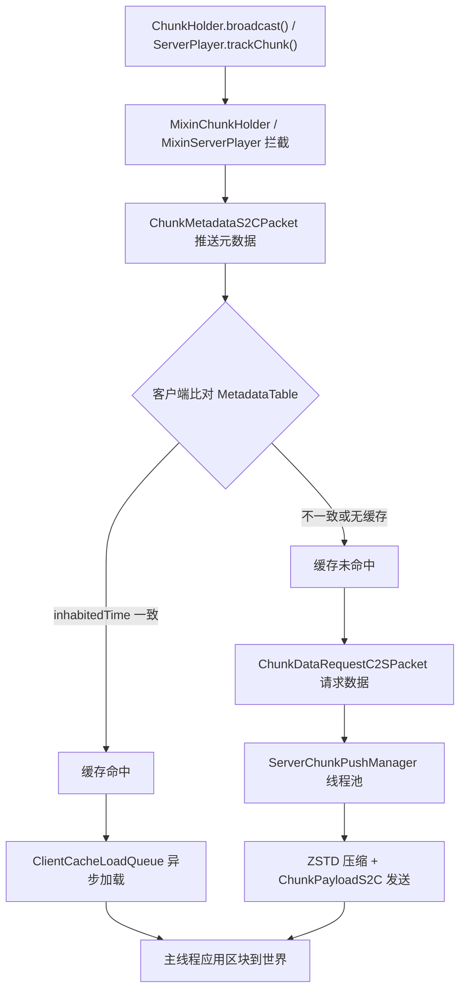

# Hassium

**Hassium** · 高性能区块压缩与客户端缓存模组  
面向 Minecraft 1.20.1 专用服务器与客户端，使用 ZSTD 替代原版 Zlib，降低存档体积与区块传输带宽

ZSTD 压缩 · 客户端区块缓存 · 元数据推送 · 自定义网络通道 · Forge / Fabric 双加载器

[English](README-en.md) · **简体中文**

> 仓库地址：[github.com/limuqy/Hassium](https://github.com/limuqy/Hassium)


---

## 特性一览

| 能力 | 说明 | 状态 |
| --- | --- | --- |
| **Region 兼容存储** | 保留 `.mca` 外层结构，使用 ZSTD 压缩区块数据 | ✅ 已实现 |
| **ZSTD 压缩** | 替代原版 Zlib，支持专用字典训练，压缩比约 6:1 ~ 9:1 | ✅ 已实现 |
| **客户端区块缓存** | 卸载区块时写入本地 Region 文件，支持 LRU 与热度清理 | ✅ 已实现 |
| **元数据推送** | 服务端主动推送区块 `inhabitedTime`，客户端比对后跳过重复传输 | ✅ 已实现 |
| **异步加载** | `ServerChunkPushManager` / `ClientCacheLoadQueue` 线程池异步处理 | ✅ 已实现 |
| **网络压缩增强** | 自定义通道 ZSTD 压缩，支持上下文复用、magicless、包聚合 | ✅ 已实现 |
| **光照剥离** | 剥离区块光照数据，减少传输体积（客户端可自行重算） | ✅ 已实现 |
| **网络流量监控** | 零开销指标收集，`/hassium stats` 服务端、`/hassiumc stats` 客户端命令 | ✅ 已实现 |
| **Bloom 预筛** | 客户端 `ChunkBloomFilter` 减少无效 IO，快速判断缓存是否存在 | ✅ 已实现 |
| **sectionHashes 优化** | `combineSectionHashes` 推导 chunkHash，避免客户端重复计算 | ✅ 已实现 |
| **section 数据合并** | `replaceSectionsInPacket` 精确 section 级别替换，减少数据传输 | ✅ 已实现 |
| **BlockEntity 优化** | 专用通道 `BlockEntityRequestC2SPacket` 请求，减少主通道压力 | ✅ 已实现 |
| **GlobalPalette 修复** | `skipPalettedContainer` 支持 bits≥9 的 GlobalPalette 解析 | ✅ 已实现 |
| **动态线程池** | `ThreadPoolExecutor` 自动扩缩容，根据队列深度调整线程数 | ✅ 已实现 |
| **1.20.5+ 迁移路径** | 预留 compression scheme `127` 迁移抽象 | ⚠️ 已抽象 |
| **Forge 端到端验证** | 编译通过，运行时验证待完成 | ⚠️ 待完成 |

---

## 支持的版本

| Minecraft | Java | Fabric | Forge |
| --- | --- | --- | --- |
| 1.20.1 | 17 | ✅ | ✅（编译通过，运行时待验证） |

**依赖版本：**

- Fabric Loader：`0.16.9`
- Fabric API：`0.92.1+1.20.1`
- Forge：`47.2.30`
- Mixin：`0.8.5`

> 当前模组版本：`1.0.0-beta`

---

## 项目状态与免责声明

- 当前为 **Beta** 阶段，API 与配置项可能变更。
- **存储功能默认启用**（`storage.enabled = true`），启用前请**备份世界存档**。
- 端到端验证目前主要在 **Fabric** 平台完成；Forge 端编译通过，运行时验证仍在进行中。
- 未安装 Hassium 的客户端默认可正常连接（`compat.requireClientMod = false`）。
- 全局数据包压缩（`globalPacketCompression`）默认启用，用 ZSTD 替换原版 Zlib。

---

## 安装

1. 从 [Releases](https://github.com/limuqy/Hassium/releases) 下载对应加载器的 JAR。
2. 将 JAR 放入客户端或服务端的 `mods/` 目录。
3. 启动游戏/服务器；模组会在 `config/hassium/` 自动生成配置文件 `hassium.json`。

**依赖：**

- **Fabric**：需安装对应版本的 Fabric API。
- **Forge**：无额外前置依赖。

> 建议服务端与客户端均安装 Hassium，以启用网络压缩与区块缓存协商。

---

## 快速开始

### 默认行为（无需额外配置）

安装后以下功能**默认启用**：

- **Hassium 通道压缩**：双方安装 Hassium 时，通过自定义通道 `hassium:*` 传输 ZSTD 压缩区块数据。
- **全局包压缩**：用 ZSTD 替换原版 Zlib，压缩所有数据包（原版区块数据包除外，避免双重压缩）。
- **客户端缓存**：区块卸载时自动写入本地缓存，重连后比对元数据，命中则跳过重复下载。

### 启用存档压缩（可选，高风险）

编辑 `config/hassium/hassium.json`：

```json
{
  "storage": {
    "enabled": true
  }
}
```

> ⚠️ 启用存储前请完整备份世界存档。

---

## 配置

配置文件：`config/hassium/hassium.json`

### 存储（Storage）

| 配置键 | 默认值 | 说明 |
| --- | --- | --- |
| `storage.enabled` | `true` | 是否启用 Region 兼容扩展存储 |
| `storage.zstdLevel` | `9` | ZSTD 压缩等级（1–22） |
| `storage.zstdDictionaryId` | `hassium-dictionary` | 字典 ID |
| `storage.storageCompressionAlgorithm` | `hassium:zstd` | 存储压缩算法 |
| `storage.verifyChecksum` | `true` | 启用 CRC32C 校验 |

### 客户端缓存（Client Cache）

| 配置键 | 默认值 | 说明 |
| --- | --- | --- |
| `clientCache.enabled` | `true` | 是否启用客户端区块缓存 |
| `clientCache.maxSizeMb` | `2048` | 最大缓存容量（MB） |
| `clientCache.maxAgeDays` | `30` | 缓存最大保留天数 |
| `clientCache.hotScoreThreshold` | `0.3` | 热度阈值，低于此值视为冷区块 |
| `clientCache.recencyWeight` | `0.7` | 最近访问权重（热度计算） |
| `clientCache.frequencyWeight` | `0.3` | 访问频率权重（热度计算） |
| `clientCache.cleanupIntervalTicks` | `6000` | 清理检查间隔 ticks（5分钟） |
| `clientCache.targetCacheSizeMb` | `0` | 目标缓存大小（0=自动计算为 maxSizeMb×0.8） |
| `clientCache.minCleanupBatchSize` | `100` | 每次最少清理区块数 |
| `clientCache.bloomFilterEnabled` | `true` | 启用 Bloom Filter 预筛 |
| `clientCache.bloomFilterExpectedInsertions` | `10000` | Bloom Filter 预期插入元素数量 |
| `clientCache.bloomFilterFpp` | `0.01` | Bloom Filter 期望假阳性率（1%） |

### 网络（Network）

| 配置键 | 默认值 | 说明 |
| --- | --- | --- |
| `network.enabled` | `true` | 启用 Hassium 自定义通道压缩（hassium:* 通道） |
| `network.compressionAlgorithm` | `hassium:zstd` | 压缩算法 |
| `network.compressionLevel` | `3` | 压缩等级（1-22，速度优先） |
| `network.maxChunksPerTick` | `10` | 每玩家每 tick 最大发送区块数 |
| `network.globalPacketCompression` | `true` | 全局包压缩（用 ZSTD 替换原版 Zlib） |
| `network.globalCompressionLevel` | `3` | 全局压缩等级 |
| `network.globalCompressionThreshold` | `256` | 全局压缩阈值（字节） |
| `network.compressionBlacklist` | `["hassium:chunk_payload_s2c"]` | 压缩黑名单（不压缩的数据包） |
| `network.useContextCompression` | `true` | 启用上下文压缩 |
| `network.magiclessZstd` | `true` | 启用 magicless ZSTD 模式 |
| `network.enablePacketAggregation` | `true` | 包聚合（多小包合并后压缩） |
| `network.aggregationMinBatchSize` | `4` | 最小批量大小 |
| `network.aggregationMaxWaitTimeMs` | `20` | 最大等待时间（ms） |
| `network.aggregationMaxSize` | `262144` | 最大聚合大小（256KB） |
| `network.enableCompactHeader` | `true` | 启用紧凑包头（仅在聚合包内部使用） |
| `network.serverChunkPushThreads` | `8` | 服务端区块推送线程数 |
| `network.clientChunkLoadThreads` | `10` | 客户端区块加载线程数 |
| `network.lightStripEnabled` | `true` | 启用光照剥离优化 |
| `network.backgroundThreads` | `8` | 后台线程池大小 |
| `network.maxChunksPerFrame` | `10` | 每帧最多应用缓存区块数 |
| `network.maxCallbacksPerFrame` | `10` | 每帧最多主线程异步回调数 |
| `network.metricsEnabled` | `true` | 启用网络指标收集（关闭时仅 ~5ns 开销） |
| `network.targetFPS` | `60` | 目标 FPS（自适应吞吐） |
| `network.maxLightRecomputePerFrame` | `4` | 每帧最多重算光照区块数 |
| `network.dynamicThreadPoolEnabled` | `true` | 启用动态线程池自动扩缩容 |
| `network.minPushThreads` | `2` | 最小推送线程数 |
| `network.maxPushThreads` | `8` | 最大推送线程数 |

### 兼容性（Compat）

| 配置键 | 默认值 | 说明 |
| --- | --- | --- |
| `compat.requireClientMod` | `false` | 是否强制要求客户端安装模组 |
| `compat.autoDowngradeOnError` | `true` | 出错时自动降级到原版协议 |

### 调试（Debug）

| 配置键 | 默认值 | 说明 |
| --- | --- | --- |
| `debug.metadataLogging` | `false` | 元数据相关日志（CLIENT_METADATA, COMPARE_METADATA, APPLY_METADATA） |
| `debug.dispatcherLogging` | `false` | 主线程调度器日志（MAIN_DISPATCHER） |
| `debug.asyncLogging` | `false` | 异步任务日志（ASYNC） |
| `debug.compressionLogging` | `false` | 压缩/解压日志（HANDLE_COMPRESSED） |
| `debug.chunkApplyLogging` | `false` | 区块应用日志（APPLY_CHUNK） |
| `debug.networkLogging` | `false` | 网络传输日志（SEND_CHUNK, RECEIVED） |
| `debug.cacheLogging` | `false` | 缓存操作日志（CACHE_LOAD, CACHE_APPLY） |

---

## 工作原理

### 区块缓存与传输流程



### 距离优先调度

服务端 `ServerChunkPushManager` 使用优先级队列，按玩家与区块的距离排序，近距离区块优先发送：

```
priority = sqrt((chunkX - playerChunkX)² + (chunkZ - playerChunkZ)²)
```

### 网络流量监控

轻量级指标收集系统，零分配、无锁设计，开销约 10-20ns/次：

```
服务端                              客户端
┌─────────────────────┐            ┌─────────────────────┐
│ NetworkStats        │            │ NetworkStats        │
│  ├─ vanillaBytesSent│            │  ├─ vanillaBytesRecv│
│  ├─ actualBytesSent │            │  ├─ actualBytesRecv │
│  ├─ metadataSent    │            │  ├─ cacheHits       │
│  ├─ dataReqReceived │            │  ├─ cacheMisses     │
│  └─ chunksCompressed│            │  └─ chunksDecomp    │
└─────────────────────┘            └─────────────────────┘
         ↓                                   ↓
  /hassium stats                     /hassiumc stats
```

**派生指标**：压缩比、带宽节省率、缓存命中率自动计算。

---

## 从源码构建

**环境要求：** JDK 17+，Gradle Wrapper 已包含。

```bash
# 首次构建或缺少反编译产物时
./gradlew common:decompile

# 构建所有平台
./gradlew build

# 仅构建 Fabric / Forge
./gradlew fabric:build
./gradlew forge:build

# 编译检查（改动 common/ 后优先运行）
./gradlew common:compileJava
./gradlew fabric:compileJava
./gradlew forge:compileJava

# 开发环境
./gradlew fabric:runClient
./gradlew fabric:runServer
./gradlew forge:runClient
./gradlew forge:runServer
```

### 测试与基准工具

```bash
# 单元测试
./gradlew common:test

# 快速压缩基准（Zlib vs ZSTD）
./gradlew common:runJava -PmainClass=io.github.limuqy.mc.hassium.benchmark.CompressionBenchmark

# 字典训练（真实存档，推荐）
./gradlew common:runJava -PmainClass=io.github.limuqy.mc.hassium.benchmark.DictionaryTrainer -Pargs="--world,C:/path/to/world/region"
```

Windows 下也可使用项目根目录的批处理脚本：`run-tests.bat`、`run-benchmark-quick.bat`、`run-benchmark-full.bat`、`run-dictionary-trainer-world.bat`。详见 [README-TESTING.md](README-TESTING.md)。

### 项目结构

```
Hassium/
├── common/       # 跨平台逻辑（存储、压缩、缓存、网络、Mixin）
├── fabric/       # Fabric 加载器入口与网络注册
├── forge/        # Forge 加载器入口与网络注册
├── buildSrc/     # Gradle 多模块构建插件
└── docs/         # 需求、架构与开发文档
```

---

## 文档

| 文档 | 说明 |
| --- | --- |
| [docs/hassium-requirements.md](docs/hassium-requirements.md) | 功能需求与实现状态 |
| [docs/hassium-development.md](docs/hassium-development.md) | 详细架构设计 |
| [docs/chunk-cache-refactor.md](docs/chunk-cache-refactor.md) | 区块缓存系统改造 |
| [docs/chunk-preload-optimization.md](docs/chunk-preload-optimization.md) | 区块预加载优化方案 |
| [docs/client-cache-eviction.md](docs/client-cache-eviction.md) | 客户端缓存淘汰策略 |
| [docs/hassium-network-optimization.md](docs/hassium-network-optimization.md) | 网络压缩优化记录 |
| [docs/network-monitoring.md](docs/network-monitoring.md) | 网络流量与缓存监控方案 |
| [docs/multithreading-refactor.md](docs/multithreading-refactor.md) | 多线程架构重构 |
| [docs/chunk-cache-optimization.md](docs/chunk-cache-optimization.md) | 区块缓存优化方案 |
| [docs/debug-logging-guide.md](docs/debug-logging-guide.md) | 调试日志使用指南 |
| [README-TESTING.md](README-TESTING.md) | 测试与基准工具使用指南 |
| [CLAUDE.md](CLAUDE.md) | 项目概览与开发指引 |
| [AGENTS.md](AGENTS.md) | AI 代理开发规范 |

---

## 已知限制与 Roadmap

| 项目 | 说明 | 状态 |
| --- | --- | --- |
| Forge 运行时验证 | 编译通过，端到端测试待完成 | ⚠️ 待完成 |
| 紧凑包头 | `enableCompactHeader` 仅在聚合包内部使用，独立使用待修复 | ⚠️ 待修复 |
| renderOnly 超视距渲染 | 骨架已存在，待缓存闭环稳定后推进 | ⏳ 规划中 |
| 方向性优先级加载 | 根据玩家移动方向调整区块加载优先级 | ⏳ 规划中 |
| 智能热点预加载 | 记录访问频率，预加载高频区域 | ⏳ 规划中 |
| 集成测试 | 在实际 Minecraft 环境中测试新区块缓存流程 | ⏳ 待完成 |
| 性能优化 | 批量元数据发送优化 | ⏳ 待完成 |
| 兼容性测试 | 更多 MOD 与环境验证 | ⏳ 待完成 |
| 每玩家统计 | 独立计数器，支持 `/hassium stats <player>` | 💡 规划中 |
| Prometheus 导出 | 通过 JMX MBean 暴露指标 | 💡 规划中 |
| 实时 HUD | F3 调试屏幕叠加层 | 💡 规划中 |

---

## 许可证

本项目采用 [GNU General Public License v3.0 or later](LICENSE) 开源。

---

## 作者

**[limuqy](https://github.com/limuqy)** — GitHub

如有问题或建议，欢迎在 [Issues](https://github.com/limuqy/Hassium/issues) 中反馈。
