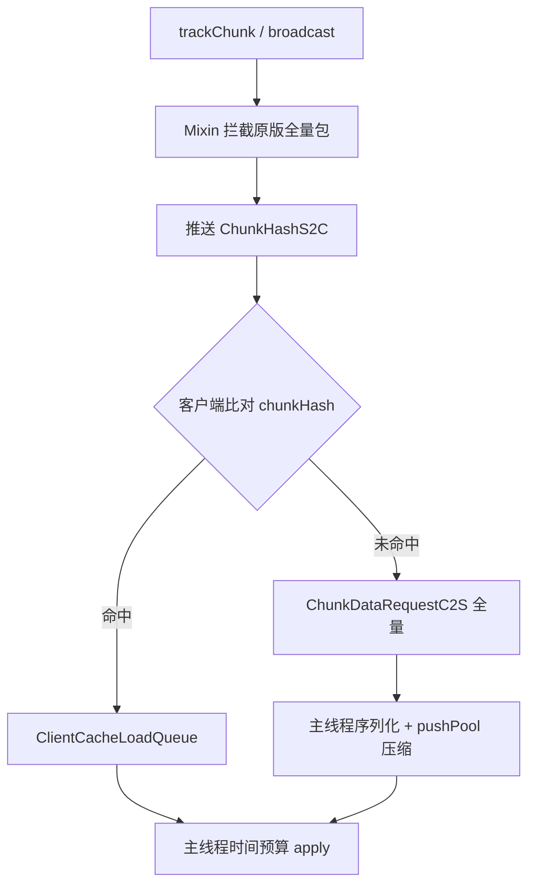

# Hassium

<p align="center">
  
</p>

**Hassium** · 高性能区块压缩与客户端缓存模组  
相对原版缩小存档与带宽、复用本地区块、减轻进服卡顿。支持 Fabric / Forge / NeoForge，覆盖 Minecraft 1.20.1–1.21.11。

[English](README-en.md) · **简体中文**

> 仓库：[github.com/limuqy/Hassium](https://github.com/limuqy/Hassium)


---

## 特性

| 能力 | 说明 |
| --- | --- |
| **高效存储** | 世界区块用更高压缩率落盘，显著减小存档体积；仍兼容原版 Region（`.mca`）布局 |
| **网络压缩** | 区块与数据包用更高效压缩传输，降低带宽占用与下载等待 |
| **区块缓存** | 曾加载过的区块写入本地；再次进入同一区域时优先用本地数据，少传全量包 |
| **光照剥离** | 服务端可不传光照数据，由客户端本地重算，进一步省流量 |
| **平滑加载** | 进服与视野扩展时限制主线程压力，减少卡顿尖峰 |
| **兼容友好** | 未安装本模组的客户端默认可连接；双端都装才能吃满压缩与缓存 |
| **流量监控** | `/hassium stats`（服务端）、`/hassiumc stats`（客户端）查看压缩与缓存效果 |

---

## 支持矩阵

| Minecraft | Fabric | Forge | NeoForge |
| --- | --- | --- | --- |
| 1.20.1 | ✅ | ✅ | ✅ |
| 1.20.2–1.20.4 | ✅ | — | ✅ |
| 1.20.5–1.20.6 | ✅ | ✅（仅 1.20.6） | ✅ |
| 1.21.1–1.21.11 | ✅ | — | ✅ |

完整九段锚点与编译矩阵见 [`docs/version-segments.md`](docs/version-segments.md)。

---

## 安装

1. 从 [Releases](https://github.com/limuqy/Hassium/releases) 下载对应加载器的 JAR。
2. 放入客户端或服务端 `mods/`。
3. 启动后生成 `config/hassium/hassium-client.toml` 与 `config/hassium/hassium-common.toml`（Fabric：Mod Menu + Cloth；Forge/NeoForge：Configured 或手改 toml）。

**依赖：** Fabric 需 Fabric API（Cloth 已 jiJ）；Forge / NeoForge 无额外前置。建议双端均安装以启用协商压缩与缓存。

---

## 默认行为

安装后默认启用：

- Hassium 通道压缩与全局包压缩
- 客户端区块缓存
- **存档存储压缩**（`storage.enabled = true`）

> 启用存储会改写区块落盘格式。首次使用前请**备份世界**。未装模组的客户端默认可连接（`compat.requireClientMod = false`）。

---

## 配置摘要

文件：`config/hassium/hassium-client.toml`、`config/hassium/hassium-common.toml`

| 键 | 默认 | 说明 |
| --- | --- | --- |
| `storage.enabled` | `true` | 世界存档 ZSTD（请备份） |
| `clientCache.enabled` | `true` | 客户端缓存 |
| `network.enabled` | `true` | 自定义通道 |
| `network.globalPacketCompression` | `true` | 全局 ZSTD |
| `network.maxChunksPerTick` | `10` | 每玩家每 tick 序列化上限 |
| `network.mainThreadChunkBudgetMs` | `3` | 客户端每帧 apply 预算（ms） |
| `network.metricsEnabled` | `true` | 指标收集 |
| `debug.*` | `false` | 分类调试日志（默认安静） |

完整说明见 [`docs/architecture.md`](docs/architecture.md)。

---

## 命令

| 命令 | 说明 |
| --- | --- |
| `/hassium stats` | 服务端统计（OP 2） |
| `/hassium metrics on\|off` | 开关指标 |
| `/hassium stats reset` | 重置计数器 |
| `/hassiumc stats` | 客户端统计 |

---

## 工作原理（简图）



细节见 [`docs/chunk-cache.md`](docs/chunk-cache.md)。

---

## 从源码构建

需要 JDK 17+（部分新版本需更高 Java，见对应 `versionProperties`）。

```bash
./gradlew build
./gradlew build "-Pmc_ver=1.21.1"   # PowerShell 必须给 -Pmc_ver 加引号
./gradlew :fabric:runClient
./gradlew :forge:runServer
```

开发者入口：[`CLAUDE.md`](CLAUDE.md)、[`AGENTS.md`](AGENTS.md)。

---

## 文档

| 文档 | 内容 |
| --- | --- |
| [`docs/architecture.md`](docs/architecture.md) | 架构、存储格式、配置、日志、命令 |
| [`docs/chunk-cache.md`](docs/chunk-cache.md) | 区块缓存推送与进服流水线 |
| [`docs/version-segments.md`](docs/version-segments.md) | 多版本九段适配真相源 |
| [`docs/mod-compat.md`](docs/mod-compat.md) | 多 Mod 兼容边界与配置逃生 |

---

## 许可证

[GPL-3.0-or-later](LICENSE)
