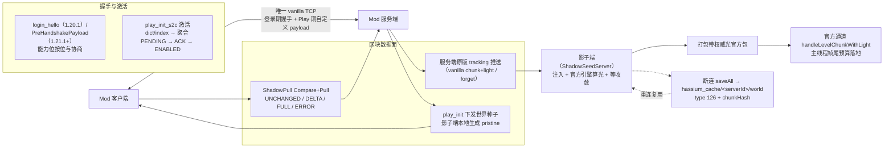

# Hassium

<p align="center">
  
</p>

**Hassium** · 高性能区块压缩与客户端区块存储模组，提供**高效压缩、网络优化、区块缓存、本地生成与光照优化**。
相对原版缩小存档与带宽、减轻进服卡顿。支持 Fabric / Forge / NeoForge，覆盖 Minecraft 1.20.1–1.21.11。

[English](README-en.md) · **简体中文**

> 仓库：[github.com/limuqy/Hassium](https://github.com/limuqy/Hassium)
> 用户文档：[GitHub Wiki](https://github.com/limuqy/Hassium/wiki) · [English Wiki](https://github.com/limuqy/Hassium/wiki/Home-en)


[](https://www.curseforge.com/minecraft/mc-mods/hassium)

---

## 特性

| 分类 | 能力 | 说明 |
| --- | --- | --- |
| **高效压缩** | 存储压缩 | 世界区块 ZSTD 落盘（type 126），存档体积显著减小；仍兼容原版 Region（`.mca`）布局 |
| | 通道压缩 | 聚合包内部字典 ZSTD + 区块推送自有压缩；不触碰原版压缩层，无跨 mod 管线冲突面 |
| **网络优化** | 平滑推送 | 服务端每 tick Pull 完成上限限速（`master.maxChunksPerTick`，满 tick ≈ 值×20/s）+ encode/压缩后台化；进服不卡主线程 |
| | 登录期能力握手 | 1.20.1 走 `hassium:login_hello` login query，1.21.1+ 走配置阶段 `PreHandshakePayload`；按位与协商能力位，无超时依赖，原版客户端零干扰 |
| | Pull 模式 | 协商通过后服务端停发整柱推送，区块数据由客户端影子虚拟玩家 tracking 驱动的统一 Compare+Pull 拉取（`ShadowPull`：UNCHANGED / DELTA / FULL / ERROR 四终态） |
| **区块缓存** | 影子端世界保存 | 进服区块统一由进程内影子服务端（完整 MinecraftServer）算光并落盘原版存档（`hassium_cache/<serverId>/world`），断连保存、重连复用 |
| | 分段增量 | 缓存过期时只补变更方块（`SectionDelta`）；过多则整段，再多则整块 |
| | 容量/热度淘汰 | `heat.idx` 按 region 文件计热度，超限整文件删除 `.mca`（`ShadowCacheEviction`） |
| | 世界导出 | `/hassiumc export` 将影子端世界目录整体拷贝为导出存档（`hassium_exports/<cacheId>`；保留 type 126 + chunkHash，原版翻译后续提供） |
| **本地生成** | SeedGen | 双端同版本且开启时，服务端在 Play 激活（`play_init_s2c`）下发世界种子，客户端影子端 tracking 触发原版 worldgen 本地生成 pristine 区块，生成后再经服务端权威 compare-pull 校验交付。**服务端开启会向客户端下发世界种子，等同泄露服务端种子** |
| **超视渲染** | OVD（影子双窗） | 多人服客户端 RD 大于服务端视距时，用影子端本地已有地形（盘 / 注入）回填视距外环带；**仅参与渲染、不参与模拟**，不向服务端请求视距外区块；与 Bobby 互斥 |
| **光照优化** | Hassium 引擎 | 进服启动进程内影子服务端统一承担**世界保存（缓存）+ 区块光照计算 + 打包官方区块包**（官方通道回传），客户端不再计算；启动失败自动降级 |
| | 光照剥离 | 服务端可剥光省流量（`chunk.lightStrip`），由影子端统一计算光照并打包回传 |
| **实用工具** | 流量监控 | `/hassium stats`（服务端）、`/hassiumc stats`（客户端）查看压缩与缓存效果 |

未安装本模组的客户端默认可连接（`compat.requireClientMod = false`）；双端都装才能吃满压缩与缓存。

---

## 支持矩阵

| Minecraft | Fabric | Forge | NeoForge |
| --- | --- | --- | --- |
| 1.20.1 | ✅ | ✅ | — |
| 1.21.1 | ✅ | ✅ | ✅ |
| 1.21.2 | ✅ | — | ✅ |
| 1.21.3–1.21.10 | ✅ | ✅ | ✅ |
| 1.21.11 | ✅ | — | ✅ |

Forge 支持 1.20.1 / 1.21.1 / 1.21.3–1.21.10（1.21.2 上游无 Forge userdev；**1.21.11 起 sunset**，该段用 NeoForge）。**1.20.1 不单独发 NeoForge 文件**：NeoForge 47.x 原生兼容 Forge mod，NeoForge 用户直接使用 Forge 版。完整七段锚点与编译矩阵见 [`docs/version-segments.md`](docs/version-segments.md)。

---

## 安装

1. 从 [Releases](https://github.com/limuqy/Hassium/releases) 下载对应加载器的 JAR。
2. 放入客户端或服务端 `mods/`。
3. 启动后生成 `config/hassium/hassium-client.toml` 与 `config/hassium/hassium-server.toml`（Fabric：Mod Menu + Cloth；Forge/NeoForge：模组列表 Cloth 配置屏，亦可手改 toml）。

**依赖：** Fabric 需 Fabric API（Cloth 已 jiJ）；Forge / NeoForge 无额外前置。建议双端均安装以启用协商压缩与缓存。

---

## 默认行为

安装后默认启用：

- 登录期能力握手 + Play 期聚合/字典压缩通道
- 影子端世界保存（进服区块落盘 `hassium_cache/<serverId>/world`，断连保存、重连复用）
- 进程内影子服务端统一算光（Hassium 引擎）

> 存档存储压缩（`storage.enabled`）默认关闭，仅专用服务器可开启；开启会改写区块落盘格式，请先**备份世界**。未装模组的客户端默认可连接（`compat.requireClientMod = false`）。

---

## 配置摘要

文件：`config/hassium/hassium-client.toml`、`config/hassium/hassium-server.toml`（Fabric 按物理端二选一生效；Forge/NeoForge 双 spec 亦按物理端二选一注册）。键集真相源：`ConfigSchema`。

| 键 | 默认 | 说明 |
| --- | --- | --- |
| `chunk.enabled` | `true` | 区块核心总开关（影子端世界保存/算光/缓存/Pull 模式；关后全程原版路径） |
| `chunk.sectionDeltaEnabled` | `true` | 分段增量（服务端规划 + 客户端应用） |
| `chunk.seedGenEnabled` | `false` | SeedGen 本地生成（双端同版本；**服务端开启会泄露世界种子**） |
| `chunk.viewDistanceExtensionEnabled` | `true` | 超视渲染 OVD（影子双窗；依赖 `chunk.enabled`；与 Bobby 互斥） |
| `chunk.maxRenderDistance` | `16` | OVD effective clientRD 上限（2–64） |
| `chunk.mainThreadChunkBudgetMs` | `15` | 客户端每帧 apply 预算（ms） |
| `chunk.maxChunksPerFrame` | `6` | 每 tick 缓存读取生产上限（影子入队 + 影子读盘） |
| `chunk.maxSizeMb` | `4096` | 缓存容量上限（MB；超限触发热度淘汰） |
| `chunk.hotScoreThreshold` | `0.3` | 热点分数阈值（低于视为冷 region，优先淘汰） |
| `chunk.cleanupIntervalTicks` | `6000` | 清理检查间隔（刻） |
| `chunk.lightStrip` | `true` | 服务端光照剥离（由影子端统一算光） |
| `storage.enabled` | `false` | 世界存档 ZSTD（默认关；仅专用服务器，请备份） |
| `storage.zstdLevel` | `3` | 存储 ZSTD 压缩等级 |
| `master.enabled` | `true` | 服务端网络通道总开关（登录期握手/聚合的门） |
| `master.maxChunksPerTick` | `5` | 每玩家每 tick 完成的 Pull FULL/DELTA 上限（满 tick ≈ 值×20/s） |
| `master.enablePacketAggregation` | `true` | 包聚合 |
| `master.aggregationMaxWaitTimeMs` | `50` | 聚合最大等待（ms；ACK 超时 5s 自动降级直发） |
| `master.aggregationMaxSize` | `262144` | 聚合最大大小（字节） |
| `master.compressionLevel` | `3` | 自有通道 ZSTD 压缩等级 |
| `master.compressionBlacklist` | `[]` | 第三方包压缩/聚合排除（默认空；Hassium 控制面已硬编码排除） |
| `compat.requireClientMod` | `false` | 无模组客户端可连（true 时登录期握手失败即踢出） |
| `compat.autoDowngradeOnError` | `true` | 出错时自动降级 |
| `debug.*` | 多为 `false` | 分类调试日志（默认安静；热路径走 `DebugLogger`；`networkMetricsAutoReset` 默认 `true`） |

完整说明见 [`docs/architecture.md`](docs/architecture.md) 与 [配置审计](docs/config-audit.md)。

---

## 命令

| 命令 | 说明 |
| --- | --- |
| `/hassium stats` | 服务端统计（OP 2） |
| `/hassium stats reset` | 重置计数器 |
| `/hassium stats toggle` | 开关统计 |
| `/hassium metrics on\|off` | 开关指标 |
| `/hassiumc stats` | 客户端统计（缓存命中 / 光照 / 节省） |
| `/hassiumc export [<服务器IP>] [seed]` | 拷贝影子端 `world` 到 `hassium_exports/<cacheId>`（`level.dat` 由影子端原版写出）；也可把该目录复制到 `saves/` |

---

## 工作原理（简图）


```mermaid
flowchart LR
    client["Mod 客户端"] <-->|"唯一 vanilla TCP<br/>登录期握手 + Play 期自定义 payload"| server["Mod 服务端"]
    subgraph 握手与激活
        hs["login_hello（1.20.1）/<br/>PreHandshakePayload（1.21.1+）<br/>能力位按位与协商"]
        act["play_init_s2c 激活<br/>dict/index → 聚合 PENDING → ACK → ENABLED"]
    end
    subgraph 区块数据面
        push["服务端原版 tracking 推送<br/>（vanilla chunk+light / forget）"]
        pull["ShadowPull Compare+Pull<br/>UNCHANGED / DELTA / FULL / ERROR"]
        seed["play_init 下发世界种子<br/>影子端本地生成 pristine"]
    end
    shadow["影子端（ShadowSeedServer）<br/>注入 + 官方引擎算光 + 等收敛"]
    pack["打包带权威光官方包"]
    apply["官方通道 handleLevelChunkWithLight<br/>主线程帧尾预算落地"]
    save["断连 saveAll → hassium_cache/&lt;serverId&gt;/world<br/>type 126 + chunkHash"]

    server --> push --> shadow
    client --> pull --> server
    server --> seed --> client
    shadow --> pack --> apply
    shadow -.-> save
    save -.->|"重连复用"| shadow
```

细节见 [`docs/architecture.md`](docs/architecture.md)。

---

## 从源码构建

需要 JDK 17+（部分新版本需更高 Java，见对应 `versionProperties`）。

```bash
./gradlew build
./gradlew build "-Pmc_ver=1.21.1"   # PowerShell 必须给 -Pmc_ver 加引号
./gradlew :fabric:runClient
./gradlew :forge:runServer
```

开发者入口：[`AGENTS.md`](AGENTS.md)。

---
## 用户文档

安装、完整配置、命令、功能说明、兼容性与排查见 [GitHub Wiki](https://github.com/limuqy/Hassium/wiki)。

| 页面 | 内容 |
| --- | --- |
| [安装](https://github.com/limuqy/Hassium/wiki/Installation) | 下载、前置和各加载器差异 |
| [配置](https://github.com/limuqy/Hassium/wiki/Configuration) | 完整配置项表与 GUI 路径 |
| [命令](https://github.com/limuqy/Hassium/wiki/Commands) | `/hassium` 与 `/hassiumc` 命令参考 |
| [特性](https://github.com/limuqy/Hassium/wiki/Features) | 缓存、分段增量、光照优化等功能详解 |
| [世界导出](https://github.com/limuqy/Hassium/wiki/World-Export) | 客户端缓存导出为存档的使用说明 |
| [兼容性](https://github.com/limuqy/Hassium/wiki/Compatibility) · [排查](https://github.com/limuqy/Hassium/wiki/Troubleshooting) | 与其他模组并用和诊断路径 |


---

## 开发文档

| 文档 | 内容 |
| --- | --- |
| [`docs/architecture.md`](docs/architecture.md) | 能力总览与场景、直连拓扑、模块架构、客户端数据流、存储格式、配置、日志、命令 |
| [`docs/chunk-cache.md`](docs/chunk-cache.md) | 区块缓存推送（ShadowPull 统一 Compare+Pull）、磁盘 NBT（§11）、导出（§12） |
| [`docs/client-chunk-light-flow.md`](docs/client-chunk-light-flow.md) | 客户端收包 → apply → 光照落地全链路 |
| [`docs/chunk-load-optimization.md`](docs/chunk-load-optimization.md) | 进服/重连加载路径与速率锚点 |
| [`docs/version-segments.md`](docs/version-segments.md) | 多版本七段适配真相源 |
| [`docs/mod-compat.md`](docs/mod-compat.md) | 多 Mod 兼容边界与配置逃生 |
| [`docs/config-audit.md`](docs/config-audit.md) | 配置项审计 |
| [`docs/runtime-smoke-test.md`](docs/runtime-smoke-test.md) | 运行时冒烟（L0–L3、PROBE、场景引擎） |

---

## 许可证

[GPL-3.0-or-later](LICENSE)
