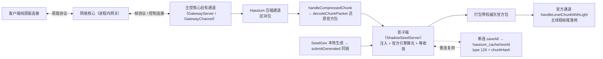

# Hassium

<p align="center">
  
</p>

**Hassium** · 高性能区块压缩与客户端区块存储模组，提供**高效压缩、网络优化、区块缓存、本地生成、超视渲染与光照优化**。
相对原版缩小存档与带宽、减轻进服卡顿。支持 Fabric / Forge / NeoForge，覆盖 Minecraft 1.20.1–1.21.11。

[English](README-en.md) · **简体中文**

> 仓库：[github.com/limuqy/Hassium](https://github.com/limuqy/Hassium)
> 用户文档：[GitHub Wiki](https://github.com/limuqy/Hassium/wiki) · [English Wiki](https://github.com/limuqy/Hassium/wiki/Home-en)


[](https://www.curseforge.com/minecraft/mc-mods/hassium)

---

## 特性

| 分类 | 能力 | 说明 |
| --- | --- | --- |
| **高效压缩** | 存储压缩 | 世界区块 ZSTD 落盘（type 126），存档体积显著减小；仍兼容原版 Region（`.mca`）布局 |
| | 网络压缩 | 区块与数据包 ZSTD 传输（自定义通道 + 全局管道 + 包聚合），降低带宽与下载等待 |
| **网络优化** | 平滑推送 | 服务端每 tick 提交上限限速（`master.maxChunksPerTick`，满 tick ≈ 值×20/s）+ 主线程序列化上限与后台化；进服/扩展视野不卡主线程 |
| | 进程内网关 | 客户端进程内网关（网络核心）：原版客户端 ↔ 网络核心 ↔ 主控核心自有通道；PLAY 期数据经网关路由，壳连接仅保活 |
| | 无感迁移 / L1 负载均衡 | 主控入站静默超时（默认 `master.migrationSilentTimeoutMs`=10000）后由 L1 迁移引擎切换网关、缓存暖续，无感迁移；多线路按 L1 负载均衡 |
| | UDP 数据面 | 网关↔主控通道的 UDP/KCP bulk 载体（`dataplane.enabled`，默认关；控制面留原版 TCP） |
| **区块缓存** | 影子端世界保存 | 进服区块统一由影子端（完整 MinecraftServer）落盘原版存档（`hassium_cache/<serverId>/world`），断连保存、重连复用 |
| | 分段增量 | 缓存过期时只补变更方块；过多则整段，再多则整块 |
| | 本地生成（SeedGen） | 服务端对 pristine 区块发坐标引用，客户端用同种子本地生成；**开启会泄露服务端世界种子**；失败/超时自动回退全量 |
| | **超视渲染** | 多人服客户端 RD 大于服务端视距时，用本地缓存回填视距外地形（仅渲染、不向服索要视距外区块）；与 Bobby 互斥 |
| | 世界导出 | `/hassiumc export` 将影子端世界目录整体拷贝为导出存档（`hassium_exports/<cacheId>`；保留 type 126 + chunkHash，原版翻译后续提供） |
| **光照优化** | Hassium 引擎 | 非网络向功能总开关（默认开）：进服启动进程内影子服务端（完整 MinecraftServer）统一承担**世界保存（缓存）+ 区块光照计算 + 打包官方区块包**（官方通道回传），客户端不再计算；启动失败自动降级 |
| | 光照剥离 | 服务端可剥光省流量，由 Hassium 引擎（影子端）统一计算光照并打包回传 |
| | 光照缓存 | 影子端算光随区块一体落盘（type 126 + chunkHash），重连复用，跳过重算 |
| | 并行光照 | 可选：安装 Promethium MOD 后开启，光照重算在后台线程池并行执行；默认官方引擎（统一异步缓冲队列，帧尾预算消费，不阻塞主线程） |
| **实用工具** | 流量监控 | `/hassium stats`（服务端）、`/hassiumc stats`（客户端）查看压缩与缓存效果 |

未安装本模组的客户端默认可连接（`compat.requireClientMod = false`）；双端都装才能吃满压缩与缓存。

---

## 支持矩阵

| Minecraft | Fabric | Forge | NeoForge |
| --- | --- | --- | --- |
| 1.20.1 | ✅ | ✅ | ✅ |
| 1.20.2–1.20.5 | ✅ | — | ✅ |
| 1.20.6 | ✅ | ✅ | ✅ |
| 1.21.1 | ✅ | ✅ | ✅ |
| 1.21.2 | ✅ | — | ✅ |
| 1.21.3–1.21.10 | ✅ | ✅ | ✅ |
| 1.21.11 | ✅ | — | ✅ |

完整九段锚点与编译矩阵见 [`docs/version-segments.md`](docs/version-segments.md)。

---

## 安装

1. 从 [Releases](https://github.com/limuqy/Hassium/releases) 下载对应加载器的 JAR。
2. 放入客户端或服务端 `mods/`。
3. 启动后生成 `config/hassium/hassium-client.toml` 与 `config/hassium/hassium-server.toml`（Fabric：Mod Menu + Cloth；Forge/NeoForge：模组列表 Cloth 配置屏，亦可手改 toml）。

**依赖：** Fabric 需 Fabric API（Cloth 已 jiJ）；Forge / NeoForge 无额外前置。建议双端均安装以启用协商压缩与缓存。

---

## 默认行为

安装后默认启用：

- Hassium 通道压缩与全局包压缩
- 影子端世界保存（进服区块落盘 `hassium_cache/<serverId>/world`，断连保存、重连复用）
- 进程内影子服务端统一算光（Hassium 引擎）

> 存档存储压缩（`storage.enabled`）默认关闭，仅专用服务器可开启；开启会改写区块落盘格式，请先**备份世界**。未装模组的客户端默认可连接（`compat.requireClientMod = false`）。

---

## 配置摘要

文件：`config/hassium/hassium-client.toml`、`config/hassium/hassium-server.toml`

| 键 | 默认 | 说明 |
| --- | --- | --- |
| `storage.enabled` | `false` | 世界存档 ZSTD（默认关；仅专用服务器，请备份） |
| `chunk.enabled` | `true` | 影子端世界保存（进服区块统一落盘 `hassium_cache/<serverId>/world`） |
| `chunk.sectionDeltaEnabled` | `true` | 缓存过期时只补变更方块（过多则整段/整块） |
| `chunk.viewDistanceExtensionEnabled` | `true` | 超视渲染（多人；与 Bobby 互斥） |
| `chunk.maxRenderDistance` | `16` | 超视渲染 / 有效 RD 上限（2–64） |
| `chunk.ovdUnloadDelaySecs` | `5` | 离开超视渲染环带后延迟卸载（秒；0=同步） |
| `chunk.mainThreadChunkBudgetMs` | `15` | 客户端每帧 apply 预算（ms） |
| `chunk.hassiumEngineEnabled` | `true` | Hassium 引擎（非网络向功能总开关）：进服启动进程内影子服务端统一承担世界保存（缓存）+ 光照计算 + 打包官方区块包；启动失败自动降级（缓存/超视渲染/SeedGen 关闭并提示）；关闭时服务端不剥光，光照随包自带 |
| `chunk.ovdLocalGeneration` | `false` | 超视渲染本地生成：超视渲染 miss 时按服务端世界种子本地生成并存入缓存；无种子自动关闭 |
| `net.enabled` | `true` | 客户端网络核心总开关（自定义通道；关后回退原版区块包） |
| `net.metricsEnabled` | `false` | 客户端网络指标（默认关闭；自检时自动开启） |
| `master.globalPacketCompression` | `true` | 全局 ZSTD |
| `master.maxChunksPerTick` | `4` | 每玩家每 tick 提交上限（发送速率 = 本值 × tick 节奏，满 tick ≈ 4×20/s ≈ 80/s；掉刻自然降速） |
| `master.metricsEnabled` | `false` | 服务端网络指标（默认关闭；自检时自动开启） |
| `master.controlReachableEndpoints` | `[]` | 网关监听端点（`endpoints[0]` 即网关端口，兜底 25566） |
| `dataplane.enabled` | `false` | UDP/KCP 数据面：网关↔主控通道的 bulk 载体（默认关）；启用前请配置可达端点（`dataplane.udpListeners[*].reachableEndpoints`） |
| `debug.*` | `false` | 分类调试日志（默认安静） |

完整说明见 [`docs/architecture.md`](docs/architecture.md)。

---

## 命令

| 命令 | 说明 |
| --- | --- |
| `/hassium stats` | 服务端统计（OP 2） |
| `/hassium metrics on\|off` | 开关指标 |
| `/hassium stats reset` | 重置计数器 |
| `/hassiumc stats` | 客户端统计（含超视渲染 / 缓存命中） |
| `/hassiumc export [<服务器IP>] [seed]` | 拷贝影子端 `world` 到 `hassium_exports/<cacheId>`（`level.dat` 由影子端原版写出）；也可把该目录复制到 `saves/` |

---

## 工作原理（简图）


```mermaid
flowchart LR
    client["客户端纯原版连接"]
    gw["网络核心（进程内网关）"]
    mc["主控核心自有通道<br/>（GatewayServer / GatewayChannel）"]
    wire["Hassium 压缩通道<br/>区块包"]
    decode["handleCompressedChunk<br/>→ decodeChunkPacket 还原官方包"]
    shadow["影子端（ShadowSeedServer）<br/>注入 + 官方引擎算光 + 等收敛"]
    pack["打包带权威光官方包"]
    apply["官方通道 handleLevelChunkWithLight<br/>主线程帧尾落地"]
    save["断连 saveAll → hassium_cache/<serverId>/world<br/>type 126 + chunkHash"]
    regen["SeedGen 本地生成 → submitGenerated 同链"]

    client <-->|"原版协议"| gw
    gw <-->|"帧协议 / 控制连接"| mc
    mc --> wire --> decode --> shadow --> pack --> apply
    regen --> shadow
    shadow -.-> save
    save -.->|"重连复用"| shadow
```

细节见 [`docs/architecture.md`](docs/architecture.md)。

---

## 从源码构建

需要 JDK 17+（部分新版本需更高 Java，见对应 `versionProperties`）。

```bash
./gradlew build
./gradlew build "-Pmc_ver=1.21.1"   # PowerShell 必须给 -Pmc_ver 加引号
./gradlew :fabric:runClient
./gradlew :forge:runServer
```

开发者入口：[`AGENTS.md`](AGENTS.md)。

---
## 用户文档

安装、完整配置、命令、功能说明、兼容性与排查见 [GitHub Wiki](https://github.com/limuqy/Hassium/wiki)。

| 页面 | 内容 |
| --- | --- |
| [安装](https://github.com/limuqy/Hassium/wiki/Installation) | 下载、前置和各加载器差异 |
| [配置](https://github.com/limuqy/Hassium/wiki/Configuration) | 完整配置项表与 GUI 路径 |
| [命令](https://github.com/limuqy/Hassium/wiki/Commands) | `/hassium` 与 `/hassiumc` 命令参考 |
| [特性](https://github.com/limuqy/Hassium/wiki/Features) | 缓存、分段增量、光照优化等功能详解 |
| [超视渲染](https://github.com/limuqy/Hassium/wiki/Beyond-View-Render) · [世界导出](https://github.com/limuqy/Hassium/wiki/World-Export) | 两项客户端功能的使用说明 |
| [兼容性](https://github.com/limuqy/Hassium/wiki/Compatibility) · [排查](https://github.com/limuqy/Hassium/wiki/Troubleshooting) | 与其他模组并用和诊断路径 |
| [网络核心与主控迁移](https://github.com/limuqy/Hassium/wiki/Network-Core-and-Master-Migration) | 网络核心（进程内网关）与主控迁移（无感迁移 / L1 负载均衡）、UDP/KCP 数据面运维说明 |

---


## 开发文档

| 文档 | 内容 |
| --- | --- |
| [`docs/architecture.md`](docs/architecture.md) | 能力总览与场景、模块架构、客户端数据流、存储格式、配置、日志、命令 |
| [`docs/chunk-cache.md`](docs/chunk-cache.md) | 区块缓存推送、超视渲染（§10）、磁盘 NBT（§11）、导出（§12） |
| [`docs/version-segments.md`](docs/version-segments.md) | 多版本九段适配真相源 |
| [`docs/mod-compat.md`](docs/mod-compat.md) | 多 Mod 兼容边界与配置逃生 |

---

## 许可证

[GPL-3.0-or-later](LICENSE)
