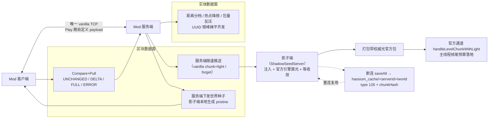

# Hassium

<p align="center">
  
</p>

**Hassium** · 高性能区块压缩与客户端区块存储模组，提供**高效压缩、网络优化、区块缓存、本地生成与光照优化**。
相对原版缩小存档与带宽、减轻进服卡顿。支持 Fabric / Forge / NeoForge，覆盖 Minecraft 1.20.1–1.21.11。

[English](README-en.md) · **简体中文**

> 仓库：[github.com/limuqy/Hassium](https://github.com/limuqy/Hassium)
> 用户文档：[GitHub Wiki](https://github.com/limuqy/Hassium/wiki) · [English Wiki](https://github.com/limuqy/Hassium/wiki/Home-en)


[](https://www.curseforge.com/minecraft/mc-mods/hassium)

---

## 特性

| 分类 | 能力 | 说明 |
| --- | --- | --- |
| **高效压缩** | 存储压缩 | 世界区块 ZSTD 落盘，存档体积显著减小；仍兼容原版 Region（`.mca`）布局 |
| | 通道压缩 | 传输通道压缩，降低带宽与下载等待；不触碰原版压缩层，无跨 mod 冲突面 |
| **网络优化** | 平滑推送 | 区块按每 tick 上限限速下发，编码与压缩后台化；进服与扩展视野不卡主线程 |
| | 实体优化 | 按距离分档降频、热点密度降频、包量反压、错峰发送；只改下发节拍，原版客户端可直接连 |
| **区块缓存** | 世界保存 | 进服区块自动落盘本地缓存，断连保存、重连复用，少传全量区块 |
| | 分段增量 | 缓存过期时只补变更方块或整段，避免整块重传 |
| | 本地生成 | 双端同版本时，大片未探索地形由本地生成，节省带宽；**服务端开启会向客户端下发世界种子** |
| | 超视渲染 | 客户端渲染距离大于服务端视距时，用本地已有地形回填视距外环带；**仅渲染，不向服务端请求**；与 Bobby 互斥 |
| | 热度淘汰 | 缓存超容量时按 region 热度自动清理旧区块 |
| | 世界导出 | `/hassiumc export` 将本地缓存导出为独立存档目录 |
| **光照优化** | 统一算光 | 客户端进程内统一计算区块光照并打包回传，加载阶段主线程不再被算光占用；启动失败自动降级 |
| | 光照剥离 | 服务端可剥离光照数据省流量，由客户端统一计算后写回 |
| | 光照缓存 | 算好的光照随区块一体落盘，重连复用，跳过重算 |
| **实用工具** | 流量监控 | `/hassium stats`（服务端）、`/hassiumc stats`（客户端）查看压缩与缓存效果 |

未安装本模组的客户端默认可连接（`compat.requireClientMod = false`）；双端都装才能吃满压缩与缓存。

---

## 支持矩阵

| Minecraft | Fabric | Forge | NeoForge |
| --- | --- | --- | --- |
| 1.20.1 | ✅ | ✅ | — |
| 1.21.1 | ✅ | ✅ | ✅ |
| 1.21.2 | ✅ | — | ✅ |
| 1.21.3–1.21.10 | ✅ | ✅ | ✅ |
| 1.21.11 | ✅ | — | ✅ |

Forge 支持 1.20.1 / 1.21.1 / 1.21.3–1.21.10（1.21.2 上游无 Forge userdev；**1.21.11 起 sunset**，该段用 NeoForge）。**1.20.1 不单独发 NeoForge 文件**：NeoForge 47.x 原生兼容 Forge mod，NeoForge 用户直接使用 Forge 版。完整七段锚点与编译矩阵见 [`docs/version-segments.md`](docs/version-segments.md)。

---

## 安装

1. 从 [Releases](https://github.com/limuqy/Hassium/releases) 下载对应加载器的 JAR。
2. 放入客户端或服务端 `mods/`。
3. 启动后生成 `config/hassium/hassium-client.toml` 与 `config/hassium/hassium-server.toml`（Fabric：Mod Menu + Cloth；Forge/NeoForge：模组列表 Cloth 配置屏，亦可手改 toml）。

**依赖：** Fabric 需 Fabric API（Cloth 已 jiJ）；Forge / NeoForge 无额外前置。建议双端均安装以启用协商压缩与缓存。

---

## 默认行为

安装后默认启用：

- 通道压缩 / 包聚合 + 区块平滑推送
- 实体优化（距离分档 / 热点降频 / 包量反压 / 错峰；原版客户端也能吃到）
- 世界保存（进服区块落盘本地缓存，断连保存、重连复用）
- 统一算光（客户端进程内计算区块光照，主线程不再被算光占用）

> 存档存储压缩（`storage.enabled`）默认关闭，仅专用服务器可开启；开启会改写区块落盘格式，请先**备份世界**。未装模组的客户端默认可连接（`compat.requireClientMod = false`）。

---

## 配置摘要

文件：`config/hassium/hassium-client.toml`、`config/hassium/hassium-server.toml`（Fabric 按物理端二选一生效；Forge/NeoForge 双 spec 亦按物理端二选一注册）。键集真相源：`ConfigSchema`。

| 键 | 默认 | 说明 |
| --- | --- | --- |
| `chunk.enabled` | `true` | 是否启用区块核心缓存 |
| `chunk.sectionDeltaEnabled` | `true` | 是否启用分段增量（服务端规划 + 客户端应用） |
| `chunk.seedGenEnabled` | `false` | 是否启用 SeedGen（本地生成 pristine 区块；需双端同版本，默认关）。服务端开启时会下发世界种子 |
| `chunk.viewDistanceExtensionEnabled` | `true` | 超视渲染 OVD（影子双窗：clientRD>serverVD 时本地源回填环带） |
| `chunk.maxRenderDistance` | `16` | 超视渲染 effective clientRD 上限 |
| `chunk.mainThreadChunkBudgetMs` | `15` | 主线程 apply 预算（ms） |
| `chunk.maxChunksPerFrame` | `6` | 每 tick 缓存读取生产上限（影子入队 + 影子读盘；主线程消费只受时间预算） |
| `chunk.maxSizeMb` | `4096` | 缓存最大容量（MB；影子端存档容量上限，超限触发热度淘汰） |
| `chunk.hotScoreThreshold` | `0.3` | 热点分数阈值（低于此值视为冷 region 文件，清理时优先淘汰） |
| `chunk.cleanupIntervalTicks` | `6000` | 清理检查间隔（刻） |
| `chunk.lightStrip` | `true` | 是否启用光照剥离 |
| `storage.enabled` | `false` | 是否启用存档压缩（默认关；区块核心缓存独立不受影响） |
| `storage.zstdLevel` | `3` | 存储 ZSTD 压缩等级 |
| `master.enabled` | `true` | 是否启用服务端网络通道（压缩/聚合/区块推送/实体优化） |
| `master.enabledOnLan` | `false` | 局域网主机是否对远程玩家启用 Hassium 网络面（握手/聚合/推送/lightStrip 等）。默认关；本机 memory 连接始终原版；storage 仍仅专用服 |
| `master.maxChunksPerTick` | `5` | 每玩家每 tick 区块下发上限：Pull FULL/DELTA 完成 + 原版通道整柱发送（满 tick ≈ 本值×20/s） |
| `master.enablePacketAggregation` | `true` | 是否启用包聚合 |
| `master.aggregationMaxWaitTimeMs` | `50` | 冲刷兜底：超过该时长（ms）未冲刷则强制冲一次（tick 尾冲刷为主，应对主线程卡顿） |
| `master.aggregationMaxSize` | `262144` | 聚合最大大小 |
| `master.compressionLevel` | `3` | 自有通道 ZSTD 压缩等级 |
| `master.compressionBlacklist` | `[]` | 第三方包 ID 的压缩/聚合排除列表（默认空）。Hassium 控制面与独立压缩通道已硬编码排除，改本列表不影响它们 |
| `master.entityTieredUpdateEnabled` | `true` | 是否按玩家距离分四档降频下发实体更新（离得越远更新越稀）。默认开；关闭后距离档表失效，密度/压力/错峰仍可独立生效 |
| `master.entityTierIntervals` | `"3,6,10,20"` | 四个距离档的实体更新间隔（刻），用逗号分隔，依次为 近/中/远/边缘；挡位边界是实体跟踪范围的 25%/50%/75%。默认 3,6,10,20（越远越稀）。数字要大不要小，须非递减；写 0 或留空用默认值 |
| `master.entityItemTierIntervals` | `"2,4,8,16"` | 掉落物与经验球的四档更新间隔（刻），逗号分隔、顺序同上，默认 2,4,8,16。物品数量多、带宽吃紧时可以把它们调稀；贴近玩家的掉落物建议不超过 3 刻，否则看起来会一跳一跳 |
| `master.entityDensityThrottleEnabled` | `true` | 是否启用区块热点降频：某个区块里实体过于密集时，对其中实体进一步加大更新间隔。默认开 |
| `master.entityDensityTierCounts` | `"32,64,96,128"` | 每档热点阈值：实体所在区块的活跃实体数达到该值时，该档的间隔按对应倍率放大。逗号分隔按 近/中/远/边缘，默认 32,64,96,128，写 0 或留空用默认值 |
| `master.entityDensityTierFactors` | `"1.0,1.5,2.0,3.0"` | 每档热点倍率：达到上面阈值后间隔乘多少倍，逗号分隔按 近/中/远/边缘，默认 1.0,1.5,2.0,3.0（1.0 = 该档不放大）。支持小数；小于 1 按 1 处理；乘上压力倍率后再受 entityMaxThrottleFactor 限制 |
| `master.entityMaxThrottleFactor` | `4` | 热点倍率与压力倍率相乘后的总上限（默认 4），用来兜住最坏情况；调大 = 密集时降得更狠 |
| `master.entityFrameBudgetPerPlayer` | `128` | 每个玩家每 tick 期望收到的实体更新包数（默认 128）。某个玩家持续超过这个量时，他视野内的实体更新会自动变稀，避免卡顿；0 = 不做这个自动限制 |
| `master.entitySmoothPushEnabled` | `true` | 实体错峰推送：同一更新间隔的实体按 UUID 稳定错开发送时刻，3 刻总量不变但不再齐发尖峰。默认开；关闭后退回原版齐发 |
| `compat.requireClientMod` | `false` | 是否强制要求客户端安装 Hassium |
| `compat.autoDowngradeOnError` | `true` | 出错时是否自动降级 |
| `debug.*` | 多为 `false` | 分类调试日志（默认安静；`networkMetricsAutoReset` 默认 `true`） |

说明列与 TOML 内注释同源（`ConfigSchema`）。完整键表见 [配置](https://github.com/limuqy/Hassium/wiki/Configuration) 与 [`docs/config-audit.md`](docs/config-audit.md)。

---

## 命令

| 命令 | 说明 |
| --- | --- |
| `/hassium stats` | 服务端统计（OP 2） |
| `/hassium stats reset` | 重置计数器 |
| `/hassium stats toggle` | 开关统计 |
| `/hassium metrics on\|off` | 开关指标 |
| `/hassiumc stats` | 客户端统计（缓存命中 / 光照 / 节省） |
| `/hassiumc export [<服务器IP>] [seed]` | 拷贝影子端 `world` 到 `hassium_exports/<cacheId>`（`level.dat` 由影子端原版写出）；也可把该目录复制到 `saves/` |

---

## 工作原理（简图）


```mermaid
flowchart LR
    client["Mod 客户端"] <-->|"唯一 vanilla TCP<br/>Play 期自定义 payload"| server["Mod 服务端"]
    subgraph 区块数据面
        push["服务端限速推送<br/>（vanilla chunk+light / forget）"]
        pull["Compare+Pull<br/>UNCHANGED / DELTA / FULL / ERROR"]
        seed["服务端下发世界种子<br/>影子端本地生成 pristine"]
    end
    subgraph 实体数据面
        ent["距离分档 / 热点降频 / 包量反压<br/>UUID 错峰摊平齐发"]
    end
    shadow["影子端（ShadowSeedServer）<br/>注入 + 官方引擎算光 + 等收敛"]
    pack["打包带权威光官方包"]
    apply["官方通道 handleLevelChunkWithLight<br/>主线程帧尾预算落地"]
    save["断连 saveAll → hassium_cache/&lt;serverId&gt;/world<br/>type 126 + chunkHash"]

    server --> push --> shadow
    client --> pull --> server
    server --> seed --> client
    server --> ent
    shadow --> pack --> apply
    shadow -.-> save
    save -.->|"重连复用"| shadow
```

细节见 [`docs/architecture.md`](docs/architecture.md)。

---

## 从源码构建

需要 JDK 17+（部分新版本需更高 Java，见对应 `versionProperties`）。

```bash
./gradlew build
./gradlew build "-Pmc_ver=1.21.1"   # PowerShell 必须给 -Pmc_ver 加引号
./gradlew :fabric:runClient
./gradlew :forge:runServer
```

开发者入口：[`AGENTS.md`](AGENTS.md)。

---
## 用户文档

安装、完整配置、命令、功能说明、兼容性与排查见 [GitHub Wiki](https://github.com/limuqy/Hassium/wiki)。

| 页面 | 内容 |
| --- | --- |
| [安装](https://github.com/limuqy/Hassium/wiki/Installation) | 下载、前置和各加载器差异 |
| [配置](https://github.com/limuqy/Hassium/wiki/Configuration) | 完整配置项表与 GUI 路径 |
| [命令](https://github.com/limuqy/Hassium/wiki/Commands) | `/hassium` 与 `/hassiumc` 命令参考 |
| [特性](https://github.com/limuqy/Hassium/wiki/Features) | 缓存、分段增量、光照优化等功能详解 |
| [世界导出](https://github.com/limuqy/Hassium/wiki/World-Export) | 客户端缓存导出为存档的使用说明 |
| [兼容性](https://github.com/limuqy/Hassium/wiki/Compatibility) · [排查](https://github.com/limuqy/Hassium/wiki/Troubleshooting) | 与其他模组并用和诊断路径 |


---

## 开发文档

| 文档 | 内容 |
| --- | --- |
| [`docs/architecture.md`](docs/architecture.md) | 能力总览与场景、直连拓扑、模块架构、客户端数据流、存储格式、配置、日志、命令 |
| [`docs/chunk-cache.md`](docs/chunk-cache.md) | 区块缓存推送（ShadowPull 统一 Compare+Pull）、磁盘 NBT（§11）、导出（§12） |
| [`docs/client-chunk-light-flow.md`](docs/client-chunk-light-flow.md) | 客户端收包 → apply → 光照落地全链路 |
| [`docs/chunk-load-optimization.md`](docs/chunk-load-optimization.md) | 进服/重连加载路径与速率锚点 |
| [`docs/version-segments.md`](docs/version-segments.md) | 多版本七段适配真相源 |
| [`docs/mod-compat.md`](docs/mod-compat.md) | 多 Mod 兼容边界与配置逃生 |
| [`docs/config-audit.md`](docs/config-audit.md) | 配置项审计 |
| [`docs/runtime-smoke-test.md`](docs/runtime-smoke-test.md) | 运行时冒烟（L0–L2、PROBE、场景引擎） |

---

## 许可证

[GPL-3.0-or-later](LICENSE)
