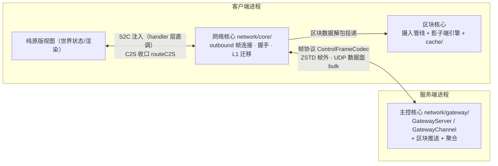
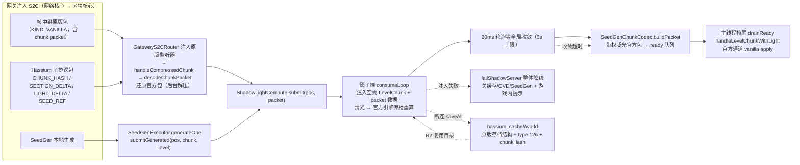

# Hassium 架构与功能说明

本文档是项目**能力总览（普通玩家/服主视角）+ 模块架构与配置运维（技术视角）**的权威说明。多版本适配见 [`version-segments.md`](version-segments.md)；区块缓存推送流水线见 [`chunk-cache.md`](chunk-cache.md)。

## 1. 这是什么

Hassium 是 Minecraft 多加载器模组（Fabric / Forge / NeoForge），围绕「**更小的网络传输 + 更快的本地加载**」优化存档与区块传输。对应 [README 特性表](../README.md) 的五大能力类：

- **高效压缩** —— 存储压缩、网络压缩
- **网络优化** —— 平滑推送、网关帧协议、L1 无感迁移（切换 outbound + 续流票据）
- **区块缓存** —— 影子端世界保存（进服区块统一由进程内影子服务端落盘原版存档）、超视渲染、世界导出
- **光照优化** —— Hassium 引擎（影子端统一算光 + 官方通道回传）、光照剥离、并行光照、同步光照
- **实用工具** —— 流量监控、本地生成（SeedGen）

目标版本：Minecraft **1.20.1–1.21.11**（九段适配，见 version-segments）。Forge 仅 **1.20.1 / 1.20.6**。

## 2. 解决什么问题（场景举例）

| 场景 | 原有问题 | 本模组怎么解 |
|------|----------|--------------|
| 进服/探图，区块一直转圈 | 服务端推全量区块包，带宽慢、主线程卡 | **网络压缩 + 平滑推送**：ZSTD 替代 Zlib，每 tick 限速推送、encode/压缩/发送全部后台化；进服首波不再卡主线程 |
| 重连服务器 / 再次进入同一区域 | 同一片区域又要重新下载一遍 | **影子端世界保存**：进服区块统一由进程内影子服务端（完整 MinecraftServer）算光并落盘原版存档（`hassium_cache/<serverId>/world`），断连保存、重连复用 |
| 缓存过期（服务器里东西变了） | 整块重传 | **分段增量**：按 section 比对，只补变更的分段 |
| 服务器视距小，远处白茫茫 | 客户端想渲染更远，但服务端不推 | **超视渲染**：用本地缓存回填视距外环带（仅渲染，不向服索要） |
| 光照数据占传输大头 | 每个区块包都带一整柱光照 | **光照剥离 + Hassium 引擎**：服务端剥光（握手协商），由客户端进程内影子服务端统一计算光照并打包官方区块包，经官方通道回传落地 |
| 大片未探索地形（pristine 区块） | 服务端也要逐块生成并传输 | **本地生成（SeedGen）**：服务端只发几十字节的引用（seed + 坐标），客户端用同 seed 本地生成，零传输生成区块 |
| 主控服务器网络抖动 | 直接断线回大厅 | **网络核心无感迁移**：主控故障/断流时由 L1 迁移引擎切换 outbound 连接，持续流票据在新主控续流，区块缓存/进度无感延续 |

## 3. 谁适合启用

- **普通玩家**：装上即用。默认全开：网络压缩、影子端世界保存、分段增量、超视渲染、光照剥离/缓存/同步模式、Hassium 引擎（进程内影子服务端统一算光与保存）。无需配置。
- **服主**：`storage.enabled`（存储压缩）**默认关**——开启会改写存档格式（type 126），**启用前请备份世界**；`chunk.seedGenEnabled` 默认关——本地生成需要**双端同版本**且客户端开同项，pristine 区块才走本地生成，否则自动回退全量推送。
- **公网部署（UDP 数据面/网关）**：默认端点是 `127.0.0.1`，仅本机可用；必须把 `dataplane.udpListeners[*].reachableEndpoints` 改为公网可达地址并放行 UDP 端口（网关监听端口取 `master.controlReachableEndpoints[0]`，兜底 25566），见 §13。

---

# 技术细节（面向有运维能力的服主与开发者；普通玩家可跳过）

## 4. 2.0.0 三核心

2.0.0 起按**进程归属**划分三个功能核心（命名体系见 `.omp/workflows/docs-2.0/work/domain-naming.md`；类名/包名/配置键一律不改，仅文档术语）：

| 核心 | 进程 | 职责 | 代码范围 |
|------|------|------|----------|
| **网络核心**（Network Core） | 客户端 | 进程内网关：outbound 帧连接、握手、L1 迁移引擎、UDP 数据面启停、ViaFabric 桥 | `network/core/` |
| **区块核心**（Chunk Core） | 客户端 | 区块摄入管线 + 缓存 + 超视渲染 + 本地生成；**影子端**（`network/seedgen/`）= 其后端引擎（生成/算光/落盘/淘汰） | `network/` 顶层摄入管线 + `network/seedgen/` + `cache/` |
| **主控核心**（Master Core） | 服务端 | 网关接入 + 区块推送 + 压缩/聚合 | `network/gateway/` + `ServerChunkPushManager` / `ChunkSender` + `ZstdPipelineSwitcher` / `HassiumAggregationManager` |

存储（`storage/` / `compression/`）、UDP 数据面（`network/dataplane/`）、配置/指标/兼容等为**支撑域**，不立核心名。

### 数据路径总览

客户端与主控的通信由网络核心接管：原版 Connection（世界侧壳连接）仅保留 keep-alive，PLAY 期数据全经**帧协议**（`ControlFrameCodec`：varint 帧长 + type + payload，纯 Netty 零 MC 依赖）走 outbound ↔ 主控 `GatewayServer`。



**注入**：主控 S2C 推送经 `GatewayChannel.sendS2CPayload` → `PACKET_S2C` 帧 → 客户端 outbound 解码 → `GatewayS2CRouter`（注册于 `NetworkCore.registerS2CInjector`）注入原版监听器 handler 层直调（`ClientPacketListener.handleXxx`，区块走 `handleLevelChunkWithLight` vanilla apply）；客户端 C2S 由 `MixinConnection` 截获 → `NetworkCore.routeC2S` 编码进 `PACKET_C2S` 帧。**切换主控只换 outbound，注入/路由不动**。

**续流**：迁移时 `MigrationEngine` 签发 `ResumeTicket`（HMAC-SHA256 签名 + epoch 防重放）随握手请求续流；主控 `ResumeTicketValidator` 验签通过 → `ServerChunkPushManager.markPlayerResumeActive` → 推送断点续流，区块缓存直接续用（`resumeAccepted=true`）；验票失败则会话待登录桥附着。

**迁移**：`NetworkCoreState` 状态机（IDLE/CONNECTING/HANDSHAKING/ACTIVE/MIGRATING）。触发 = 故障（outbound 心跳静默超时 `master.migrationFaultTimeoutMs`）或策略（TPS/负载/维护窗口，`MigrationPolicy`）；执行 = `PrewarmSession` 预连就绪后无缝切换或直连切换，详见 §12.6。

网络核心未达项交接见 [`network-core-followups.md`](network-core-followups.md)（后续波）。

## 5. 模块结构

```
Hassium/
├── common/              # 共享逻辑（合并进各加载器源码集编译）
├── fabric/ / forge/ / neoforge/
├── versionProperties/   # 每 MC 版本 builds_for、依赖版本
└── buildSrc/            # architectury-loom + Manifold
```

依赖方向：`common` ← 加载器模块。平台差异通过 `platform/services/` + ServiceLoader。

### 包地图（common）

| 包 | 职责 |
|----|------|
| `storage/`（存储域） | `HassiumChunkWriteBuffer`（type 126 payload 写缓冲）、`ShadowStorageHashes`（进程内 chunkHash/光脏桥）；type 126 压缩由 `compression/CompressionService` 收口 |
| `compression/`（存储域） | `CompressionCodec` / `CompressionService`、字典注册 |
| `network/`（**主控核心**） | 服务端网络与推送：握手（`HassiumHandshake` / `PreHandshakeProtocol` / `SeedGenTail`）、管线 ZSTD 与聚合（`ZstdPipelineSwitcher` / `ZstdNegotiationTracker` / `HassiumAggregationManager`）、chunkHash / section-delta / light-delta / BlockEntity 推送、`ServerChunkPushManager` / `ChunkSender` / `ServerLoadReporter`、续流票据（`ResumeTicket` / `ResumeTicketValidator`） |
| `network/seedgen/`（区块核心 = 影子端后端引擎） | 影子端：`ShadowSeedServer` / `ShadowLightCompute` / `ShadowServerRegistry` / `SeedGenLevelCompat` / `SeedGenChunkCodec` / `SeedGenQueue` / `SeedGenExecutor` / `ShadowCacheEviction` / `OvdLocalGenerator` |
| `network/dataplane/`（数据面，支撑域） | UDP 数据面：`DataPlaneUdpServer` / `DataPlaneClientBundle` / `ReliableDatagramSession` / `UdpBulkRouter` / `ControlFailoverHandler` / `DataPlaneFrame` / `Hkdf` 等 |
| `network/core/`（**网络核心**） | 客户端进程内网关：`NetworkCore`（状态机 `NetworkCoreState`：IDLE/CONNECTING/HANDSHAKING/ACTIVE/MIGRATING）、`GatewayS2CRouter`（S2C 注入器）、`GatewayPacketCodec`（帧内原版/Hassium 子协议编解码）；`core/outbound/` outbound 帧协议（`OutboundConnection` / `ControlFrameCodec` / `HandshakeCodec` / `UdpDataPlane`）；`core/migration/` L1 迁移引擎（`MigrationEngine` / `MigrationPolicy` / `PrewarmSession` / `IdleWindowDetector` / `MigrationEndpoint`）；`core/viafabric/`（`ViaFabricCompat` / `ViaDecodeBridge`） |
| `network/gateway/`（**主控核心**） | 服务端网关接入：`GatewayServer`（帧监听）/ `GatewayChannel`（帧连接，outbound 对称端）/ `GatewayPlayerSession` / `GatewayPlayerRegistry` / `GatewayServerInfoProvider` / 登录桥（`LoginPayloadSink` / `C2SPayloadSink`） |
| `network/ClientChunkHandler` → `ClientChunkPipeline`（区块核心） | 客户端区块摄入管线的门面与状态容器（Phase 0 隔离：storage / pending hash / SeedGen 握手信息全收拢为单例状态）；S2C 区块数据由网络核心经网关帧注入原版监听器后 handler 层直调 |
| `cache/`（区块核心） | 客户端侧轻量设施：`ChunkContentHashUtil`（section hash 算法）；`cache/client/` OVD 超视渲染（`ViewDistanceExtensionService` / `IClientLevelExtension`）、主线程预算（`ClientMainThreadBudget`）、Bloom（`ChunkBloomFilter`）、生命周期（`ClientLifecycleHelper`）；**缓存存储与清理由影子端承担**（`seedgen/ShadowSeedServer` 存档 + `seedgen/ShadowCacheEviction` 热度淘汰，heat.idx 按服务器分离） |
| `config/` / `metrics/` / `compat/` / `mixin/`（支撑设施） | `HassiumConfigService` 门面（Fabric：`FabricTomlConfigIO`；Forge/NeoForge：`ModConfigSpec`）；`NetworkStats` 零分配指标（`HassiumMetricsImpl`）；Manifold 跨版本 API 桥接；全部 Mixin（common only） |
| `migration/` / `api/`（支撑设施） | 存档迁移工具（`MigrationTool`）与对外 API（`HassiumApi` / `HassiumCapabilities`） |

## 6. 客户端区块数据流

**影子端架构**：客户端进程内运行一个完整 `MinecraftServer`（`ShadowSeedServer`，专用线程驱动主循环），统一承担**世界保存（缓存）+ 光照计算 + 打包官方区块包**。2.0.0 起所有 Hassium 数据经**网络核心网关帧**进入客户端：S2C 由 `GatewayS2CRouter` 注入原版监听器（handler 层直调），区块数据解包后与 SeedGen 生成一样投递影子端（区块核心后端引擎）算光，再把带权威光的官方区块包经官方通道 apply；客户端本身不再读写缓存、不再计算光照，只保留注入直调 + 官方通道 apply。



要点：

- **统一汇合**：网关注入的原版包/Hassium 子协议包（`GatewayS2CRouter` → handler 直调 → `handleCompressedChunk` → `decodeChunkPacket` 还原官方 `ClientboundLevelChunkWithLightPacket`）与 SeedGen 生成区块（`submitGenerated`）全部投递 `ShadowLightCompute`（任意线程可投，同柱 REPLACE 覆盖）；服务端未装 MOD（无网关/Hassium 通道）时走原版直发，影子端不启动，光随包自带
- **出站收口**：PLAY 期客户端 C2S 由 `MixinConnection` 截获 → `NetworkCore.routeC2S` → `GatewayPacketCodec` 编码进 `PACKET_C2S` 帧经 outbound 发往主控 `GatewayChannel`（主控按会话 sink 分发）；世界侧壳连接仅 keep-alive 响应走 vanilla TCP
- **影子端算光**：`injectChunk` 建空壳 `LevelChunk` + `replaceWithPacketData` 填数据 + 清光（`queueSectionData(null)`）→ 官方 `ThreadedLevelLightEngine` 传播重算（与区块生成后算光同款逻辑，无特殊机制）；`SeedGenExecutor.generateOne` 生成的区块走 `submitGenerated` 同链
- **收敛等待**：后台单循环注入全部 → 20ms 轮询等全局收敛（5s 上限）→ `SeedGenChunkCodec.buildPacket` 打包（带权威光）入 ready；**收敛超时仍打包直推**（数据完整、光欠由后续传播/相邻块补齐——客户端不参与光照计算）
- **官方通道落地**：主线程帧尾 `drainReady` 直接调 `connection.handleLevelChunkWithLight`（原版 apply 路径）；预算化由 `MixinVanillaChunkApplyBudget` 原样生效
- **世界保存**：断连 `saveAll()`（`ChunkSerializer.write` → `chunkMap.write` → IOWorker）落盘 `hassium_cache/<serverId>/world`（**原版存档结构**，非旧 HBT1 客户端缓存；数据不迁移）。影子端固定走 Hassium 服务端压缩存储（type 126 + chunkHash，`MixinRegionFile` shadow 上下文 gate）；重连复用目录。热度索引 `heat.idx` 随 saveAll 落盘（`ShadowCacheEviction.save`），装配时加载（跨会话累计）
- **失败语义**：**注入失败 = 握手失败等价**——`failShadowServer` 整体降级（关闭缓存/超视渲染/SeedGen + 游戏内提示），不做逐柱兜底；旧链 `MixinLightRecompute` 仅覆盖非影子模式（引擎关闭/服务端未剥光）的空光块
- **缓存清理**（`ShadowCacheEviction`）：容量上限（`chunk.maxSizeMb` 等 7 键）超限后按热度（`hotScore = recencyWeight·1/(1+ageTicks) + frequencyWeight·1/(1+accessCount)`）淘汰冷区块——`chunkMap.write(pos, null)` 逐柱删除（offset 置 0 + 释放扇区），仅删不在 `injectedChunks`（本会话使用中）的磁盘残留；客户端主线程帧尾节流驱动（`chunk.cleanupIntervalTicks`），扫描/删除在后台池

## 7. 存储格式

外层保持原版 Anvil（`.mca`，32×32，2-sector header）：

```
Sector 0:     Offset Table
Sector 1:     Timestamp Table（原版）
Sector 2+:    [length(4)][type=126][magic 0x48][hash(8)][ZSTD 压缩数据]
```

- **无** HassiumEnvelope / HSM1 / type 127 运行时写入（127 仅作未来原版 scheme 迁移规划）
- 服务端：`MixinRegionFile`（需 `storage.enabled`；仅专用服务器写，单人/局域网保持原版格式，读兼容）
- **影子端**（客户端进程内世界后端）：固定写 Hassium 格式（type 126）——`MixinRegionFile` 写 gate 在 shadow 上下文放行，payload 带 chunkHash（存储桥 `ShadowStorageHashes` 提供）；落盘目录 `hassium_cache/<serverId>/world`（原版存档结构，非旧 HBT1 客户端缓存）
- 旧客户端缓存（`ClientHassiumStorage` / HBT1 磁盘缓存 / `HassiumRegionFile` 等）**已裁剪**；数据不迁移
- 客户端辅存：`heat.idx`（影子端热度索引，`hassium_cache/<serverId>/heat.idx` 按服务器分离；容量/热度淘汰用）
- 字典缺失时拒绝写入 Hassium payload，回退原版

## 8. 网络压缩

| 能力 | 说明 | 默认 |
|------|------|------|
| 网关帧协议 | 客户端 outbound（网络核心）↔ 主控 `GatewayServer`（主控核心）的 TCP 控制面（`ControlFrameCodec`：varint 帧长 + type + payload，纯 Netty 零 MC 依赖）；ZSTD 装于帧协议之外（握手协商后 `OutboundConnection.installZstd` / `GatewayChannel.installZstd`） | 网络核心路径 |
| 自定义通道 | `hassium:*` ZSTD 传区块等（经网关帧中继可达） | `net.enabled=true` |
| 全局包压缩 | Pipeline 替换原版 Zlib（主控侧 vanilla 路径；网关通道复用其阈值/等级） | `master.globalPacketCompression=true` |
| 上下文 / magicless | 提升压缩比 | 均默认启用 |
| 包聚合 | 仅主控侧 vanilla 路径（`MixinConnection` 仅对 `ServerGamePacketListenerImpl` 生效）；网关通道不聚合 | `master.enablePacketAggregation=true` |
| 紧凑包头 | 聚合包内 `CompactHeaderCodec`（主控侧） | 默认启用 |
| 平滑推送 | 每 tick 提交上限限速（`master.maxChunksPerTick=5`，满 tick ≈ 100/s，掉刻时每 tick 提交量不变、每秒总量自然下降保护主线程）；encode/压缩/hash/发送全后台（1.21.2+ 主线程仅 build，<1.21.2 全后台） | 默认启用 |
| UDP/KCP 数据面 | 网关↔主控通道的 bulk 载体：每个 `udpListeners` 项建立独立 KCP session；按 `weight` 加权轮询发送 S2C bulk，异常时自动回落帧连接；握手尾 `udpTail.hasUdpDataplane()` 触发客户端 `UdpDataPlane.start` | `dataplane.enabled=false`（默认关；默认端点仅本机可用） |
| 网关控制恢复（L1 迁移） | outbound 心跳静默超时（`master.migrationFaultTimeoutMs`=60000）或策略（TPS/负载/维护窗口）触发切换；`ResumeTicket` 续流票据（HMAC-SHA256 + epoch 防重放）验签后续流；服务端 failover permit 链保留（`controlStallMs`/`failoverExpiryMs` 键已删，`ControlFailoverHandler` 引用固定常量 6000/30000） | 迁移引擎默认开启 |

控制面（握手、index sync、chunkHash 等）在压缩黑名单，不进 PENDING 聚合缓冲，也不走 UDP 数据面；UDP 只承载 Bind 后的 S2C bulk，网关帧连接即控制连接。聚合仅主控侧 vanilla 路径，网关通道不聚合；客户端↔世界侧壳连接不再承载 Hassium 压缩/聚合数据流。多通道的早期裸 TCP PoC 已退役（归档）；运行时验证见 [`runtime-smoke-test.md`](runtime-smoke-test.md#网关双主控迁移冒烟t7)「网关双主控迁移冒烟（T7）」节。

## 9. 配置默认值（安全与行为）

配置文件：

- `config/hassium/hassium-client.toml` — 仅物理客户端（缓存与客户端网络应用项）
- `config/hassium/hassium-server.toml` — 客户端与专用服（存储、服务端网络、兼容与调试）

游戏内编辑：
- **Fabric**：Night Config 自管 toml + jiJ **Cloth**；安装 **Mod Menu** 即可打开。不依赖 FCAP / Configured。
- **Forge / NeoForge**：原生 ConfigSpec + jiJ **Cloth**（模组列表「配置」按钮）；亦可手改 toml。Configured 仍可选。Forge **1.20.6** 因与 NeoForge 共用 `ModConfigSpec`，仅该端保留 FCAP Forge 桥接。

各项 GUI 文案见 `assets/hassium/lang/*`；toml 注释仍为中文。

| 项 | 默认 | 说明 |
|----|------|------|
| `storage.enabled` | **false** | 默认关；开启后存档 ZSTD（type 126）；**启用前请备份世界**。仅专用服务器写（单人/局域网保持原版格式，读兼容） |
| `storage.zstdLevel` | 3 | 存储压缩等级 |
| `chunk.enabled` | true | 客户端区块缓存总开关 |
| `chunk.sectionDeltaEnabled` | true | 缓存过期时分段增量（关则过期走全量） |
| `chunk.viewDistanceExtensionEnabled` | true | 超视渲染（依赖 chunk.enabled；与 Bobby 互斥） |
| `chunk.maxRenderDistance` | 16 | 运行时有效 RD / 超视渲染环带上限（2–64） |
| `chunk.ovdUnloadDelaySecs` | 5 | 超视渲染离开环带后延迟卸载秒数（0=同步卸载） |
| `chunk.mainThreadChunkBudgetMs` | 15 | 客户端主线程 apply 预算（ms） |
| `chunk.seedGenThreads` | 2 | 本地区块生成线程数（固定平台线程池；0=禁用本地生成，SeedRef 一律回退全量） |
| `chunk.hassiumEngineEnabled` | **true** | Hassium 引擎（非网络向功能总开关）：进服启动进程内影子服务端（完整 MinecraftServer）统一承担**世界保存（缓存）+ 区块光照计算 + 打包官方区块包**（官方通道回传）。启动失败自动降级：客户端缓存/超视渲染/SeedGen 关闭并游戏内提示，仅保留网络向优化；false=不启动（此时服务端不剥光——剥光在握手协商，光照随包自带） |
| `chunk.ovdLocalGeneration` | false | 超视渲染本地生成：超视渲染区域缓存 miss 时用 Hassium 引擎按服务端世界种子本地生成区块（与服务器地形一致）并存入本地缓存；无种子（服务端未装 MOD）时自动关闭生成 |
| `chunk.seedGenEnabled` | **false** | 本地区块生成（双端同版本，默认关）。服务端对 pristine 区块发 SeedRef 替代区块数据；客户端本地生成，失败/超时回退全量 |
| `chunk.lightStrip` | true | 光照剥离：服务端发包带空 lightMask；实际剥光由握手协商门控（客户端声明 `lightComputeSupported` 才剥，否则光随包自带） |
| `net.enabled` | true | 客户端网络核心总开关（进程内网关与优化通道） |
| `net.metricsEnabled` | false | 客户端网络指标 |
| `master.enabled` | true | 服务端网络通道总开关 |
| `master.globalPacketCompression` | true | 全局 ZSTD（主控侧 vanilla 路径） |
| `master.compressionLevel` | 3 | 网络压缩等级（速度优先） |
| `master.maxChunksPerTick` | **5** | 每玩家每 tick 提交上限（1.21.2+ 为主线程序列化上限，1.20.x/1.21.1 为后台提交上限；发送速率 = 本值 × tick 节奏，满 tick ≈ 100/s） |
| `master.metricsEnabled` | false | 服务端网络指标 |
| `master.controlReachableEndpoints` | `[]` | 网关监听/outbound 端点（`endpoints[0]` 即网关端口，兜底 25566） |
| `master.migrationFaultTimeoutMs` | 60000 | L1 迁移故障静默超时（faultTimeout，ms）；客户端 failover 已退役 |
| `dataplane.enabled` | **false** | 启用 UDP/KCP 数据面（网关↔主控通道的 bulk 载体）；关后不启动 UDP listener、不广告端点 |
| `compat.requireClientMod` | false | 无模组客户端可连 |
| `debug.*` | 全 false | 调试分类日志，见 §10 |

`master.controlReachableEndpoints`（`host:port` 列表）是主控核心的**网关监听地址源**——`resolveBindPort` 取 `endpoints[0]` 端口（0<port<65536 时使用），否则兜底 `GatewayPlayerBridge.DEFAULT_GATEWAY_PORT=25566`；并兼作网络核心 outbound 的地址源（L1 迁移引擎）。`dataplane.udpListeners` 是服务端 UDP socket 与其客户端可达地址的列表；每项为 `{ bindHost, bindPort, weight, reachableEndpoints }`，其中 `reachableEndpoints` 为 `{ host, port, priority }` 列表。`bindHost` 只在服务端绑定，绝不下发给客户端；公网服必须把默认的 `127.0.0.1:25565` 改成客户端实际可达的 UDP 地址，并放行对应 UDP 端口。

## 10. 日志策略

正常加载路径默认安静：仅少量生命周期 INFO（初始化、字典加载、握手摘要、管道切换、断开清理）。

热路径（收发包、命中/未命中、压缩大小等）走 `DebugLogger`，由 `debug.*` 控制：

| 配置键 | 含义 |
|--------|------|
| `debug.metadataLogging` | chunkHash / 元数据比对 |
| `debug.dispatcherLogging` | 主线程调度 |
| `debug.asyncLogging` | 异步任务（含 SeedGen 生成/超时） |
| `debug.compressionLogging` | 压缩/解压 |
| `debug.chunkApplyLogging` | 区块 apply |
| `debug.networkLogging` | 网络收发 |
| `debug.cacheLogging` | 缓存读写 |

ERROR / WARN 始终输出。

## 11. 命令与监控

| 命令 | 侧 | 说明 |
|------|-----|------|
| `/hassium stats` | 服务端 | 压缩/发送统计（需 OP 2） |
| `/hassium metrics on\|off` | 服务端 | 运行时开关指标 |
| `/hassium stats reset` | 服务端 | 重置计数器 |
| `/hassiumc stats` | 客户端 | 接收/缓存命中/超视渲染/光照/区块加载（新增/过期/**本地生成**）统计 |
| `/hassiumc export [<服务器IP>] [seed]` | 客户端 | 导出本地缓存为 `saves/` 下原版 Anvil 世界 |

实现：`metrics/NetworkStats`（`AtomicLong`，可关闭）。指标关闭时相关 stats 命令不可用。导出走 `CacheWorldExporter`（异步，见 `chunk-cache.md` §12）。

客户端 stats 的「区块加载」行口径：`新增` = 无本地缓存的全量请求；`过期` = 缓存过期/技术性回退；`本地` = SeedGen 影子服务端本地生成（等价一次全量请求，带宽节省按 16KB/chunk 原版 Zlib 等价计入）。

## 12. 卖点特性（已实现摘要）

按大类组织：**高效压缩 / 网络优化 / 区块缓存 / 光照优化 / 实用工具**。

### 12.1 高效压缩

| 特性 | 配置 / 命令 | 要点 | 详文 |
|------|-------------|------|------|
| **存储压缩** | `storage.enabled`（默认 false，仅专用服）、`storage.zstdLevel`（3） | chunk payload ZSTD 落盘 type 126；外层 Region 不变；启用改写落盘格式需备份 | [`chunk-cache.md`](chunk-cache.md) |
| **网络压缩** | `net.enabled`（客户端网关）、`master.globalPacketCompression`、`master.compressionLevel`、`master.enablePacketAggregation` | `hassium:*` 通道 ZSTD + 可选全局管道替换 Zlib + 聚合/紧凑包头/上下文压缩 | [`chunk-cache.md`](chunk-cache.md) |

### 12.2 网络优化

| 特性 | 配置 / 命令 | 要点 | 详文 |
|------|-------------|------|------|
| **平滑推送** | `master.maxChunksPerTick`（5）、`master.serverChunkPushThreads` | 每 tick 提交上限限速（满 tick ≈ 100/s，掉刻自然降速保护主线程；主线程峰值 ≤8ms/tick）；encode/压缩/hash/发送全在推送池——1.21.2+ 主线程仅 build（对齐原版，ThreadingDetector 约束），<1.21.2 全后台 | [`chunk-cache.md`](chunk-cache.md)、[`runtime-smoke-test.md`](runtime-smoke-test.md) |
| **网关帧协议** | 无专属配置键（网关端口 = `master.controlReachableEndpoints[0]`，兜底 25566） | 客户端 outbound（网络核心）↔ 主控 `GatewayServer`（主控核心）的 TCP 控制面：varint 帧长 + type + payload；ZSTD 装于帧协议之外（握手协商后安装）；S2C 推送经 `PACKET_S2C` 帧回传，C2S 经 `PACKET_C2S` 帧收口 | §4、§8 |
| **L1 迁移（无感续流）** | `master.migrationFaultTimeoutMs`（默认 60000 = 故障静默超时） | 主控故障/断流时切换 outbound 至新主控：`PrewarmSession` 预连 + `ResumeTicket` 续流票据（HMAC-SHA256 + epoch 防重放）→ 主控 `ResumeTicketValidator` 验签 → `markPlayerResumeActive` 推送续流；无需重进世界，区块缓存直接续用；策略触发（TPS/负载/维护窗口）见 §12.6 | [`runtime-smoke-test.md`](runtime-smoke-test.md#网...
| **多通道数据面（历史）** | 早期 `DataPlanePoCConfig` | 1.20.1 Fabric 的双裸 TCP PoC 已退役，不是生产配置或运维入口 | [`archive/multi-channel_network_research.md`](archive/multi-channel_network_research.md) |

### 12.3 区块缓存

| 特性 | 配置 / 命令 | 要点 | 详文 |
|------|-------------|------|------|
| **影子端世界保存** | `chunk.enabled`（默认 true） | 进服区块统一由进程内影子服务端（完整 MinecraftServer）落盘原版存档（`hassium_cache/<serverId>/world`，type 126 + chunkHash），断连保存、重连复用；旧 HBT1 客户端磁盘缓存已裁剪 | [`chunk-cache.md`](chunk-cache.md) |
| **容量/热度淘汰** | `chunk.maxSizeMb`、`chunk.hotScoreThreshold`、`chunk.recencyWeight`、`chunk.frequencyWeight`、`chunk.cleanupIntervalTicks`、`chunk.targetSizeMb`、`chunk.minCleanupBatchSize` | 影子端存档超限后按热度淘汰冷区块（heat.idx 跨会话累计；`chunkMap.write(pos,null)` 逐柱删除；仅删非本会话使用中的磁盘残留） | [`chunk-cache.md`](chunk-cache.md) |
| **分段增量** | `chunk.sectionDeltaEnabled`（默认 true） | MISMATCH 时按 section 比对，仅补变更分段 + BE 覆盖；失败/超时回退全量 | [`chunk-cache.md`](chunk-cache.md) §11.5 |
| **超视渲染** | `chunk.viewDistanceExtensionEnabled`、`chunk.maxRenderDistance`、`chunk.ovdUnloadDelaySecs` | 多人、clientVD>serverVD 时本地缓存回填环带；Forget 原地 renderOnly；不向服索要视距外区块/BE | [`chunk-cache.md`](chunk-cache.md) §10 |
| **OVD 本地生成** | `chunk.ovdLocalGeneration`（默认 false） | 超视渲染区域缓存 miss 时用 Hassium 引擎按服务端世界种子本地生成区块（与服务器地形一致），renderOnly 落地并存入本地缓存；无种子（服务端未装 MOD）时自动关闭生成 | [`chunk-cache.md`](chunk-cache.md) §10 |
| **世界导出** | `/hassiumc export [<服务器IP>] [seed]` | 影子端世界目录整体拷贝 → `hassium_exports/<cacheId>`（保留 type 126 + chunkHash；原版翻译后续提供） | [`chunk-cache.md`](chunk-cache.md) §12 |

### 12.4 光照优化

| 特性 | 配置 / 命令 | 要点 | 详文 |
|------|-------------|------|------|
| **光照剥离** | `chunk.lightStrip`（默认 true） | 服务端发包带空 lightMask（构造近零成本）；剥光在握手协商——仅客户端声明引擎可用（`lightComputeSupported` = `hassiumEngineEnabled`）时才剥，否则光随包自带 | [`chunk-cache.md`](chunk-cache.md)、[`runtime-smoke-test.md`](runtime-smoke-test.md) |
| **引擎光照** | `chunk.hassiumEngineEnabled`（默认 true） | 影子端统一算光：所有区块数据（压缩通道/SeedGen 生成）投递 `ShadowLightCompute` → 影子服务端注入（空壳 + packet 数据 + 清光 → 官方引擎传播重算，与区块生成后算光同款）→ 20ms 轮询等收敛（5s 上限）→ 打包带权威光官方包 → 主线程帧尾 `drainReady` 经官方通道（`handleLevelChunkWithLight`）vanilla apply；收敛超时仍打包直推（光欠由后续传播补齐）；注入失败 = 握手失败等价（`failShadowServer` 整体降级，无逐柱兜底）；服务端未剥光（引擎关闭/未装 MOD）时影子端不介入 | [`chunk-cache.md`](chunk-cache.md) |

### 12.5 本地生成（SeedGen）

| 特性 | 配置 / 命令 | 要点 | 详文 |
|------|-------------|------|------|
| **本地生成** | `chunk.seedGenEnabled`（默认 false，双端同开）、`chunk.seedGenThreads`（2） | 服务端对 pristine（未生成）区块发 `SeedRef`（seed + 坐标 + hash，几十字节）替代区块数据；客户端影子服务端（`ShadowSeedServer`）本地生成，经 `submitGenerated` 与远程区块同链（算光 → 打包官方包 → 官方通道落地），断连一并 `saveAll` 落盘；失败/超时回退全量请求 | [`chunk-cache.md`](chunk-cache.md) |

本地生成的区块与直推同链：推送即入库（本地缓存同样受益），stats「区块加载」行计入「本地」计数，带宽节省按缓存命中同口径计入。

### 12.6 网络核心 L1 迁移运维

**拓扑与职责**：原版 Minecraft TCP 连接仍承担 login 与兼容回退路径；客户端网络核心 outbound 帧连接（↔ 主控 `GatewayServer`）承载控制面与数据面调度；UDP/KCP 数据面只承载已 Bind session 的 S2C bulk。服务端从 `dataplane.udpListeners` 广告可达 UDP 地址；网关监听端口取 `master.controlReachableEndpoints[0]`（无有效端口时兜底 `GatewayPlayerBridge.DEFAULT_GATEWAY_PORT=25566`，与 vanilla 端口错开）。两类地址必须分别配置：前者需要 UDP 防火墙/NAT 放行，后者必须能建立完整 Minecraft TCP 会话。

**迁移触发**（`MigrationEngine`）：

- **故障触发**：outbound 心跳静默超过 `master.migrationFaultTimeoutMs`（默认 60000 ms；L1 迁移引擎 faultTimeout）→ 立即切换 outbound；
- **策略触发**（`MigrationPolicy`）：主控 TPS 低于 `minTps`（默认 15）、系统负载高于 `maxLoadAverage`（默认 4）、或处于 `maintenanceWindow`（`HH:mm-HH:mm`，默认空 = 不启用）→ 主动迁移；
- **执行**：`PrewarmSession` 向新主控预连（握手 + 续流票据）就绪后无缝切换（`ACTIVE → MIGRATING → ACTIVE`）；预连未就绪时直连迁移（带续流）；切换只换 outbound，客户端注入/路由不动。

**续流票据**：迁移时客户端持 `ResumeTicket`（HMAC-SHA256 签名 + epoch 防重放）在新主控握手请求续流；主控 `ResumeTicketValidator` 验签通过 → `ServerChunkPushManager.markPlayerResumeActive` → S2C 推送从断点续流（区块缓存/进度无感延续）；验票失败 → `resumeAccepted=false`，会话待登录桥附着，数据推送不流入。

**维护窗口**：`maintenanceWindow` 配置为计划内迁移窗口——进入窗口即触发迁移（配合 prewarm 预连实现无感主控切换）；迁移期间玩家无需重进世界，磁盘缓存直接续用。

**配置原则**：默认 listener `0.0.0.0:25565` 仅将 `127.0.0.1:25565` 作为客户端可达地址，适合本机开发，不能直接用于公网服。公网部署必须为每个 listener 填写可从客户端访问的 `reachableEndpoints`，避免把 wildcard 或内网 bind 地址下发；使用不同公网端口时，网关 TCP 与 UDP 可达端点应分别写入并放行。

**自检验证**：`dataplane.enabled=false` 时必须不存在 UDP listener/Bind（冒烟打标；`recoveryFreeze` 键已删（2026-08-09 config-restructure），历史仅冒烟打标）。网关双主控迁移冒烟见 [`runtime-smoke-test.md`](runtime-smoke-test.md#网关双主控迁移冒烟t7)「网关双主控迁移冒烟（T7）」节（`GatewaySmokeTest` 真实 TCP 双端；UDP 数据面默认关、不在冒烟范围；1.1.2 的 `UdpFailover` phase 已退役）。

## 13. 相关文档

- [`chunk-cache.md`](chunk-cache.md) — 区块缓存推送、超视渲染（§10）、磁盘 NBT（§11）、导出（§12）
- [`network-core-followups.md`](network-core-followups.md) — 网络核心未达项交接清单（后续波）
- [`version-segments.md`](version-segments.md) — 九段适配真相源
- [`mod-compat.md`](mod-compat.md) — 多 Mod 兼容边界与配置逃生
- [`config-audit.md`](config-audit.md) — 配置项审计与清理记录
- [`runtime-smoke-test.md`](runtime-smoke-test.md) — 多版本运行时自检与网关双主控迁移冒烟
- [`archive/multi-channel_network_research.md`](archive/multi-channel_network_research.md) — 多通道设计与已退役裸 TCP PoC 的历史记录（归档）
- [`handoff/handoff-2026-08-09-network-core.md`](handoff/handoff-2026-08-09-network-core.md) — 网络核心 2.0.0 决策锚点交接
- 根目录 `README.md` — 用户安装与特性
- `AGENTS.md` — 开发者与 Agent 入口

[← 用户文档](../README.md#用户文档) · [Home](../README.md) · [→ chunk-cache](chunk-cache.md)
