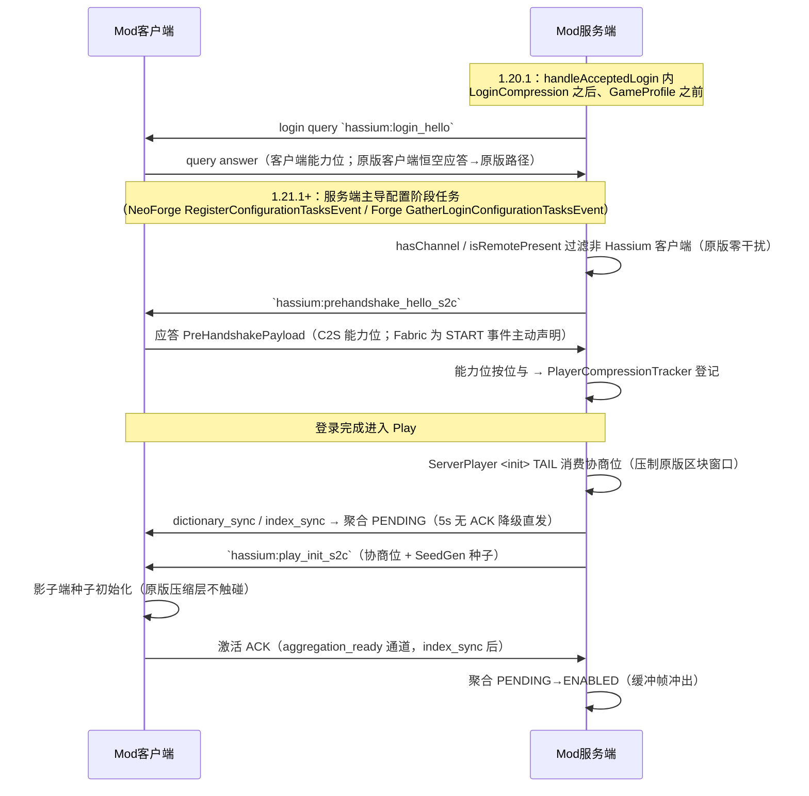
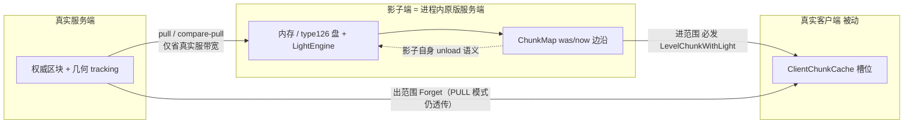
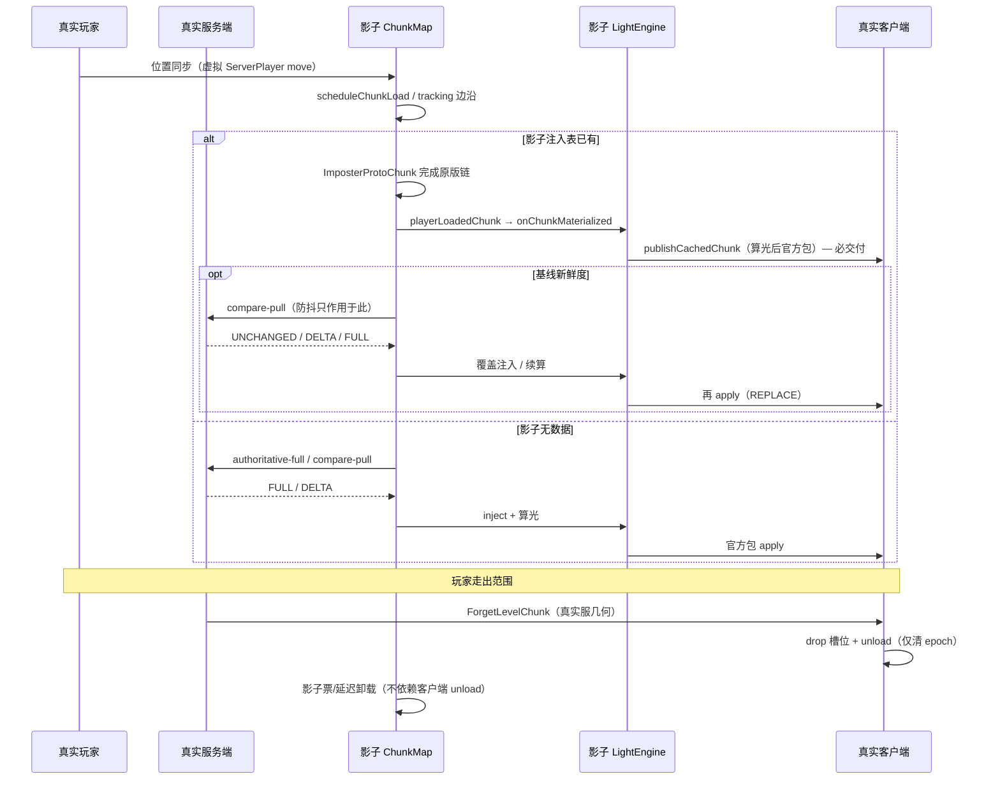

# Hassium 架构与功能说明

本文档是项目**能力总览（普通玩家/服主视角）+ 模块架构与配置运维（技术视角）**的权威说明。多版本适配见 [`version-segments.md`](version-segments.md)；区块缓存推送流水线见 [`chunk-cache.md`](chunk-cache.md)。

## 1. 这是什么

Hassium 是 Minecraft 多加载器模组（Fabric / Forge / NeoForge），围绕「**更小的网络传输 + 更快的本地加载**」优化存档与区块传输。对应 [README 特性表](../README.md) 的五大能力类：

- **高效压缩** —— 存储压缩（ZSTD 落盘 type 126）、通道压缩（聚合包内部字典 ZSTD + 区块推送自有压缩；不触碰 vanilla 压缩层）
- **网络优化** —— 平滑推送（每 tick 提交上限限速 + 全路径后台化）、登录期能力握手 + Play 期激活链、Pull 模式（服务端权威边沿声明 + 客户端 Compare+Pull；OVD 环带票驱动）
- **区块缓存** —— 影子端世界保存（进程内影子服务端按原版区块机制加载、落盘和推送）、分段增量、容量/热度淘汰、世界导出
- **本地生成** —— SeedGen：影子端对 pristine 区块执行生成前权威校验后再进入原版 ChunkStatus/LightEngine。**开启服务端开关会向客户端下发世界种子，等同泄露服务端种子**
- **光照优化** —— 影子端原版 LightEngine 统一算光并通过官方 vanilla packet 回传；服务端可剥光（`chunk.lightStrip`）

> **超视渲染（OVD）**：影子双窗设计——权威窗（serverVD）由服务端 `chunk_authority_s2c` 声明 + Compare+Pull；OVD 环带由 `ShadowTicketDriver` 出票装载（缺盘柱），本地源（盘/注入）回填，禁止真服请求。影子 tracking 半径在接管态压到最小（仅算光邻域 + 自愈扫描）。客户端只抬 `ClientChunkCache` 半径并拦 Forget。详见 [`chunk-cache.md`](chunk-cache.md) §10。

目标版本：Minecraft **1.20.1 / 1.21.1–1.21.11**（七段适配，见 version-segments）。Forge 支持 **1.20.1 / 1.21.1 / 1.21.3–1.21.10**（1.21.2 无上游 userdev；1.21.11 sunset）。

## 2. 解决什么问题（场景举例）

| 场景 | 原有问题 | 本模组怎么解 |
|------|----------|--------------|
| 进服/探图，区块一直转圈 | 服务端推全量区块包，带宽慢、主线程卡 | **平滑推送 + 通道压缩**：每 tick 限速推送、encode/压缩/发送全部后台化；聚合包内部字典 ZSTD 省带宽 |
| 重连服务器 / 再次进入同一区域 | 同一片区域又要重新下载一遍 | **影子端世界保存**：进服区块统一由进程内影子服务端（完整 MinecraftServer）算光并落盘原版存档（`hassium_cache/<serverId>/world`），断连保存、重连复用 |
| 缓存过期（服务器里东西变了） | 整块重传 | **统一 ShadowPull**：影子有基线时请求服务端权威比较，UNCHANGED 复用缓存、DELTA 只补变更方块（分段增量）、过多则整段/整块 |
| 大片未探索地形（pristine 区块） | 服务端也要逐块生成并传输 | **影子端本地生成**：先经服务端权威校验，再进入影子端原版 ChunkStatus/LightEngine；**开启服务端开关会泄露世界种子** |
| 服务端视距与客户端接收 | 客户端需自行维护缓存状态参与 admission | **服务端权威声明 + 影子 ChunkMap**：服务端声明 enter/leave 与权威 hash；影子端物化/算光/交付，真实客户端只接收 vanilla chunk+light/forget packet（全被动） |

## 3. 谁适合启用

- **服主**：`storage.enabled`（存储压缩）**默认关**——开启会改写存档格式（type 126），**启用前请备份世界**；`chunk.seedGenEnabled` 默认关——本地生成需要**双端同版本**且客户端开同项，pristine 区块才走本地生成，否则由影子端向服务端受控取数。**开启服务端本地生成会向客户端下发世界种子，等同泄露服务端种子**（探图/种子地图/导出存档均可利用）。
- **公网部署**：直连拓扑下客户端与服务端之间只有一条 vanilla TCP（游戏端口），无额外端口需要放行；仅注意 `chunk.seedGenEnabled` 的种子泄露面（见上）。

---

# 技术细节（面向有运维能力的服主与开发者；普通玩家可跳过）

## 4. 直连拓扑（登录期握手 + Play 期激活）

直连拓扑下客户端与服务端之间**只有一条 vanilla TCP 连接**：登录期用 vanilla login custom query（1.20.1）/ 配置阶段任务下发的 hello payload（1.21.1+）协商能力位，Play 期所有自定义 payload（区块/实体/业务）都走 vanilla 通道。网络核心（进程内网关）、UDP 数据面、续流迁移已裁剪（历史见 [`archive/`](archive/) 与 [`handoff/handoff-2026-09-04-vanilla-direct-network.md`](handoff/handoff-2026-09-04-vanilla-direct-network.md)）。

| 域 | 进程 | 职责 | 代码范围 |
|------|------|------|----------|
| **登录握手**（handshake） | 双端 | 能力位协商（agg/delta/seed/light/pull 按位与）+ Play 激活链 | `network/handshake/` |
| **区块核心**（Chunk Core） | 客户端 | 区块摄入管线 + 缓存 + 本地生成；**影子端**（`network/seedgen/`）= 其后端引擎（生成/算光/落盘/淘汰） | `network/` 顶层摄入管线 + `network/seedgen/` + `cache/` |
| **服务端传输面** | 服务端 | 区块推送 + 聚合（字典 ZSTD；EventLoop 阈值翻折防双重压缩） | `ServerChunkPushManager` + `HassiumAggregationManager` / `ConnectionChannelAccess` |

存储（`storage/` / `compression/`）、配置/指标/兼容等为**支撑域**，不立核心名。

### 握手与激活时序



- **无超时依赖**：空应答或无共同能力位 → 服务端原版路径（`compat.requireClientMod=true` 时登录期踢出）；配置任务 fire-and-forget（发 hello 即完成，不等待应答 → 无 stall 面）
- **原版零干扰**：1.20.1 只消费 `hassium:login_hello` 通道与本模组 transactionId，velocity/FML 等未知 query 原样放行；1.21.1+ 配置任务仅对声明了 hassium 通道的客户端注册（`hasChannel` / `isRemotePresent`）
- **原版压缩层不触碰**：管线级全局包压缩已退役；通道压缩 = 聚合包内部字典 ZSTD（EventLoop 阈值翻折防与 vanilla zlib 双重压缩）+ 区块推送自有压缩

## 5. 模块结构

```
Hassium/
├── common/              # 共享逻辑（合并进各加载器源码集编译）
├── fabric/ / forge/ / neoforge/
├── versionProperties/   # 每 MC 版本 builds_for、依赖版本
└── buildSrc/            # architectury-loom + Manifold
```

依赖方向：`common` ← 加载器模块。平台差异通过 `platform/services/` + ServiceLoader。

### 包地图（common）

| 包 | 职责 |
|----|------|
| `storage/`（存储域） | `HassiumChunkWriteBuffer`（type 126 payload 写缓冲）、`ShadowStorageHashes`（进程内 chunkHash/光脏桥）、`ShadowStorageManager` / `ShadowRegionHeat`（region 映像 + `heat.idx`）；type 126 压缩由 `compression/CompressionService` 收口 |
| `compression/`（存储域） | `CompressionCodec` / `CompressionService`、字典注册 |
| `network/`（直连传输面） | 登录期握手（`network/handshake/`）+ 统一 Compare+Pull（`ServerChunkPushManager.resolveShadowPull` / `ShadowPullClient`）+ 聚合链（字典 ZSTD；`ConnectionChannelAccess`）；SeedRef 推送已退役 |
| `network/seedgen/`（区块核心 = 影子端后端引擎） | `ShadowSeedServer` 运行虚拟 `ServerPlayer`，由 `ServerChunkCache` / `ChunkMap` / `ChunkHolder` 管理加载、卸载、ChunkStatus 与光照；`ShadowCacheEviction` 负责缓存淘汰 |
| `network/handshake/`（登录握手） | 双端能力协商与 Play 激活链（1.20.1 login query / 1.21.1+ 配置阶段任务 hello + C2S 应答；Fabric 为 START 主动声明） |
| `network/ClientChunkHandler` → `ClientChunkPipeline` | 仅负责 vanilla payload 解包、官方 packet apply 与状态降级；不维护独立视距/halo |
| `cache/`（区块核心支撑） | 客户端轻量预算与生命周期（`ClientMainThreadBudget` / `ClientLifecycleHelper` / `ChunkMeshCompileLog`）；缓存存储、读盘和清理由影子服务端承担 |
| `config/` / `metrics/` / `compat/` / `mixin/`（支撑设施） | `HassiumConfigService` 门面；`NetworkStats` 指标；Manifold 跨版本 API 桥接（`PacketId` / `HassiumChannels`）；全部 Mixin（common only） |

## 6. 客户端区块数据流

> **状态：原版对齐（2026-09-10 波）**。客户端对区块**全被动**（只收官方 chunk+light / forget）；
> 影子端扮演「进程内原版服务端」：**只认 tracking 的 was/now 边沿**决定交付/Forget，
> 不维护「本会话已发过」表，也不因客户端卸载拆影子注入表。

### 6.0 对齐原则（相对原版 1.20.1 `ChunkMap`）

原版契约（mojmap 对照）：

| 边沿 | 原版行为 | Hassium 影子端 |
|------|----------|----------------|
| **进范围** `!was && now` | `playerLoadedChunk` → `trackChunk` **无条件**发 `ClientboundLevelChunkWithLightPacket` | `onChunkMaterialized` **必交付**：影子有数据 → `publishCachedChunk`；无数据 → pull 落地后再交付 |
| **出范围** `was && !now` | `untrackChunk` → `ForgetLevelChunkPacket` | 影子 tracking 出窗 → 影子内存按自身 unload 语义回收；真实客户端 Forget 来自**真实服务端**几何 tracking（PULL 模式下 trackChunk 被压制，forget 仍透传） |
| **客户端** | `ClientChunkCache` 槽位收包即写 / Forget 即 drop | 同左；`MixinClientLevel.unload` 清光桥凭据；若影子仍在可见形状内且有数据 → **入重发队列**（真实服 Forget 半径可能 &lt; 影子 vd，不能等 tracking 边沿） |
| **「已发送」记忆** | **无** | **无**。`requestedMisses` 仅防「对真实服务端」的重复 compare-pull，**不得**挡「影子 → 真实客户端」交付 |



### 6.1 端到端时序



### 6.2 供给路径（数据从哪来 → 怎么到客户端）

| 路径 | 触发 | 影子侧 | 客户端交付 |
|------|------|--------|------------|
| **盘/内存命中** | tracking 进范围且 `injectedChunk` / `loadFromDisk` 有货 | `publishCachedChunk` → `submitPreLight` | 必交付（等价原版 trackChunk） |
| **本地 SeedGen** | 门控开 + 真实 seed | 原版 worldgen → 物化 → 同上 | 必交付 |
| **网络 pull** | 影子无基线，或 compare 裁决 DELTA/FULL | `ShadowPullClient` → inject → 算光 | 必交付 |
| **空占位 / 悬置** | 选柱时尚无数据 | 等 pull 落地 `completeSuspendedLoad` 再进物化桥 | 落地后必交付 |
| **形状外角区** | ticket 比可见形状宽一环 | 只注入供算光邻域 | **不**向真实客户端交付 |

### 6.3 客户端职责边界

**做**：

- 接收并 `apply` 影子发出的官方 `ClientboundLevelChunkWithLightPacket`
- 接收真实服务端 `ForgetLevelChunkPacket` 并 `ClientChunkCache.drop`
- unload 时清光桥 epoch（`shadowApplyEpochs`），供后续 light 包门控

**不做**（已从旧模型移除）：

- 客户端 unload **拆影子注入表**（曾导致「影子有、客户端无」永久洞）
- 会话级「已请求过就不再交付」防抖挡 **client 交付**
- 客户端自算视距 halo / 独立 admission

### 6.4 与真实服务端的带宽优化（非交付门禁）

- **compare-pull**：影子有本地基线时请求真实服裁决 UNCHANGED/DELTA/FULL，避免重复下载整柱。
- **`requestedMisses`**：只防对真实服的重复 pull（含回退风暴），**卸载后应清除**，允许再 compare。
- **分段增量 / 字典 ZSTD / 聚合**：作用于影子↔真实服务端与通道压缩，不改变「进范围必交付」语义。
- **权威边沿（2026-09-13，默认开启）**：服务端在整柱推送抑制点顺带声明「柱进入权威 tracking 集合 + 权威内容 hash」（`chunk_authority_s2c`，含跨会话 `epoch`/`snapshot`）。客户端本地基线 hash 与声明相同时**不发任何请求**、本地交付并计全命中；未知/不等才回退 compare-pull；无基线走空基线 FULL / 声明驱动 SeedGen。影子端在声明流存活期让位（10s 断流看门狗 + 宽限补发兜底）；**选柱接管**（`P5_TAKEOVER=true`）：OVD 环带由 `ShadowTicketDriver` 出票，影子 tracking 半径压到最小。详见 [`client-chunk-flow-handover.md`](client-chunk-flow-handover.md) §9。
- **注入表回收**：影子注入表按客户端 leave（真服 Forget）事件 + 6s 宽限回收（先 flush 落盘再摘表），**不得**按影子端自绘几何推断（实测会把未交付柱摘掉并使 teardown flush 悬挂）。

### 6.5 关键实现锚点

| 语义 | 代码 |
|------|------|
| 进范围交付桥 | `MixinChunkMap.hassium$shadowBridgeLoadedChunk` → `ShadowTrackingSession.onChunkMaterialized` |
| 本地交付 | `ShadowLightCompute.publishCachedChunk` → 算光 → `drainReady` → `handleLevelChunkWithLight` |
| 客户端卸载 | `MixinClientLevel` → `ShadowTrackingSession.onClientChunkUnloaded`（清 epoch；窗内有货则 `redeliverQueue`） |
| 窗内重发 | `drainRedeliver` / sweep 对 `injected && !clientApplyEpoch` 限速 `publishCachedChunk` |
| 真实服 Forget | 原版 `untrackChunk`（PULL 模式不压制 forget） |
| 影子选柱/补洞 | 声明驱动（权威窗）+ `ShadowTicketDriver` 环带票（OVD）+ `sweepVisibleShape` 自愈扫描 |
| 权威边沿（服务端声明 enter + 权威 chunkHash） | `ChunkAuthorityNotifier` → `chunk_authority_s2c` → `ChunkAuthorityClient`（三分支：hash 命中 → 零请求本地交付并记全命中 / 带基线比较 / 空基线 FULL 或本地生成）；`pullEmissionSuppressed()` 为真时影子端不自绘 pull |
| P5 选柱接管（默认开） | `ShadowTicketDriver.P5_TAKEOVER=true`：OVD 环带 FORCED 票 + tracking 半径压到 3x3；虚拟玩家仅作算光邻域/位置源 |
| 注入表回收 | 客户端 leave（真服 Forget）→ `outsideSinceMs` → `reclaimOutOfRetainSet` 宽限 6s 后 `unloadChunk`（flush + 摘表，`ShadowStorageHashes` 基线保留） |

### 6.6 关键设计决策

**原版 tracking 边沿是唯一交付触发（2026-09-10）**：曾用 `requestedMisses` 会话防抖 + 客户端 unload 拆影子表，与原版「进范围必重发」相反，造成对角线永久洞。现对齐：边沿必交付；防抖只作用于对真实服的网络 pull。

**空区块占位（2026-09-09）**：`scheduleChunkLoad` 对未注入柱返回空 ProtoChunk / 悬置 future，避免阻塞 vanilla 选柱链；数据到达后经物化桥交付。

**统一比较（影子↔真实服）**：基线 hash + sectionHashes 交服务端裁决；客户端不得自猜。比较结果落地后走与盘命中相同的 `publishCached` / inject 管线。

**生成安全**：无真实 seed 或 SeedGen 关闭时不生成；不得把本地猜测推到客户端。

**世界保存**：影子 `saveAll()` 写 `hassium_cache/<serverId>/world` type 126；热度淘汰 `ShadowCacheEviction`。

## 7. 存储格式

外层保持原版 Anvil（`.mca`，32×32，2-sector header）：

```
Sector 0:     Offset Table
Sector 1:     Timestamp Table（原版）
Sector 2+:    [length(4)][type=126][magic 0x48][hash(8)][ZSTD 压缩数据]
```

- **无** HassiumEnvelope / HSM1 / type 127 运行时写入（127 仅作未来原版 scheme 迁移规划）
- 服务端：`MixinRegionFile`（需 `storage.enabled`；仅专用服务器写，单人/局域网保持原版格式，读兼容）
- **影子端**（客户端进程内世界后端）：固定写 Hassium 格式（type 126）——`MixinRegionFile` 写 gate 在 shadow 上下文放行，payload 带 chunkHash（存储桥 `ShadowStorageHashes` 提供）；落盘目录 `hassium_cache/<serverId>/world`（原版存档结构，非旧 HBT1 客户端缓存）
- 旧客户端缓存（`ClientHassiumStorage` / HBT1 磁盘缓存 / `HassiumRegionFile` 等）**已裁剪**；数据不迁移
- 客户端辅存：`heat.idx`（region 文件级热度索引，`hassium_cache/<serverId>/heat.idx`；解析文件内容，不靠 mtime）
- 字典缺失时拒绝写入 Hassium payload，回退原版

## 8. 网络压缩

| 能力 | 说明 | 默认 |
|------|------|------|
| 自定义通道 | `hassium:*` 携区块/业务帧（登录期能力协商 + Play 期 `play_init_s2c` 激活后启用；原版服务端连接不探测、不接管） | `master.enabled` / 协商能力位 |
| 通道压缩 | **仅两处，均不触碰 vanilla 压缩层**：聚合包内部字典 ZSTD（发送时 EventLoop 阈值翻折防双重压缩）+ 区块推送自有压缩。管线级全局包压缩已退役 | — |
| 包聚合 | 服务端 vanilla 路径（`MixinConnection` 拦截）；客户端反聚合 receiver；ACK 超时 5s 降级；批次等待默认 50ms | `master.enablePacketAggregation=true` |
| 紧凑包头 | 聚合包内 `CompactHeaderCodec`（两级 VarInt 命名空间索引，`index_sync_s2c` 同步） | 默认启用（能力位协商） |
| 平滑推送 | 每 tick Pull 完成上限（`master.maxChunksPerTick=5` FULL/DELTA，满 tick ≈ 100/s；UNCHANGED 另额 32）；主线程 hash/比较/packet 快照，encode/ZSTD 在推送池 | 默认启用 |

控制面（握手、index sync、chunkHash 等）在压缩黑名单，不进 PENDING 聚合缓冲。UDP 数据面/网关帧协议/L1 迁移已随直连拓扑裁剪（历史见 [`archive/multi-channel_network_research.md`](archive/multi-channel_network_research.md)）。

## 9. 配置默认值（安全与行为）

配置文件（双文件按物理端加载）：

- `config/hassium/hassium-client.toml` — 仅物理客户端（`chunk.*` / `debug.*` 客户端键）
- `config/hassium/hassium-server.toml` — 仅专用服（`storage.*` / `master.*` / `compat.*` / `chunk.lightStrip` / `debug.*` 服务端键）

游戏内编辑：
- **Fabric**：Night Config 自管 toml + jiJ **Cloth**；安装 **Mod Menu** 即可打开。不依赖 FCAP / Configured。
- **Forge / NeoForge**：原生 ConfigSpec + jiJ **Cloth**（模组列表「配置」按钮）；亦可手改 toml。Configured 仍可选。FCAP Forge 桥已随 Forge 1.20.6 退役。

各项 GUI 文案见 `assets/hassium/lang/*`；toml 注释仍为中文。键集真相源：`ConfigSchema`（45 键）。

| 项 | 默认 | 说明 |
|----|------|------|
| `storage.enabled` | **false** | 默认关；开启后存档 ZSTD（type 126）；**启用前请备份世界**。仅专用服务器写（单人/局域网保持原版格式，读兼容） |
| `storage.zstdLevel` | 3 | 存储压缩等级 |
| `chunk.enabled` | true | 区块核心总开关（影子端世界保存/算光/缓存/Pull 模式；关后全程原版路径） |
| `chunk.sectionDeltaEnabled` | true | 缓存过期时只补变更方块（过多则整段/整块） |
| `chunk.viewDistanceExtensionEnabled` | true | 超视渲染（OVD；依赖 `chunk.enabled`；与 Bobby 互斥）。见 [`chunk-cache.md`](chunk-cache.md) §10 |
| `chunk.maxRenderDistance` | 16 | 超视渲染 effective clientRD 上限（2–64） |
| `chunk.mainThreadChunkBudgetMs` | 15 | 客户端主线程 apply 预算（ms） |
| `chunk.maxChunksPerFrame` | 6 | 每 tick 缓存读取生产上限（影子入队 + 影子读盘；主线程消费只受时间预算） |
| `chunk.maxSizeMb` | 4096 | 影子端存档容量上限（MB；超限触发热度淘汰） |
| `chunk.hotScoreThreshold` | 0.3 | 热点分数阈值（低于视为冷 region 文件，清理时优先淘汰） |
| `chunk.recencyWeight` / `chunk.frequencyWeight` | 0.7 / 0.3 | 热度分数中最近访问/访问频率权重 |
| `chunk.cleanupIntervalTicks` | 6000 | 清理检查间隔（刻） |
| `chunk.targetSizeMb` | 0（自动） | 目标缓存大小（MB） |
| `chunk.minCleanupBatchSize` | 100 | 每轮最多淘汰的 region 文件数 |
| `chunk.seedGenEnabled` | **false** | 本地区块生成（双端同版本，默认关）。**服务端开启会向客户端下发世界种子（泄露服务端种子）**；客户端门控开时影子 tracking 触发 vanilla worldgen，交付后 compare-pull |
| `chunk.lightStrip` | true | 服务端光照剥离，必须经 Hassium 能力握手 |
| `master.enabled` | true | 服务端网络通道总开关（登录期握手/压缩/聚合的门） |
| `master.compressionLevel` | 3 | 自有通道 ZSTD 压缩等级（速度优先） |
| `master.useContextCompression` | true | 上下文压缩（字典 ZSTD） |
| `master.maxChunksPerTick` | **5** | 每玩家每 tick 完成的 Pull FULL/DELTA 上限（主线程 hash/比较；encode/ZSTD 在推送池；满 tick ≈ 100/s） |
| `master.enablePacketAggregation` / `aggregationMinBatchSize` / `aggregationMaxWaitTimeMs` / `aggregationMaxSize` | `true` / `4` / `50ms` / `256KB` | 包聚合（服务端拦截 + 客户端反聚合；ACK 超时 5s 自动降级） |
| `master.compressionBlacklist` | 控制面键集 | 压缩/聚合黑名单（控制面不进聚合缓冲） |
| `compat.requireClientMod` | false | 无模组客户端可连（true 时登录期握手失败即踢出，替代超时等待） |
| `compat.autoDowngradeOnError` | true | 出错时自动降级 |
| `debug.*` | 多为 `false` | 调试分类日志，见 §10（`debug.networkMetricsAutoReset` 默认 `true`） |

网关监听/端点/鉴权（`controlReachableEndpoints` / `bindHost` / `authToken`）、L1 迁移（`master.migration*` 7 键）、续流票据（`resumeTicketTtlMs`）、UDP 数据面（`dataplane.*`）、管线级全局包压缩（`globalPacketCompression` 等 4 键）、`chunk.ovdUnloadDelaySecs`（延迟卸载取消，不再恢复）、`chunk.seedGenThreads` / `master.serverChunkPushThreads`、`net.*` 客户端网络键族、`chunk.hassiumEngineEnabled` / `chunk.unloadDelaySecs` 均已退役删除；旧 toml 中的残留键由加载器静默清除（legacy key hygiene，见 `FabricTomlConfigIO` 清理表）。OVD 两键（`viewDistanceExtensionEnabled` / `maxRenderDistance`）随双窗重做恢复；`chunk.ovdLocalGeneration` 随后退役删除（已入清理表）。

## 10. 日志策略

正常加载路径默认安静：仅少量生命周期 INFO（初始化、字典加载、握手摘要、管道切换、断开清理）。

热路径（收发包、命中/未命中、压缩大小等）走 `DebugLogger`，由 `debug.*` 控制：

| 配置键 | 端 | 含义 |
|--------|----|------|
| `debug.metadataLogging` | 客户端 | chunkHash 元数据收发 |
| `debug.cacheLogging` | 客户端 | 缓存命中/未命中/读盘 |
| `debug.chunkApplyLogging` | 客户端 | 区块 apply 落地 |
| `debug.lightVerify` | 客户端 | 光照验算 |
| `debug.networkMetricsEnabled` | 客户端 | 网络指标（冒烟测试 `hassium.smokeTest=true` 强开） |
| `debug.networkMetricsAutoReset` | 客户端 | 退出自动复位指标 |
| `debug.compressionLogging` | 服务端 | 压缩大小/字典 |
| `debug.asyncLogging` | 服务端 | 后台任务调度 |
| `debug.dispatcherLogging` | 服务端 | 主线程调度队列 |
| `debug.networkLogging` | 服务端 | 网络收发 |

## 11. 命令

| 命令 | 端 | 说明 |
|------|----|------|
| `/hassium stats` | 服务端 | 打印统计（vanilla 字节 / 实际字节 / 元数据 / 数据请求 / 缓存 / 光照 / 节省行） |
| `/hassium stats reset` / `stats toggle` | 服务端 | 重置计数器 / 开关统计 |
| `/hassium metrics on` / `off` | 服务端 | 开关指标 |
| `/hassiumc stats` | 客户端 | 客户端统计四行（语义/公式见 `MetricsSemantics`） |
| `/hassiumc export [<服务器IP>] [seed]` | 客户端 | 导出影子端世界目录（见 [`chunk-cache.md`](chunk-cache.md) §12） |

## 12. 相关文档

- [`chunk-cache.md`](chunk-cache.md) — 区块缓存推送（ShadowPull 统一 Compare+Pull）、磁盘 NBT（§11）、导出（§12）
- [`client-chunk-light-flow.md`](client-chunk-light-flow.md) — 客户端收包 → apply → 光照落地全链路
- [`chunk-load-optimization.md`](chunk-load-optimization.md) — 进服/重连加载路径与速率锚点
- [`version-segments.md`](version-segments.md) — 七段适配真相源
- [`mod-compat.md`](mod-compat.md) — 多 Mod 兼容边界与配置逃生
- [`config-audit.md`](config-audit.md) — 配置项审计与清理记录
- [`runtime-smoke-test.md`](runtime-smoke-test.md) — 多版本运行时自检（直连拓扑门禁：握手 + ZSTD + 区块落地）
- [`archive/multi-channel_network_research.md`](archive/multi-channel_network_research.md) — 多通道设计与已退役裸 TCP PoC 的历史记录（归档）
- [`handoff/handoff-2026-09-04-vanilla-direct-network.md`](handoff/handoff-2026-09-04-vanilla-direct-network.md) — 直连拓扑回归交接（网络核心/UDP/迁移裁剪）
- 根目录 `README.md` — 用户安装与特性
- `AGENTS.md` — 开发者与 Agent 入口

[← 用户文档](../README.md#用户文档) · [Home](../README.md) · [→ chunk-cache](chunk-cache.md)
