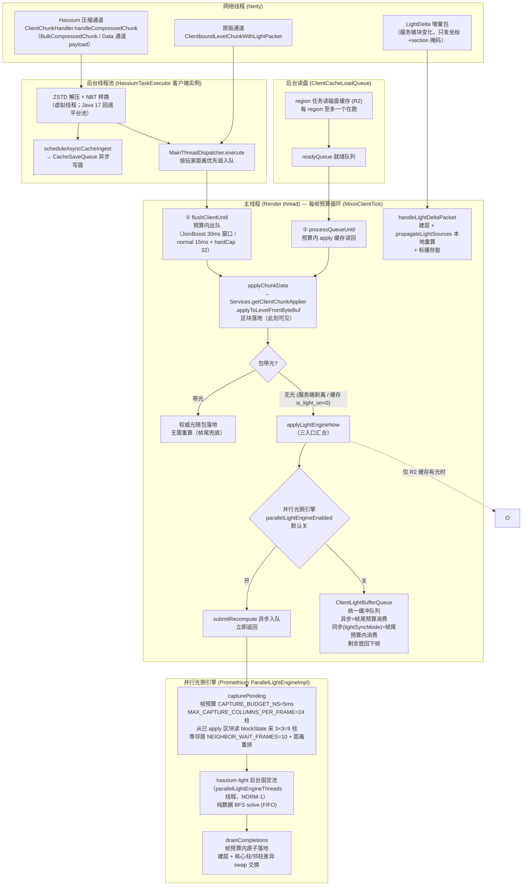

# 客户端区块接收与光照应用流程

客户端从收到区块数据包到区块/光照落地主线程的完整链路：线程归属、队列、预算与时序。
服务端推送链见 [`chunk-cache.md`](chunk-cache.md) §3；磁盘缓存格式见 [`disk-nbt-cache.md`](disk-nbt-cache.md)。

**相关专文：**

| 主题 | 文档 |
|------|------|
| 服务端推送 / chunkHash / 缓存命中 | [`chunk-cache.md`](chunk-cache.md) |
| 并行光照引擎调优（capture 吞吐/完成率） | 见 hassium-parallel-light-capture-tuning skill |
| 虚拟线程超订（为什么光照用固定平台池） | hassium-virtual-thread-oversubscription skill |

## 1. 总览图



## 2. 线程与队列全景

| 环节 | 队列 / 预算 | 线程 | 代码 |
|------|-------------|------|------|
| 收包 | —（payload 回调） | Netty | `ClientChunkHandler.handleCompressedChunk` |
| 解压 / 转 NBT | `HassiumTaskExecutor` 提交 | 后台虚拟线程 | `ExecutorFactory.create` |
| 写盘 | `CacheSaveQueue` | 后台 | `scheduleAsyncCacheIngest` |
| 主线程调度 | `PriorityBlockingQueue`（按玩家距离） | — | `MainThreadDispatcher.execute` |
| 区块 apply | `ClientMainThreadBudget`（JoinBoost 30ms 窗口 / normal `mainThreadChunkBudgetMs`）+ `maxChunksPerFrame` 硬顶 | Render thread | `MixinClientTick` + `MixinVanillaChunkApplyBudget` |
| R2 读盘 | region 级任务（每 region 至多一个在跑）→ `readyQueue` | 后台虚拟线程 + 主线程 | `ClientCacheLoadQueue` |
| 光照重算（官方引擎，默认） | `ClientLightBufferQueue` 统一缓冲：帧内收集、帧尾消费——异步 `FRAME_BUDGET_NS`=5ms 预算（~2-3 块/帧）剩余留帧；同步（`lightSyncMode=true`）双帧缓冲、帧尾 `SYNC_FRAME_BUDGET_NS`=12ms 预算内消费（~4-5 块/帧，剩余放回下一帧不丢，黑块窗口 ≤2-3 帧） | Render thread（入队任意线程） | `ClientLightBufferQueue` + `ClientLightRecomputeService.applyLightEngine` |
| 光照 capture | `CAPTURE_BUDGET_NS`=5ms、24 柱/帧 | Render thread（独占） | `ParallelLightEngineImpl.capturePending` |
| 光照 solve | `hassium-light` 固定平台池，FIFO | 后台（NORM-1） | `ParallelLightEngineImpl.ensurePool` |
| 光照落地 | `drainCompletions(frameDeadlineNs)` | Render thread | `ParallelLightEngineImpl.drainCompletions` |
| 局部光照更新（方块变化 checkBlock） | 引擎统一队列：同柱在飞任务挂载 / 独立队列；`drainCompletions` 预算内应用 | 入队：任意线程（主线程方块更新）；消费：Render thread | `MixinLevelLightEngine` + `PromethiumLightBridge.submitLocalUpdate` |

## 3. 三条数据入口

1. **Hassium 压缩通道**（默认，走 ZSTD + 聚合）：Netty 收 payload → 后台解压 → `MainThreadDispatcher` 距离优先级排队 → 主线程 apply。
2. **原版通道**（未压缩 / 原版包）：`ClientPacketListener.handleLevelChunkWithLight`（主线程），`MixinVanillaChunkApplyBudget` 将其预算化（原版是"收到即 apply"、无每帧预算）。
3. **R2 磁盘读回**：`ClientCacheLoadQueue` 后台读盘 → `readyQueue` → 主线程 `processQueueUntil` 预算内 apply。

三条路最终都汇入 `applyChunkData` → `applyToLevelFromByteBuf`（平台抽象 `IClientChunkApplier`）。

## 4. 主线程每帧预算循环（MixinClientTick）

固定顺序：

```
flushClientUntil(帧预算)   →  MainThreadDispatcher 出队 apply
processQueueUntil(帧预算)  →  R2 缓存读回 apply
drainCompletions(帧预算)   →  并行引擎：capture 采样 + 已完成 solve 落地
bufferQueue.drainFrame()   →  官方引擎：统一缓冲队列（异步=预算消费；同步=双帧交换后全量）
flushPendingCalibrations   →  渲染前兜底官方传播队列（原版方块变化）
```

光照永远排在区块 apply 之后、渲染之前——这是"区块先出现、光后到"的时序根源。

## 5. 光照入口与分支

`MixinLightRecompute`（`handleLevelChunkWithLight` TAIL）判定包是否带光：

- **带光**（`network.lightStrip=false` 或原版）：权威光照随包落地（apply 时 queueSectionData 生效），无需重算；先落地内圈块重算时缺失本块的边界差值——官方路径由帧尾 `flushPendingCalibrations` 兜底（官方队列跨块传播天然合并），并行路径由引擎后台传播域（核心柱 ±16 格）承担。
- **无光**（`network.lightStrip=true` 默认 / 缓存 `is_light_on=0`）：`applyLightEngineNow`：
  1. 并行引擎开且 `lightSyncMode=false` → `submitRecompute` 异步入队，立即返回。
  *  2. 官方引擎路径（默认 / 同步模式强制）→ 入 `ClientLightBufferQueue`：异步帧尾按预算消费（每帧 5ms，~2-3 块；剩余留帧，不阻塞 apply 链路）；同步（`lightSyncMode=true`）双帧缓冲——本帧 apply 入队，帧尾预算内落地（`SYNC_FRAME_BUDGET_NS`=12ms ≈ 4-5 块，剩余放回下一帧不丢，黑块窗口 ≤2-3 帧；预算化防止加载风暴期帧尾全量消费击穿帧率）。

  注：曾有的 `restoreCachedLightToEngine`（R2 磁盘旧光预灌防黑块）已移除——磁盘缓存光可能是未收敛 / 空光字段（SectionDelta 残缺 light、empty-mask 全 0），灌入引擎显示错误亮度；重算完成原子落地新光即最终画面。

`LightDelta` 是旁路：`handleLightDeltaPacket` 建层 + `propagateLightSources` 本地重算（跳过跨块传播），标缓存脏；residual 由后续渲染帧 drain。

### 原版局部光照更新（方块放置/破坏 → `LevelLightEngine.checkBlock`）

`LevelChunk.setBlockState`（含服务端方块包、流体、红石等全部客户端方块变化）在光属性变化
时调用 `LevelLightEngine.checkBlock`——此前在主线程任意时刻内联写官方引擎。

- **并行引擎开启**：`MixinLevelLightEngine` HEAD 拦截重定向到引擎统一队列
  （`submitLocalUpdate`）——同柱有在飞重算任务时挂载到任务上、结果落地后立即应用
  （消除「局部更新先传播、旧快照重算后落地覆盖修正」的陈旧光竞态），无在飞任务时入
  独立队列、下一次 drain 应用；官方引擎写入因此收敛到单一消费者（异步写引擎的前提）。
  引擎消费窗口内（drain 中）与单机集成服务端引擎身份直通原版。

落地方式（阶段二，主线程税降一个数量级）：后台 solve 产物字节数组零复制包成
`DataLayer`（引用包装），主线程只做**双缓冲 map 交换**——`LightEngine.storage` 的
`visibleSectionData`（渲染读）与 `updatingSectionData`（传播写）同时 `setLayer` + 清缓存
（官方传播 swap 时 visible = updating 浅拷贝共享 DataLayer 对象，单 map 交换会被传播覆盖；
字段反射经 `HassiumLightHooks.swapDataLayer`，SRG/字段缺失自动降级 memcpy 功能保真）。
`copyMasked`（邻柱差异只增亮合并）保持逐字节合并语义。
- **并行引擎关闭 / MOD 缺席**：直通原版，帧尾 `flushPendingCalibrations` 兜底传播，
  行为与改造前一致。

## 6. 暗块窗口

"暗块窗口" = 区块落地（可见）→ 引擎有光（变亮）之间的墙钟延迟，**出现在剥离光照的所有加载**（R1 无缓存 / R2 无预灌）：重算完成前引擎无光。R2 与 R1 行为一致，不再预灌旧光（旧光可能是未收敛/空光字段，显示错误亮度）。

窗口由三个独立预算队列串行构成，主瓶颈是 capture：

```
capture 排队（~240 帧，R1 625 块 × 9 柱 ÷ 24 柱/帧）
  + solve FIFO（单任务实测最高 266ms）
  + NEIGHBOR_WAIT_FRAMES=10（0.5s，等螺旋序邻居 1-5 帧到达）
  + drain 落地（帧预算内）
```

官方引擎路径（默认）：缓冲队列 5ms/帧预算 → 加载风暴（32 块/帧）下积压多帧消化，暗块窗口随队列积压增长（每帧 ~2-3 块，625 块 ≈ 4-5s）；预算为部分主线程占用，帧时间不被单帧峰值击穿。`lightSyncMode=true` 时改走双帧缓冲：本帧收集、帧尾预算内落地（`SYNC_FRAME_BUDGET_NS`=12ms ≈ 4-5 块，剩余放回下一帧不丢，黑块窗口 ≤2-3 帧），落地量受帧预算 + chunk apply 限流（maxChunksPerFrame + 时间预算）共同约束；预算化前帧尾全量消费会在加载风暴期把主线程打满（实测 R1 单核 100%、~16fps），预算化后削峰摊平（实测 R1 ~20fps 起、峰值帧剩余放回、黑块观感不明显）。

优化杠杆（已落地，R1 完成率 30%→98%）：`MAX_CAPTURE_COLUMNS_PER_FRAME=24`、`CAPTURE_BUDGET_NS=5ms`、`SNAPSHOT_CACHE_MAX=256`（命中 62%）、`NEIGHBOR_WAIT_FRAMES=10`。

消除窗口的路线（决策见 hassium 讨论记录）：

- **首选**：`network.lightStrip=false`（服务端带光发送）→ 客户端零重算零暗块，代价是带宽（光数据 ZSTD 压缩率高，需实测）。
- **R1 无缓存**：任何客户端重算方案都无法做到"apply 即有光"，除非服务端随包附光骨架（未实现）。

## 7. 关键组件索引

| 组件 | 职责 |
|------|------|
| `ClientChunkHandler` | 压缩通道收包、解压调度、`applyChunkData` 统一入口 |
| `MainThreadDispatcher` | 后台→主线程回调队列（距离优先级） |
| `ClientMainThreadBudget` | apply 帧预算（JoinBoost / normal / hardCap） |
| `MixinVanillaChunkApplyBudget` | 原版 chunk 包 apply 预算化 |
| `ClientCacheLoadQueue` | R2 磁盘读回（region 级并发） |
| `ClientLightRecomputeService` | 光照编排：并行/官方分派、同步重算实现（缓冲队列消费用） |
| `ClientLightBufferQueue` | 官方引擎统一缓冲队列：帧内收集、帧尾消费（异步=预算；同步 `lightSyncMode`=双帧交换 + 帧预算内消费，剩余放回） |
| `PromethiumLightBridge` | 并行光照引擎运行时桥接（反射发现 Promethium MOD；MOD 缺席自动降级官方引擎） |
| `MixinLevelLightEngine` | 原版局部光照更新重定向：并行引擎开启时 checkBlock 入引擎统一队列（客户端引擎身份门控 + 消费窗口豁免） |
| `ParallelLightEngine`（Promethium MOD 内） | 并行光照引擎：capture / solve / drain（`parallelLightEngineEnabled=true` 且 MOD 安装时） |
| `ClientMetadataHandler.handleLightDeltaPacket` | LightDelta 旁路本地重算 |
| `CacheSaveQueue` | 后台写盘（含光照回写） |
