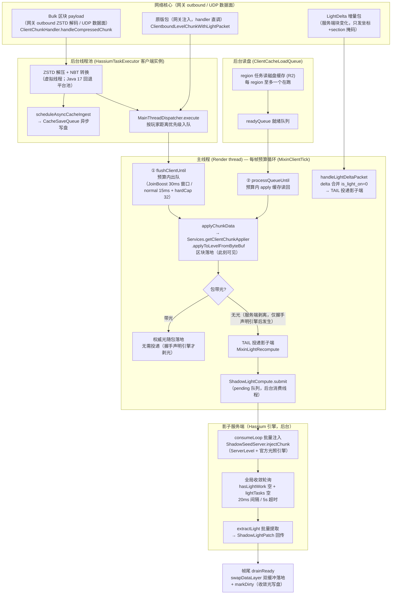

# 客户端区块接收与光照应用流程

客户端从收到区块数据包到区块/光照落地主线程的完整链路：线程归属、队列、预算与时序。
服务端推送链见 [`chunk-cache.md`](chunk-cache.md) §3；磁盘缓存格式见 [`chunk-cache.md`](chunk-cache.md) §11。

链路归属：客户端收包 → apply → 光照落地全链路属**区块核心**（客户端进程内区块域，影子端 = 其后端引擎）；传输经**网络核心**（客户端进程内网关）outbound 承载；服务端推送属**主控核心**。配置键 `clientCache.*` 为区块核心配置族，键名保留。

**相关专文：**

| 主题 | 文档 |
|------|------|
| 服务端推送 / chunkHash / 缓存命中 | [`chunk-cache.md`](chunk-cache.md) |
| Hassium 引擎（影子端）总体说明 | [`architecture.md`](architecture.md) §5、§11.4 |

## 1. 总览图



## 2. 线程与队列全景

| 环节 | 队列 / 预算 | 线程 | 代码 |
|------|-------------|------|------|
| 收包 | —（payload 回调） | 网关 outbound / UDP 事件循环 | `ClientChunkHandler.handleCompressedChunk`（网关注入直调） |
| 解压 / 转 NBT | `HassiumTaskExecutor` 提交 | 后台虚拟线程 | `ExecutorFactory.create` |
| 写盘 | `CacheSaveQueue` | 后台 | `scheduleAsyncCacheIngest` |
| 主线程调度 | `PriorityBlockingQueue`（按玩家距离） | — | `MainThreadDispatcher.execute` |
| 区块 apply | `ClientMainThreadBudget`（JoinBoost 30ms 窗口 / normal `mainThreadChunkBudgetMs`）+ `maxChunksPerFrame` 硬顶 | Render thread | `MixinClientTick` + `MixinVanillaChunkApplyBudget` |
| R2 读盘 | region 级任务（每 region 至多一个在跑）→ `readyQueue` | 后台虚拟线程 + 主线程 | `ClientCacheLoadQueue` |
| 光照投递 | `ShadowLightCompute` pending/ready/failed 三 map | 投递：主线程（TAIL）；消费：后台 | `MixinLightRecompute` + `ShadowLightCompute` |
| 影子端注入 + 收敛 | 批量注入 → 全局收敛轮询（20ms / 5s 超时）→ 批量提取 | 影子端主循环线程 | `ShadowSeedServer.runMainLoop` |
| 光照落地 | 帧尾 `drainReady`（渲染前，预算内） | Render thread | `MixinClientTick` + `HassiumLightHooks.swapDataLayer` |

## 3. 三条数据入口

1. **Bulk 区块 payload**（默认）：经网络核心网关 outbound 帧协议送达（ZSTD 帧外解码；客户端不聚合），或 UDP 数据面（`DataPlaneClientBundle`）到达 → 均直调 `ClientChunkHandler.handleCompressedChunk` → 后台解压 → `MainThreadDispatcher` 距离优先级排队 → 主线程 apply。
2. **原版包（网关注入）**：`NetworkCore.dispatchS2C` 把解码出的原版包直调进注入器 → `ClientPacketListener.handleLevelChunkWithLight`（主线程），`MixinVanillaChunkApplyBudget` 将其预算化（原版是"收到即 apply"、无每帧预算）。
3. **R2 磁盘读回**：`ClientCacheLoadQueue` 后台读盘 → `readyQueue` → 主线程 `processQueueUntil` 预算内 apply。

三条路最终都汇入 `applyChunkData` → `applyToLevelFromByteBuf`（平台抽象 `IClientChunkApplier`，
内部调 `handleLevelChunkWithLight`，因此缓存读回 / delta 合并也与网络包共用 TAIL 投递点）。

## 4. 主线程每帧预算循环（MixinClientTick）

固定顺序：

```
flushClientUntil(帧预算)   →  MainThreadDispatcher 出队 apply
processQueueUntil(帧预算)  →  R2 缓存读回 apply
ShadowLightCompute.drainReady()         →  影子端算好的光批量落地（swapDataLayer）
ShadowLightCompute.drainFailedRecompute →  失败柱丢弃（无本地兜底）
会话中收敛写回                        →  加载风暴停止后脏块写盘（SettleWriteback）
```

光照落地永远排在区块 apply 之后、渲染之前——区块先出现、光同帧后到（黑块窗口 = 0）。

## 5. 光照投递与影子端管线

`MixinLightRecompute`（`handleLevelChunkWithLight` TAIL）判定包是否带光：

- **带光**：权威光照随包落地（apply 时 queueSectionData 生效），无需投递。
- **无光**：仅当握手协商剥光后发生（客户端声明引擎可用 → 服务端 `network.lightStrip`
  才剥）。投递 `ShadowLightCompute.submit(pos, packet)`（pending 队列）。

影子端管线（消费线程，非主线程）：

1. **注入**：批量取 pending → `ShadowSeedServer.injectChunk`：`new LevelChunk(level, pos)` 空壳
   + `replaceWithPacketData`（全柱 `queueSectionData` + `updateSectionStatus` + `propagateLightSources`）。
2. **收敛**：`isLightConverged` = `hasLightWork()==false` 且 lightTasks 空；20ms 轮询、5s 超时。
3. **提取**：逐 section `getDataLayerData().copy()` → `ShadowLightPatch`（sky/block 两层）。
4. **落地**：帧尾 `drainReady` → 主线程逐 section `swapDataLayer`（双缓冲 map 交换）+
   `markDirty`（收敛光由断连/卸载 dump 写盘）。

失败（注入异常 / 收敛超时）→ failed 队列 → 帧尾丢弃。**客户端无本地光照逻辑**（不重算、
不缓冲、不并行）；影子端启动失败时整体降级（缓存/OVD/SeedGen 关闭并提示），剥光在握手侧
已协商（未声明引擎 → 服务端不剥），黑块不会因单柱失败扩大。

`LightDelta` 是旁路：`handleLightDeltaPacket` 合并变更 section（`is_light_on=0`）→ apply
（走 `handleLevelChunkWithLight`）→ TAIL 投递影子端。

## 6. 暗块窗口

影子端模式（默认）：注入 → 收敛 → 提取 → 帧尾落地，全部在后台完成；apply 当帧渲染前落地，
**黑块窗口 = 0**。

引擎未启用（`hassiumEngineEnabled=false` / 服务端未装 MOD）：不剥光，光随包自带，无暗块。
启动失败降级：剥光不会发生（握手未声明引擎），同样无暗块。

## 7. 关键组件索引

| 组件 | 职责 |
|------|------|
| `ClientChunkHandler` | bulk 收包（网关 outbound / UDP 注入直调）、解压调度、`applyChunkData` 统一入口 |
| `MainThreadDispatcher` | 后台→主线程回调队列（距离优先级） |
| `ClientMainThreadBudget` | apply 帧预算（JoinBoost / normal / hardCap） |
| `MixinVanillaChunkApplyBudget` | 原版 chunk 包 apply 预算化 |
| `ClientCacheLoadQueue` | R2 磁盘读回（region 级并发） |
| `MixinLightRecompute` | `handleLevelChunkWithLight` TAIL：空光 → 影子端投递 |
| `ShadowLightCompute` | 投递队列（pending/ready/failed）+ 帧尾落地编排 |
| `ShadowServerRegistry` | 影子端共享单例：握手后创建、失败降级、断连关闭 |
| `ShadowSeedServer` | 进程内 ServerLevel + 官方光照引擎：注入 / 收敛 / 提取 |
| `HassiumLightHooks` | 官方引擎原语（`swapDataLayer` 双缓冲落地、`getDataLayerData` 提取） |
| `ClientMetadataHandler.handleLightDeltaPacket` | LightDelta 旁路：合并 + 投递 |
| `CacheSaveQueue` | 后台写盘（含收敛光照回写） |
