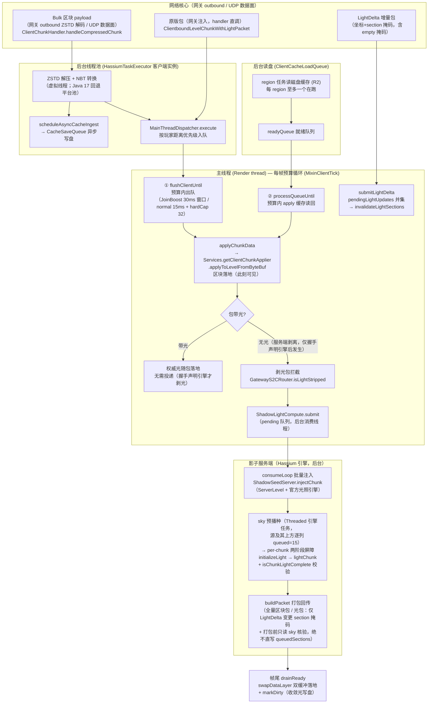

# 客户端区块接收与光照应用流程

客户端从收到区块数据包到区块/光照落地主线程的完整链路：线程归属、队列、预算与时序。
服务端推送链见 [`chunk-cache.md`](chunk-cache.md) §3；磁盘缓存格式见 [`chunk-cache.md`](chunk-cache.md) §11。

链路归属：客户端收包 → apply → 光照落地全链路属**区块核心**（客户端进程内区块域，影子端 = 其后端引擎）；传输经**网络核心**（客户端进程内网关）outbound 承载；服务端推送属**主控核心**。配置键 `chunk.*` 为区块核心配置族（2026-08-09 config-restructure：原 `clientCache.*` 重排为 `chunk.*`）。

**相关专文：**

| 主题 | 文档 |
|------|------|
| 服务端推送 / chunkHash / 缓存命中 | [`chunk-cache.md`](chunk-cache.md) |
| Hassium 引擎（影子端）总体说明 | [`architecture.md`](architecture.md) §5、§11.4 |

## 1. 总览图



## 2. 线程与队列全景

| 环节 | 队列 / 预算 | 线程 | 代码 |
|------|-------------|------|------|
| 收包 | —（payload 回调） | 网关 outbound / UDP 事件循环 | `ClientChunkHandler.handleCompressedChunk`（网关注入直调） |
| 解压 / 转 NBT | `HassiumTaskExecutor` 提交 | 后台虚拟线程 | `ExecutorFactory.create` |
| 写盘 | `CacheSaveQueue` | 后台 | `scheduleAsyncCacheIngest` |
| 主线程调度 | `PriorityBlockingQueue`（按玩家距离） | — | `MainThreadDispatcher.execute` |
| 区块 apply | `ClientMainThreadBudget`（JoinBoost 30ms 窗口 / normal `mainThreadChunkBudgetMs`）+ `maxChunksPerFrame` 硬顶 | Render thread | `MixinClientTick` + `MixinVanillaChunkApplyBudget` |
| R2 读盘 | region 级任务（每 region 至多一个在跑）→ `readyQueue` | 后台虚拟线程 + 主线程 | `ClientCacheLoadQueue` |
| 光照投递 | `ShadowLightCompute` pending/generated/delta/pendingLightUpdates/inflight + 帧尾光桥 | 投递：网关 Netty / 解压后台；消费：后台池 | `submit` / `submitLightDelta` + `ShadowLightCompute` |
| 影子端注入 + 收敛 | sky 预播种（Threaded 任务）→ per-chunk 两阶段屏障（`initializeLight` → `lightChunk`）→ `isChunkLightComplete` 校验，缺层自动续投（≤6 / 超时 ≤2） | 引擎 mailbox / 后台池 | `ShadowSeedServer.runMainLoop` + `ShadowLightCompute` |
| 光照落地 | 帧尾 `drainReady`（渲染前，预算内；光桥只对影子区块包已落地且客户端未卸载的柱发送） | Render thread | `MixinClientTick` + `ShadowLightCompute.drainReady` |

## 3. 三条数据入口

1. **Bulk 区块 payload**（默认）：经网络核心网关 outbound 帧协议送达（ZSTD 帧外解码；客户端不聚合），或 UDP 数据面（`DataPlaneClientBundle`）到达 → 均直调 `ClientChunkHandler.handleCompressedChunk` → 后台解压 → `MainThreadDispatcher` 距离优先级排队 → 主线程 apply。
2. **原版包（网关注入）**：`NetworkCore.dispatchS2C` 把解码出的原版包直调进注入器 → `ClientPacketListener.handleLevelChunkWithLight`（主线程），`MixinVanillaChunkApplyBudget` 将其预算化（原版是"收到即 apply"、无每帧预算）。
3. **R2 磁盘读回**：`ClientCacheLoadQueue` 后台读盘 → `readyQueue` → 主线程 `processQueueUntil` 预算内 apply。

三条路最终都汇入 `applyChunkData` → `applyToLevelFromByteBuf`（平台抽象 `IClientChunkApplier`，
内部调 `handleLevelChunkWithLight`，因此缓存读回 / delta 合并也与网络包共用 TAIL 投递点）。

## 4. 主线程每帧预算循环（MixinClientTick）

固定顺序：

```
flushClientUntil(帧预算)   →  MainThreadDispatcher 出队（区块/实体/BE）
ShadowLightCompute.drainReady()   →  影子端算好的光/区块批量落地（官方 handler）
ShadowLightCompute.drainLightMasks() →  in-flight 柱暂缓，其余光更新攒批入队
```

`drainReady` 内部顺序：卸载检查 → 标脏收敛清理 → 光屏障超时扫表 → `drainLightMasks` →
按优先级消费回传队列（每帧 ≤ `max(1, hardCap)`）。光更新收集只发生在渲染前的同一主线程帧尾。

## 5. 光照投递与影子端管线

区块包判定（`GatewayS2CRouter.routeChunk`）：

- **带光**：权威光照随包落地（官方 `handleLevelChunkWithLight`）。
- **剥光包**（服务端 `chunk.lightStrip`，握手声明引擎后才发生）：不直接 apply——
  先投递 `ShadowLightCompute.submit(pos, packet)`；影子端算完打包带光区块包回传，
  客户端从源头就不会看到无光区块。

影子端管线（消费线程，非主线程）：

1. **注入**：`ShadowSeedServer.injectChunk`：`new LevelChunk(level, pos)` 空壳 +
   `replaceWithPacketData`（重填 `skyLightSources`——水面/地形高度表随区块数据刷新）。
   重注入（REPLACE 覆盖）时 `clearChunkLight` 撤销 sky 源注册（`setLightEnabled(false)`）
   并把整柱 section（含上下 padding）强制覆盖为共享空光层（`queueSectionData(EMPTY)`）；
   **全新柱跳过清光**（无引擎状态，省 2×~30 个引擎任务，避免首波任务量越过
   ThreadedLevelLightEngine 1000 阈值触发 sorter 线程并发 `runUpdate` → 任务错序 →
   空光层被打包推送）。
2. **屏障**：对每柱先 `ensureChunkLightLayers`（缺失 section 投 `updateSectionStatus(false)`
   初始化 + `setLightEnabled(true)` 注册 sky 源/地表源之上的空层填 15，镜像 vanilla
   `initializeLight`）再提交官方 `lightChunk(chunk, false)`；future 完成后再校验
   `isChunkLightComplete()` = `chunk.isLightCorrect()==true` 且 sky/block 全部 section
   DataLayer 非 null，**且位于任一行天空源的 section 的 sky 层非全空**（全空 sky 层只
   在深海/地下合法；位于源的 section 全空 = 播种/fill 未跑到 → 判未收敛）。null 层会被
   官方光包静默省略 → 客户端黑块；全空层会打包成 empty 掩码 → 客户端把已亮 section
   置 0（「亮→黑→亮」跳变源之一）。不全时自动重试（正常完成≤6 轮；5s 超时后续投≤2
   轮），仍不全才按欠光回传 + 标脏 + 光更新桥梁补发。这就是原版的「未收敛状态」处理：
   原版只在 FULL（lightCorrect）后推送，Hassium 等同一信号而不是等一个不保证 section
   层齐备的 future。
3. **打包**：区块路径 `SeedGenChunkCodec.buildPacket`（官方带光区块包）；纯光路径
   （LightDelta）`ClientboundLightUpdatePacket(pos, engine, null, null)`
   （全柱光包，不回传方块数据）。
4. **落地**：帧尾 `drainReady` 官方通道消费；每帧硬顶。屏障期间同柱的
   `lightUpdates` 掩码暂缓（`inflightLight` 守卫），最终全量光回传后丢弃中间态，
   避免水面/边界「先亮→再黑→终亮」跳变。

`LightDelta`（增量算光）主链路：

1. 服务端 `MixinChunkHolder` 拦截 `ClientboundLightUpdatePacket`，剥离数据只发掩码
   （新版 append 尾块补发 emptySky/emptyBlock 掩码；旧接收端自动忽略尾块）。
2. 客户端 `NetworkCore.dispatchS2CBusiness → ShadowLightCompute.submitLightDelta`，
   同柱掩码取并集入 `pendingLightUpdates`。
3. consumeLoop → `ShadowSeedServer.invalidateLightSections`：只清服务端声明变化的
   section（含变空 section）——强制覆盖共享空光层（原版 notReady 移除路径对带邻域的
   section 永不生效，且重建时的 `new DataLayer(15)` 会把源下 section 填满 15、传播
   只增不减 → 水面梯度永久丢失）→ `propagateLightSources` 重播（播种 fill + 向下衰减
   传播按块重写空层 → 梯度重建）→ 全柱光包回传。不清的柱只标脏，后续 R2 读盘命中
   走 relight 链，不会把旧光当权威光复用。
4. ~~新柱收敛后对 4 邻柱登记全柱补光~~（2026-08-15 移除）：该机制是光包风暴与跳变的
   主放大器（每柱收敛 × 4 邻柱整柱清光重算 + 全柱光包回传，跑图时成百上千光包占据
   在途屏障与回传队列，区块注入被挤占 → 虚空区块迟迟未补全）。邻柱边界补光本就由
   跨柱传播 + `collectLightUpdate → drainLightMasks` 桥梁事件驱动覆盖（邻柱到货时其
   传播写进已存在柱的边界 section，触发光照更新包补发）；sky 是 per-column 播种与
   邻柱无关——反向补光纯属冗余。

失败（注入异常 / 重试超限）→ 欠光回传 + 标脏 + 光照更新桥梁兜底。**客户端无本地
光照逻辑**；影子端启动失败时整体降级（缓存/OVD/SeedGen 关闭并提示），剥光在握手侧
已协商（未声明引擎 → 服务端不剥），黑块不会因单柱失败扩大。

## 6. 暗块窗口

影子端模式（默认）：区块包只有在「lightCorrect=true + 两光层齐全 + 源上方 sky 层非全空」
后才入回传队列，渲染前落地，**黑块窗口 = 0**；纯光增量只发光包不重推区块，已加载区块
不会被回退成黑块。空层/欠光一律先续投重试（重跑 propagateLightSources 自愈），重试耗尽
才欠光回传，不再把「亮区→黑→亮」的中间态推给客户端。

引擎未启用（`hassiumEngineEnabled=false` / 服务端未装 MOD）：不剥光，光随包自带，无暗块。
启动失败降级：剥光不会发生（握手未声明引擎），同样无暗块。

## 7. 关键组件索引

| 组件 | 职责 |
|------|------|
| `ClientChunkHandler` | bulk 收包（网关 outbound / UDP 注入直调）、解压调度、`applyChunkData` 统一入口 |
| `GatewayS2CRouter` | 原版包注入路由；剥光区块包先投影子端再回传，杜绝直接 apply 黑块 |
| `MainThreadDispatcher` | 后台→主线程回调队列（距离优先级） |
| `ClientMainThreadBudget` | 主线程 apply 帧预算（JoinBoost / normal / hardCap） |
| `ShadowLightCompute` | 投递队列（pending/generated/delta/pendingLightUpdates/inflight）+ 屏障重试 + 帧尾落地编排 |
| `ShadowServerRegistry` | 影子端共享单例：握手后创建、失败降级、断连关闭 |
| `ShadowSeedServer` | 进程内 ServerLevel + 官方光照引擎：注入 / 清光（vanilla updateChunkStatus 同款）/ 增量清光 / 完整度校验 |
| `LightDeltaS2CPacket` | 增量光变更掩码（append-only 尾块携带 empty 掩码） |
| `MixinServerChunkCache` / `collectLightUpdate` | 影子端光出口事件 → 光更新桥梁 |
| `NetworkCore.dispatchS2CBusiness` | `LIGHT_DELTA → ShadowLightCompute.submitLightDelta` 收口 |
