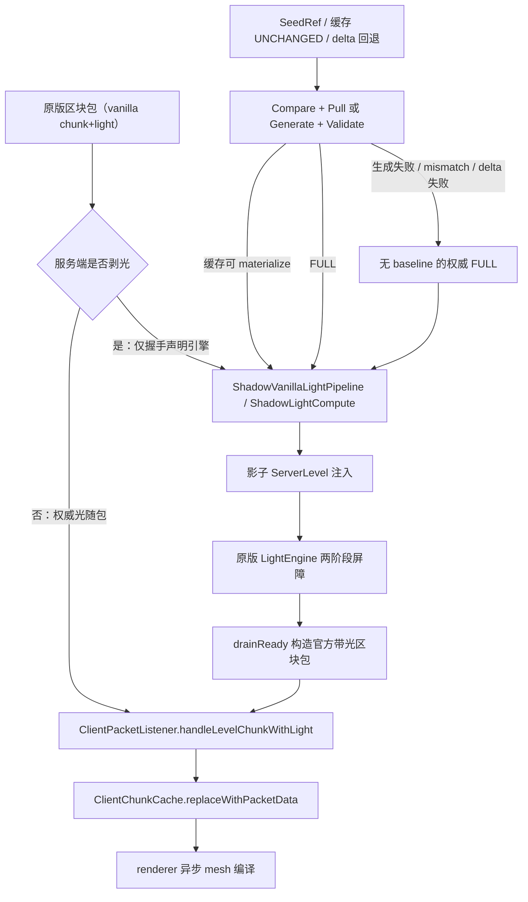

# 客户端区块接收与光照应用流程

客户端从收到区块数据包到区块/光照落地主线程的完整链路：线程归属、队列、预算与时序。
服务端推送链见 [`chunk-cache.md`](chunk-cache.md) §3；磁盘缓存格式见 [`chunk-cache.md`](chunk-cache.md) §11。

链路归属：客户端收包 → apply → 光照落地全链路属**区块核心**（客户端进程内区块域，影子端 = 其后端引擎）；传输走**唯一 vanilla TCP**（登录期握手 + Play 期自定义 payload）；服务端推送属**服务端传输面**。配置键 `chunk.*` 为区块核心配置族（2026-08-09 config-restructure：原 `clientCache.*` 重排为 `chunk.*`）。

**相关专文：**

| 主题 | 文档 |
|------|------|
| 服务端推送 / chunkHash / 缓存命中 | [`chunk-cache.md`](chunk-cache.md) |
| Hassium 引擎（影子端）总体说明 | [`architecture.md`](architecture.md) §5、§6 |

## 1. 总览图



**生命周期边界**：Hassium 只选择/处理数据来源；`ClientChunkCache` 仍是区块驻留和卸载的唯一真相源。`clientAppliedChunkCount` 是会话累计成功 apply，`clientCache.loadedChunks` 是采样时刻完整驻留量；二者不能用 mesh trace 的一次快照互相替代。

## 2. 线程与队列全景

| 环节 | 队列 / 预算 | 线程 | 代码 |
|------|-------------|------|------|
| 收包 | —（payload 回调） | Netty / vanilla 网络线程 | `ClientChunkHandler` / `ClientChunkPipeline`（官方包 + 自定义 payload 统一入口） |
| 解压 / 转 NBT | `HassiumTaskExecutor` 提交 | 后台虚拟线程 | `ExecutorFactory.create` |
| 主线程调度 | `PriorityBlockingQueue`（按玩家距离） | — | `MainThreadDispatcher.execute` |
| 区块 apply | `ClientMainThreadBudget`（JoinBoost 30ms 窗口 / normal `mainThreadChunkBudgetMs`）；无数量硬顶 | Render thread | `MixinClientTick` |
| 光照投递 | `ShadowLightCompute` pending/generated/delta/pendingLightUpdates/inflight + 帧尾光桥 | 投递：Netty / 解压后台；消费：后台池 | `submit` / `submitLightDelta` + `ShadowLightCompute` |
| 影子端注入 + 收敛 | 注入表 + UNKNOWN FULL 票 → per-chunk 两阶段屏障（`initializeLight` → 邻柱 holder `INITIALIZE_LIGHT` parent → `lightChunk`）；`isChunkLightComplete` 不挡首包 | 引擎 mailbox / 后台池 | `ShadowSeedServer.runMainLoop` + `ShadowLightCompute` |
| 光照落地 | 帧尾 `drainReady`（渲染前，预算内；光桥只对影子区块包已落地且客户端未卸载的柱发送） | Render thread | `MixinClientTick.drainReady` |

**线程纪律**：Netty 线程只做入队；`ClientMainThreadBudget` 是唯一主线程 apply 闸门（时间预算，无数量硬顶）；`maxChunksPerFrame` 只限缓存读取生产（影子入队 + 影子读盘），不限 apply。

## 3. 收包 → apply 路径

```text
vanilla chunk+light 包 / hassium:* payload
        │
        ▼
MixinClientPacketListener.handleLevelChunkWithLight（HEAD / RETURN）
        │
        ├─ 无影子基线 → 原版 apply（首次建基线）
        └─ 有影子基线 → ShadowPull（Compare + Pull）
        ▼
ClientChunkHandler.applyShadowPullFull
        │  decode 原版包（后台）→ 原版 listener 落地
        ▼
ClientChunkCache.replaceWithPacketData → renderer
```

- `applyShadowPullFull` 是统一 apply 入口（ShadowPull FULL payload = 原版 `ClientboundLevelChunkWithLightPacket` 线格式，decode 后经原版 `handleLevelChunkWithLight` 落地；原 `applyChunkData` 与加载屏快路径已随退役 `chunk_payload` 通道删除）
- `storePendingContentHash` 在 apply 前登记 chunkHash，供影子端落表

## 4. 光照管线（影子端统一算光）

影子端 = 进程内完整 `MinecraftServer` 上下文（`ShadowSeedServer`），光照由原版 `LightEngine` 计算：

1. **注入**：`ShadowSeedServer.injectChunk` 把权威/缓存/本地生成数据注入影子 `ServerLevel`
2. **两阶段屏障**：`initializeLight` → 邻柱 holder `INITIALIZE_LIGHT` parent → `lightChunk`；`isChunkLightComplete` 不挡首包（欠光可先落地，光桥后补）
3. **光出口桥**：`MixinServerChunkCache.collectLightUpdate` 捕获影子光更新 → `LightDeltaS2CPacket`（增量掩码，append-only 尾块携带 empty 掩码）
4. **帧尾落地**：`drainReady` 渲染前预算内把 ready 队列倒进 `handleLevelChunkWithLight`；光桥只对「影子区块包已落地且客户端未卸载」的柱发送
5. **失败降级**：影子端启动失败（`ShadowServerRegistry.failShadowServer`）→ 关缓存/SeedGen/影子光照，全程原版路径（服务端不剥光——剥光在握手协商）

## 5. 关键组件

| 组件 | 职责 |
|------|------|
| `ClientChunkHandler` / `ClientChunkPipeline` | 收包统一入口（官方包 + 自定义 payload）、解压调度、`applyShadowPullFull`、握手/影子端状态机 |
| `MainThreadDispatcher` | 后台→主线程回调队列（距离优先级） |
| `ClientMainThreadBudget` | 主线程 apply 时间预算（JoinBoost / normal）；`maxChunksPerFrame` 只限缓存读取生产 |
| `ShadowLightCompute` | 投递队列（pending/generated/delta/pendingLightUpdates/inflight）+ 屏障重试 + 帧尾落地编排 |
| `ShadowServerRegistry` | 影子端共享单例：握手后创建、失败降级、断连关闭 |
| `ShadowSeedServer` | 进程内 ServerLevel + 官方光照引擎：注入 / 清光（vanilla updateChunkStatus 同款）/ 增量清光 / 完整度校验 |
| `LightDeltaS2CPacket` | 增量光变更掩码（append-only 尾块携带 empty 掩码） |
| `MixinServerChunkCache` / `collectLightUpdate` | 影子端光出口事件 → 光更新桥梁 |

## 6. 退役引用说明

以下旧链路概念已随直连拓扑/管线退役，不再出现在现行数据流中（历史见 [`handoff/handoff-2026-09-04-vanilla-direct-network.md`](handoff/handoff-2026-09-04-vanilla-direct-network.md)）：

- 网关 outbound / UDP 事件循环收包（现走 vanilla Netty 线程）
- `NetworkCore.dispatchS2CBusiness`（`network/core/` 已裁剪）
- `GatewayS2CRouter` 原版包注入路由（现由 `MixinClientPacketListener` 直拦）
- `ClientCacheLoadQueue` / `CacheSaveQueue`（缓存存储与读盘由影子端承担）
- 管线级全局包压缩解压步骤（通道压缩 = 聚合包内部字典 ZSTD + 区块推送自有压缩）
