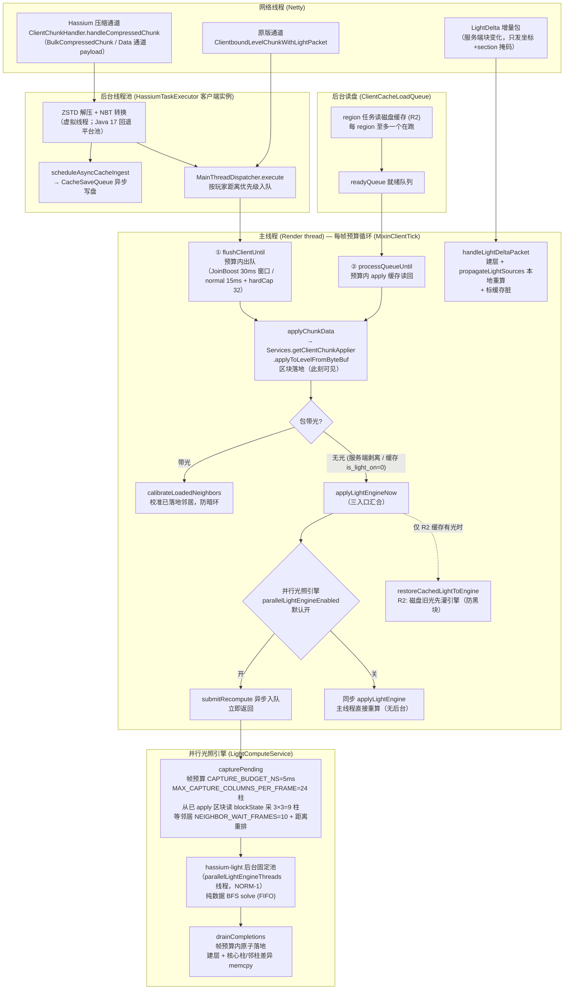

# 客户端区块接收与光照应用流程

客户端从收到区块数据包到区块/光照落地主线程的完整链路：线程归属、队列、预算与时序。
服务端推送链见 [`chunk-cache.md`](chunk-cache.md) §3；磁盘缓存格式见 [`disk-nbt-cache.md`](disk-nbt-cache.md)。

**相关专文：**

| 主题 | 文档 |
|------|------|
| 服务端推送 / chunkHash / 缓存命中 | [`chunk-cache.md`](chunk-cache.md) |
| 并行光照引擎调优（capture 吞吐/完成率） | 见 hassium-parallel-light-capture-tuning skill |
| 虚拟线程超订（为什么光照用固定平台池） | hassium-virtual-thread-oversubscription skill |
| 缓存旧光预灌（R2 防黑块） | hassium-client-cached-light-restore skill |

## 1. 总览图



## 2. 线程与队列全景

| 环节 | 队列 / 预算 | 线程 | 代码 |
|------|-------------|------|------|
| 收包 | —（payload 回调） | Netty | `ClientChunkHandler.handleCompressedChunk` |
| 解压 / 转 NBT | `HassiumTaskExecutor` 提交 | 后台虚拟线程 | `ExecutorFactory.create` |
| 写盘 | `CacheSaveQueue` | 后台 | `scheduleAsyncCacheIngest` |
| 主线程调度 | `PriorityBlockingQueue`（按玩家距离） | — | `MainThreadDispatcher.execute` |
| 区块 apply | `ClientMainThreadBudget`（JoinBoost 30ms 窗口 / normal `mainThreadChunkBudgetMs`）+ `maxChunksPerFrame` 硬顶 | Render thread | `MixinClientTick` + `MixinVanillaChunkApplyBudget` |
| R2 读盘 | region 级任务（每 region 至多一个在跑）→ `readyQueue` | 后台虚拟线程 + 主线程 | `ClientCacheLoadQueue` |
| 光照 capture | `CAPTURE_BUDGET_NS`=5ms、24 柱/帧 | Render thread（独占） | `LightComputeService.capturePending` |
| 光照 solve | `hassium-light` 固定平台池，FIFO | 后台（NORM-1） | `LightComputeService.ensurePool` |
| 光照落地 | `drainCompletions(frameDeadlineNs)` | Render thread | `LightComputeService.drainCompletions` |

## 3. 三条数据入口

1. **Hassium 压缩通道**（默认，走 ZSTD + 聚合）：Netty 收 payload → 后台解压 → `MainThreadDispatcher` 距离优先级排队 → 主线程 apply。
2. **原版通道**（未压缩 / 原版包）：`ClientPacketListener.handleLevelChunkWithLight`（主线程），`MixinVanillaChunkApplyBudget` 将其预算化（原版是"收到即 apply"、无每帧预算）。
3. **R2 磁盘读回**：`ClientCacheLoadQueue` 后台读盘 → `readyQueue` → 主线程 `processQueueUntil` 预算内 apply。

三条路最终都汇入 `applyChunkData` → `applyToLevelFromByteBuf`（平台抽象 `IClientChunkApplier`）。

## 4. 主线程每帧预算循环（MixinClientTick）

固定顺序：

```
flushClientUntil(帧预算)   →  MainThreadDispatcher 出队 apply
processQueueUntil(帧预算)  →  R2 缓存读回 apply
drainCompletions(帧预算)   →  capture 采样 + 已完成 solve 落地
flushPendingCalibrations   →  渲染前合并校准传播
```

光照永远排在区块 apply 之后、渲染之前——这是"区块先出现、光后到"的时序根源。

## 5. 光照入口与分支

`MixinLightRecompute`（`handleLevelChunkWithLight` TAIL）判定包是否带光：

- **带光**（`network.lightStrip=false` 或原版）：只需 `calibrateLoadedNeighbors`——先落地的内圈块重算时缺少本块，边界 1 格固化暗值，本块到达后必须补亮，否则形成视觉暗环。
- **无光**（`network.lightStrip=true` 默认 / 缓存 `is_light_on=0`）：`applyLightEngineNow`：
  1. `restoreCachedLightToEngine`：R2 缓存有光时先灌旧光（内容过期没关系），重算完成前渲染不黑块；无缓存（R1）跳过。
  2. 并行引擎开（默认）→ `submitRecompute` 异步入队，立即返回。
  3. 并行引擎关 → 同步 `applyLightEngine` 主线程重算（卡顿路径，仅调试用）。

`LightDelta` 是旁路：`handleLightDeltaPacket` 建层 + `propagateLightSources` 本地重算（跳过跨块传播），标缓存脏；residual 由后续渲染帧 drain。

## 6. 暗块窗口

"暗块窗口" = 区块落地（可见）→ 引擎有光（变亮）之间的墙钟延迟，**只出现在 R1 首次进服 + 网络剥离光照**的组合（无旧光可灌）。R2/重连有 `restoreCachedLightToEngine` 预灌，无感。

窗口由三个独立预算队列串行构成，主瓶颈是 capture：

```
capture 排队（~240 帧，R1 625 块 × 9 柱 ÷ 24 柱/帧）
  + solve FIFO（单任务实测最高 266ms）
  + NEIGHBOR_WAIT_FRAMES=10（0.5s，等螺旋序邻居 1-5 帧到达）
  + drain 落地（帧预算内）
```

优化杠杆（已落地，R1 完成率 30%→98%）：`MAX_CAPTURE_COLUMNS_PER_FRAME=24`、`CAPTURE_BUDGET_NS=5ms`、`SNAPSHOT_CACHE_MAX=256`（命中 62%）、`NEIGHBOR_WAIT_FRAMES=10`。

消除窗口的路线（决策见 hassium 讨论记录）：

- **首选**：`network.lightStrip=false`（服务端带光发送）→ 客户端零重算零暗块，代价是带宽（光数据 ZSTD 压缩率高，需实测）。
- **R1 无缓存**：任何客户端重算方案都无法做到"apply 即有光"，除非服务端随包附光骨架（未实现）。

## 7. 关键组件索引

| 组件 | 职责 |
|------|------|
| `ClientChunkHandler` | 压缩通道收包、解压调度、`applyChunkData` 统一入口 |
| `MainThreadDispatcher` | 后台→主线程回调队列（距离优先级） |
| `ClientMainThreadBudget` | apply 帧预算（JoinBoost / normal / hardCap） |
| `MixinVanillaChunkApplyBudget` | 原版 chunk 包 apply 预算化 |
| `ClientCacheLoadQueue` | R2 磁盘读回（region 级并发） |
| `ClientLightRecomputeService` | 光照入口：预灌旧光、同步/并行分流、邻居校准 |
| `LightComputeService` | 并行光照引擎：capture / solve / drain |
| `ClientMetadataHandler.handleLightDeltaPacket` | LightDelta 旁路本地重算 |
| `CacheSaveQueue` | 后台写盘（含光照回写） |
