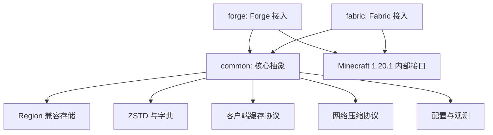
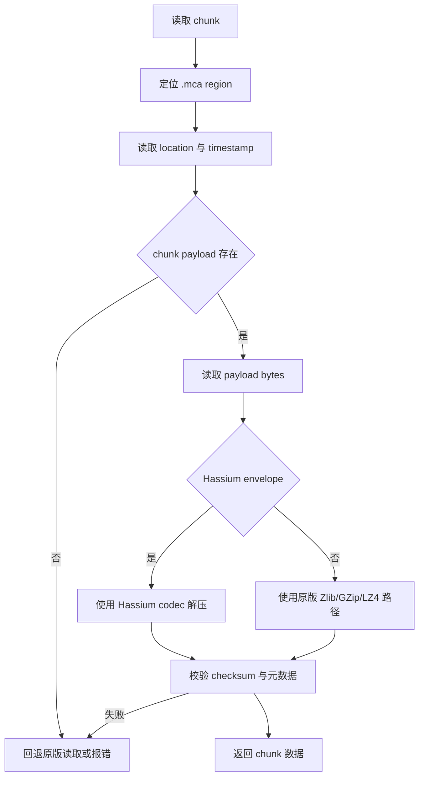
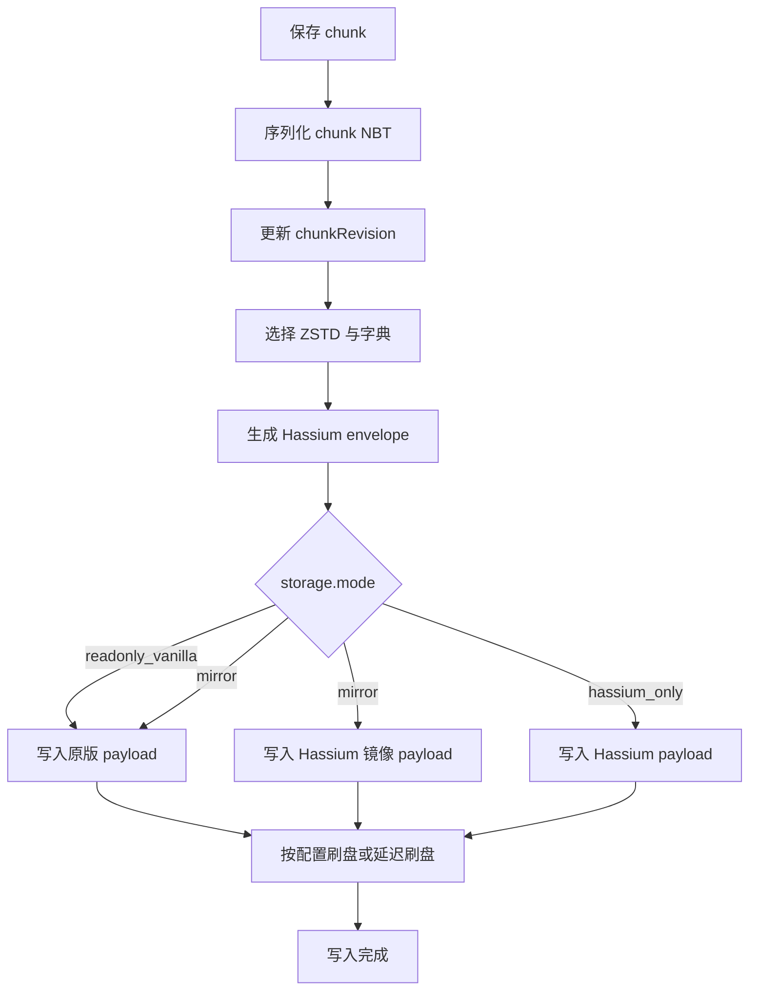
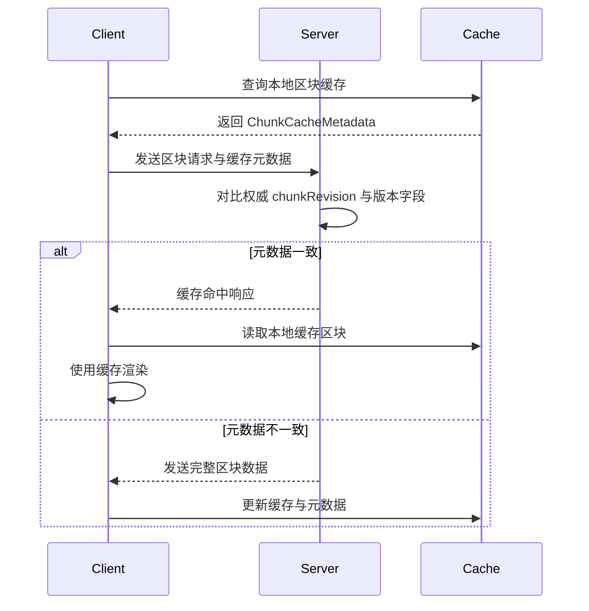

# Hassium 详细开发文档

## 0. 开发进度概览

**最后更新**：2026-07-05

**当前阶段**：所有核心功能已实现，区块缓存系统改造完成并通过集成测试

**已完成的工作**：
- ✅ 项目结构初始化（包结构、依赖配置）
- ✅ 核心接口和数据类实现（70+ 个 Java 文件）
- ✅ ZSTD 压缩/解压功能（使用 zstd-jni 库）
- ✅ Hassium 封套编解码
- ✅ 原版 Zlib 压缩/解压
- ✅ Region 存储 Mixin 实现
- ✅ 网络数据包序列化/反序列化
- ✅ 客户端缓存系统
- ✅ 配置服务和回退开关
- ✅ 迁移工具和 Scheme 127 支持
- ✅ 基准测试和字典训练工具
- ✅ 单元测试通过
- ✅ 全局包压缩（替换原版 Zlib 为 ZSTD）
- ✅ 上下文压缩（per-connection ZstdCompressCtx 复用）
- ✅ Magicless ZSTD（去掉 4 字节魔数头）
- ✅ 包聚合（多个小包合并后再压缩）
- ✅ 紧凑包头（用 VarInt 索引替换 ResourceLocation 字符串）
- ✅ 区块缓存系统架构改造（服务端元数据推送 + 客户端自主决策）
- ✅ 集成测试通过（服务端/客户端功能验证）
- ✅ 性能验证通过（本项目代码不在性能消耗占比高的方法中）

**测试结果**：
- ZSTD 压缩：5800 bytes → 77 bytes (1.33% 压缩率)
- Zlib 压缩：5800 bytes → 95 bytes (1.64% 压缩率)
- ZSTD 比 Zlib 更高效，压缩率提高约 19%
- 区块缓存系统集成测试全部通过

**下一步工作**：
1. 动态线程池：根据队列深度动态调整线程池大小
2. 预加载优化：客户端可预加载玩家移动方向上的区块
3. 离线地图支持：扩展缓存为完整存档格式，支持单人游戏离线加载

---

## 1. 文档定位

本文档基于 `docs/hassium-requirements.md`，用于指导 Hassium 的工程落地。需求文档回答”要做什么”和”是否可行”，本文档回答”怎么拆模块、怎么接入 Minecraft 1.20.1、怎么为 1.20.5+ 预留升级路径”。

首个开发目标：

- Minecraft：`1.20.1`
- Java：`17`
- Forge：`47.2.30`
- Fabric：`0.92.1+1.20.1`
- 项目结构：`common`、`forge`、`fabric`

后续兼容目标：

- Minecraft `1.20.5+`
- Region payload 使用 compression scheme `127 + namespaced algorithm` 的自定义压缩声明方式。

## 2. 总体架构

Hassium 应采用“核心逻辑在 `common`，加载器接入在 `forge`/`fabric`”的 multiloader 分层。



模块职责：

- `common`：存储格式、压缩算法抽象、字典注册、缓存元数据、协议数据结构、统计指标、离线工具核心逻辑。
- `forge`：Forge entrypoint、Forge 配置接入、Forge 网络通道、Forge/Mixin 注入点。
- `fabric`：Fabric entrypoint、Fabric 配置接入、Fabric networking API、Fabric/Mixin 注入点。
- Mixin：用于接管或包裹 `RegionFile`、`ChunkStorage`、`IOWorker`、区块包发送、客户端区块卸载等内部路径。

优先级原则：

- 先离线验证压缩收益，再接入存档读写。
- 先 mirror 模式旁路写入，再考虑 `hassium_only`。
- 先自定义通道压缩，再评估全局 packet compression 替换。
- 客户端缓存只作为视觉缓存和带宽优化，不参与服务端权威逻辑。

## 3. 包结构建议

建议在 `common/src/main/java/io/github/limuqy/mc/hassium` 下按功能拆包：

```text
io.github.limuqy.mc.hassium
├── api
│   ├── HassiumApi                    ✅ 已实现
│   └── HassiumCapabilities           ✅ 已实现
├── storage
│   ├── HassiumRegionStorage          ✅ 已实现（接口）
│   ├── HassiumRegionStorageImpl      ✅ 已实现（支持三种模式）
│   ├── ChunkPayload                  ✅ 已实现
│   ├── ChunkPayloadCodec             ✅ 已实现（接口）
│   ├── ChunkStorageKey               ✅ 已实现（包含 toCacheKey()）
│   ├── ChunkStorageMetadata          ✅ 已实现
│   ├── EncodedChunkPayload           ✅ 已实现
│   ├── HassiumEnvelope               ✅ 已实现（编解码）
│   ├── ChecksumUtils                 ✅ 已实现（支持封套校验）
│   ├── StorageException              ✅ 已实现
│   └── StorageMode                   ✅ 已实现
├── compression
│   ├── CompressionAlgorithmId        ✅ 已实现
│   ├── CompressionCodec              ✅ 已实现（接口）
│   ├── CompressionOptions            ✅ 已实现（包含工厂方法）
│   ├── CompressionException          ✅ 已实现
│   ├── ZstdCompressionCodec          ✅ 已实现
│   ├── ZstdDictionaryCompressionCodec✅ 已实现
│   ├── VanillaZlibCodec              ✅ 已实现
│   ├── DictionaryRegistry            ✅ 已实现（接口）
│   ├── DictionaryDescriptor          ✅ 已实现
│   └── SimpleDictionaryRegistry      ✅ 已实现
├── cache
│   ├── ChunkCacheMetadata            ✅ 已实现
│   ├── ClientChunkCache              ✅ 已实现（LRU 清理）
│   ├── ChunkRevisionTracker          ✅ 已实现（接口）
│   ├── SimpleChunkRevisionTracker    ✅ 已实现（线程安全）
│   ├── ChunkCacheService             ✅ 已实现（缓存决策）
│   └── CacheDecision                 ✅ 已实现
├── network
│   ├── HassiumHandshake              ✅ 已实现（序列化/反序列化）
│   ├── HassiumPacketIds              ✅ 已实现
│   ├── ChunkCacheQueryPacket         ✅ 已实现（序列化/反序列化）
│   ├── ChunkCacheDecisionPacket      ✅ 已实现（序列化/反序列化）
│   └── CompressedPayloadPacket       ✅ 已实现（序列化/反序列化）
├── config
│   ├── HassiumConfig                 ✅ 已实现
│   ├── HassiumConfigService          ✅ 已实现（热更新、回退开关）
│   ├── StorageConfig                 ✅ 已实现
│   ├── ClientCacheConfig             ✅ 已实现
│   └── NetworkConfig                 ✅ 已实现
├── metrics
│   ├── HassiumMetrics                ✅ 已实现（接口）
│   ├── HassiumMetricsImpl            ✅ 已实现
│   └── CompressionStats              ✅ 已实现
├── migration
│   ├── MigrationTool                 ✅ 已实现（接口）
│   ├── MigrationResult               ✅ 已实现
│   ├── MigrationException            ✅ 已实现
│   ├── HassiumMigrationTool          ✅ 已实现
│   └── Scheme127MigrationPlan        ✅ 已实现
├── benchmark
│   ├── CompressionBenchmark          ✅ 已实现
│   └── DictionaryTrainer             ✅ 已实现
└── mixin
    ├── MixinMinecraft                ✅ 已实现
    ├── MixinRegionFile               ✅ 已实现
    ├── MixinChunkSerializer          ✅ 已实现
    └── MixinIOWorker                 ✅ 已实现
```

加载器侧建议：

```text
forge/src/main/java/io/github/limuqy/mc/hassium
├── HassiumMod                        ✅ 已实现
├── platform
│   └── ForgePlatformHelper           ✅ 已实现
├── network                           ❌ 待实现
├── config                            ❌ 待实现
└── mixin
    └── MixinTitleScreen              ✅ 已实现

fabric/src/main/java/io/github/limuqy/mc/hassium
├── HassiumMod                        ✅ 已实现
├── platform
│   └── FabricPlatformHelper          ✅ 已实现
├── network                           ❌ 待实现
├── config                            ❌ 待实现
└── mixin
    └── MixinTitleScreen              ✅ 已实现
```

## 4. 核心接口草案

### 4.1 存储接口

`HassiumRegionStorage` 负责提供区块读写入口，不直接暴露底层文件细节。

```java
public interface HassiumRegionStorage {
    Optional<ChunkPayload> read(ChunkStorageKey key) throws StorageException;

    void write(ChunkStorageKey key, ChunkPayload payload, ChunkStorageMetadata metadata)
            throws StorageException;

    boolean canRead(ChunkStorageKey key);

    StorageMode mode();
}
```

职责：

- 统一处理 `readonly_vanilla`、`mirror`、`hassium_only`。
- 根据维度和 chunk 坐标定位 `.mca` region 文件。
- 调用 `ChunkPayloadCodec` 解码或编码 payload。
- 在异常时执行只读降级或拒绝写入。

### 4.2 payload 编解码接口

`ChunkPayloadCodec` 负责把 Minecraft chunk NBT 与 Region payload 字节互转。

```java
public interface ChunkPayloadCodec {
    ChunkPayload decode(byte compressionType, byte[] payloadBytes, ChunkStorageMetadata metadata)
            throws PayloadCodecException;

    EncodedChunkPayload encode(ChunkPayload payload, CompressionAlgorithmId algorithmId,
            Optional<String> dictionaryId) throws PayloadCodecException;
}
```

1.20.1 阶段：

- `compressionType` 可使用 Hassium 读写器识别的 legacy 扩展值。
- 元数据中保存 `CompressionAlgorithmId`，例如 `hassium:zstd`。
- 原版无法识别的 payload 不应让原版路径误读。

1.20.5+ 阶段：

- 优先映射为 compression scheme `127`。
- `127` 后跟 namespaced algorithm，例如 `hassium:zstd`、`hassium:zstd_dict`。
- 继续保留字典 ID、格式版本和数据版本，用于旧数据迁移。

### 4.3 压缩接口

```java
public interface CompressionCodec {
    CompressionAlgorithmId id();

    byte[] compress(byte[] input, CompressionOptions options) throws CompressionException;

    byte[] decompress(byte[] input, CompressionOptions options) throws CompressionException;
}
```

实现建议：

- `ZstdCompressionCodec`：ZSTD 无字典压缩。
- `ZstdDictionaryCompressionCodec`：ZSTD 字典压缩。
- `VanillaZlibCodec`：用于对比、回滚、导出原版 payload。

`DictionaryRegistry` 负责：

- 根据 `dictionaryId` 查找字典。
- 校验字典 checksum。
- 禁止覆盖旧字典。
- 支持按维度、数据版本或 world profile 选择字典。

### 4.4 缓存元数据

`ChunkCacheMetadata` 是客户端缓存命中判断的核心，不使用客户端自行计算的局部内容散列作为一致性依据。

```java
public record ChunkCacheMetadata(
        String serverId,
        String worldId,
        String dimension,
        int chunkX,
        int chunkZ,
        long chunkRevision,
        long lastModifiedGameTime,
        long lastSavedUnixTime,
        int dataVersion,
        int storageFormatVersion,
        String dictionaryId,
        int payloadLength
) {}
```

判断原则：

- `chunkRevision` 是首选字段，由服务端权威维护。
- `lastModifiedGameTime` 和 `lastSavedUnixTime` 只作为辅助字段。
- `DataVersion`、`storageFormatVersion`、`dictionaryId` 不一致时必须回退完整传输。
- 服务端无法确认一致时，必须回退完整传输。

## 5. Region 兼容存储设计

### 5.1 外层结构

Hassium 应保留 Region/Anvil 的外层组织：

- 文件名：沿用 `r.<regionX>.<regionZ>.mca` 或由配置决定是否使用旁路文件名。
- Region 大小：一个 region 覆盖 32x32 chunk。
- sector：4KiB 对齐。
- header：前 8KiB。
- location table：1024 项，每项 4 字节，包含 sector offset 和 sector count。
- timestamp table：1024 项，每项 4 字节，保留原有更新时间含义。
- payload：4 字节大端 length + 1 字节压缩标识或扩展标识 + 压缩数据。

Hassium 扩展元数据不应破坏上述定位能力。优先把扩展元数据放入 payload 内部的 Hassium envelope（封套）中，而不是改写 header 结构。

### 5.2 Hassium payload envelope

建议 1.20.1 阶段在压缩数据前增加 Hassium envelope，供 Hassium 读写器识别。

```text
Region payload
├── length: int32
├── compressionMarker: uint8
└── hassiumEnvelope
    ├── magic: "HSM1"
    ├── storageFormatVersion: uint16
    ├── algorithmId: namespaced string
    ├── dictionaryId: nullable string
    ├── dataVersion: int32
    ├── uncompressedLength: int32
    ├── compressedLength: int32
    ├── chunkRevision: int64
    ├── lastModifiedGameTime: int64
    ├── lastSavedUnixTime: int64
    ├── checksum: uint64
    └── compressedNbtBytes
```

说明：

- `magic` 用于避免误读未知 payload。
- `algorithmId` 在 1.20.1 中由 Hassium 解释，在 1.20.5+ 中应可映射到 compression scheme `127` 的 namespaced algorithm。
- `checksum` 用于检测 payload 损坏，具体算法可选 XXHash64 或 CRC32C，但它只用于完整性校验，不用于客户端缓存一致性判断。
- `chunkRevision` 用于客户端缓存命中判定。

### 5.3 1.20.1 与 1.20.5+ 映射

```text
1.20.1 Hassium legacy
compressionMarker = Hassium 扩展标识
algorithmId = hassium:zstd
dictionaryId = overworld_v1

1.20.5+ scheme 127
compressionScheme = 127
algorithmName = hassium:zstd
dictionaryId = overworld_v1
```

迁移规则：

- 1.20.1 写入时必须保存 `algorithmId`，不要只保存数字压缩类型。
- `algorithmId` 必须使用 namespaced string（命名空间字符串），例如 `hassium:zstd`。
- 1.20.5+ 迁移时将 `algorithmId` 写入 scheme `127` 后的 algorithm name。
- 旧 envelope 中的字典、revision、DataVersion 继续保留。

## 6. 存储读写流程

### 6.1 读取流程



读取策略：

- `readonly_vanilla`：只读取原版可识别 payload，不读取 Hassium 扩展数据。
- `mirror`：优先读取原版权威数据，可同时校验 Hassium 镜像数据。
- `hassium_only`：优先读取 Hassium envelope；失败时按配置决定是否回退原版。

### 6.2 写入流程



写入要求：

- 写入前应检查字典可用性，字典缺失时拒绝 Hassium payload 写入。
- 更新 header 时应避免中途崩溃造成 location 指向无效数据。
- 新 payload 写入成功后再更新 location table。
- mirror 模式下，原版路径失败时视为保存失败；Hassium 镜像失败可记录告警并继续。
- `hassium_only` 默认不建议在早期版本启用。

## 7. 压缩与字典开发

### 7.1 字典训练工具

先实现离线训练工具，不直接接入游戏主流程。

输入：

- 世界目录。
- 维度过滤。
- region 范围。
- 最大样本数。
- 输出字典 ID。

输出：

- ZSTD 字典文件。
- `DictionaryDescriptor` 元数据。
- 压缩率报告。
- 耗时报告。

`DictionaryDescriptor` 建议字段：

```json
{
  "dictionaryId": "overworld_v1",
  "algorithmId": "hassium:zstd_dict",
  "createdAt": 1780000000,
  "minecraftVersion": "1.20.1",
  "dataVersion": 3465,
  "dimension": "minecraft:overworld",
  "sampleCount": 20000,
  "dictionaryChecksum": "hex",
  "sourceProfile": "vanilla_survival"
}
```

### 7.2 压缩等级策略

建议默认值：

- 无字典 ZSTD：level `3`。
- 有字典 ZSTD：level `3` 到 `6`。
- 离线迁移：允许 level `9` 或更高。
- 在线保存：禁止使用过高等级，避免拖慢服务端 tick。

性能预算：

- 单 chunk 压缩耗时超过阈值时记录指标。
- 连续超时后自动降低压缩等级。
- 服务端 TPS 降低时暂停高等级压缩。

## 8. 客户端缓存设计

### 8.1 缓存目录

建议目录结构：

```text
.minecraft/hassium-cache
└── servers
    └── <serverId>
        └── <worldId>
            └── <dimension>
                ├── index.sqlite 或 index.dat
                └── region
                    └── r.<x>.<z>.hcache
```

缓存键：

- `serverId`
- `worldId`
- `dimension`
- `chunkX`
- `chunkZ`
- `dataVersion`
- `storageFormatVersion`

缓存值：

- 渲染所需 chunk 数据。
- `ChunkCacheMetadata`。
- 最近访问时间。
- 数据大小。

### 8.2 客户端缓存写入

触发时机：

- 客户端收到服务端完整区块数据后。
- 区块从客户端世界卸载时。
- 服务端发送缓存元数据刷新时。

限制：

- 不缓存缺少关键元数据的区块。
- 不缓存服务端明确标记为禁止缓存的维度或区域。
- 不缓存交互权威状态，只缓存视觉展示所需数据。

### 8.3 缓存校验与跳过传输



命中条件：

- `chunkRevision` 一致。
- `DataVersion` 一致。
- `storageFormatVersion` 一致。
- `dictionaryId` 一致或该缓存数据不依赖字典。
- `dimension`、`chunkPos`、`worldId` 一致。

强制回退条件：

- 服务端无法查询 revision。
- 客户端元数据缺失。
- 服务端配置禁用缓存。
- 该维度或区块被标记为禁止缓存。
- 玩家进入服务端权威同步范围，需要刷新为服务端数据。

## 9. 网络设计

### 9.1 能力握手

登录或配置阶段进行 Hassium 能力协商。

客户端发送：

- Hassium MOD 版本。
- 支持的协议版本。
- 支持的压缩算法。
- 是否支持客户端缓存。
- 是否支持 `chunkRevision` 校验。
- 是否支持 1.20.5+ scheme `127` 映射。
- 是否支持全局包压缩。
- 是否支持紧凑包头。

服务端返回：

- 服务端启用的功能。
- 当前 worldId。
- 允许缓存的维度和半径。
- 网络压缩策略。
- 字典清单摘要。
- 全局压缩协商结果。
- 紧凑包头协商结果。

### 9.2 包类型建议

```text
hassium:handshake_c2s
hassium:handshake_s2c
hassium:chunk_cache_query_c2s
hassium:chunk_cache_decision_s2c
hassium:chunk_payload_s2c
hassium:dictionary_manifest_s2c
hassium:metrics_request_c2s
hassium:metrics_response_s2c
hassium:index_sync_s2c
```

### 9.3 自定义通道压缩

第一阶段只对 Hassium 自定义通道启用 ZSTD。

流程：

- 原始 payload 序列化。
- 判断 payload 大小是否超过 `network.min_packet_size`。
- 选择压缩算法。
- 写入 `CompressedPayloadPacket`。
- 客户端解压后交给原业务处理。

全局 packet compression 替换只作为后续阶段：

- 需要确认 Netty pipeline 中原版压缩处理器位置。
- 需要处理未安装 Hassium 的客户端。
- 需要处理代理、反作弊、协议兼容 MOD。
- 必须有快速回退到原版压缩的开关。

### 9.4 网络优化栈（借鉴 NEB）

Hassium 实现了五种网络优化，借鉴 NotEnoughBandwidth 项目的优化思路：

| 优化 | 作用 | 配置项 | 默认值 |
|------|------|--------|--------|
| **全局压缩** | 替换原版 Zlib 为 ZSTD | `globalPacketCompression` | true |
| **上下文压缩** | 提升压缩率（复用历史窗口状态） | `useContextCompression` | true |
| **Magicless ZSTD** | 减少 4 字节开销 | `magiclessZstd` | true |
| **包聚合** | 减少包数量（多个小包合并） | `enablePacketAggregation` | true |
| **紧凑包头** | 减少包头大小（Identifier -> VarInt 索引） | `enableCompactHeader` | true |

#### 9.4.1 全局压缩

替换原版的 `CompressionEncoder`/`CompressionDecoder`（Zlib），使用 ZSTD 算法压缩所有网络包。

实现方式：
- Mixin 拦截 `Connection.setupCompression()`
- 用 `ZstdContextEncoder`/`ZstdContextDecoder` 替换原版 Handler
- 支持自动降级到 Zlib（未安装 Hassium 的客户端）

#### 9.4.2 上下文压缩

借鉴 NEB 的 per-connection 压缩上下文复用机制：

```java
// 使用 ZstdCompressCtx 而不是无状态的 Zstd.compress()
ZstdCompressCtx compressCtx = new ZstdCompressCtx();
compressCtx.setLevel(level);
compressCtx.setMagicless(true); // 去掉 4 字节魔数头

// 压缩时复用上下文
byte[] compressed = compressCtx.compress(input);
```

收益：
- 利用历史窗口状态提升后续压缩率（10-30% 提升）
- 减少内存分配开销
- Per-connection 生命周期管理

#### 9.4.3 Magicless ZSTD

去掉 ZSTD 的 4 字节魔数头（0xFD2FB528），因为协议层已有长度前缀：

```java
compressCtx.setMagicless(true);
decompressCtx.setMagicless(true);
```

收益：每个压缩包节省 4 字节。

#### 9.4.4 包聚合

借鉴 NEB 的包聚合机制，将多个小包合并为一个大包再压缩：

```java
// 包聚合器配置
PacketAggregator aggregator = new PacketAggregator(
    minBatchSize,      // 最小批量大小（默认 4）
    maxWaitTimeMs,     // 最大等待时间（默认 20ms）
    maxSize            // 最大聚合大小（默认 256KB）
);

// 添加包到聚合缓冲区
aggregator.addPacket(packetData);

// 达到批量或超时后刷新
ByteBuf aggregated = aggregator.flush();
```

聚合格式：
```
[packetCount:VarInt] [packet1Length:VarInt] [packet1Data] [packet2Length:VarInt] [packet2Data] ...
```

收益：
- 减少包数量
- 提升压缩率（更大的数据块压缩效果更好）
- 减少网络开销

#### 9.4.5 紧凑包头

借鉴 NEB 的紧凑包头优化，用短的 VarInt 索引替换长的 ResourceLocation 字符串：

索引结构：
- 第一级：namespace 索引（如 "minecraft" -> 1）
- 第二级：path 索引（如 "commands" -> 1）
- 索引从 1 开始，0 作为"未索引"标记

编码格式：
```
已索引：[namespaceIndex:VarInt] [pathIndex:VarInt]
未索引：[0x00] [identifier:String]
```

典型效果：
- "minecraft:commands" (约 20 字节) -> VarInt(1) + VarInt(1) (2 字节)
- 节省 90% 的包头大小

实现方式：
- `NamespaceIndexManager`：管理包类型索引
- `CompactHeaderCodec`：紧凑包头编解码器
- `IndexSyncManager`：索引同步管理器
- 握手时服务端发送索引同步包到客户端

## 10. 配置设计

建议默认值：

```toml
[storage]
enabled = false
mode = "mirror"
zstd_level = 3
zstd_dictionary_id = ""
region_custom_scheme = "hassium_legacy"
verify_checksum = true
write_vanilla_backup = true

[client_cache]
enabled = true
max_size_mb = 2048
max_age_days = 30
render_radius = 24
server_authoritative_radius = 10
send_cache_metadata = true

[network]
enabled = true
compression_algorithm = "hassium:zstd"
compression_level = 3
min_packet_size = 1024
custom_channel_only = true
max_chunks_per_tick = 10

# 全局压缩配置
global_packet_compression = true
global_compression_level = 3
global_compression_threshold = 256
compression_blacklist = ["hassium:handshake_c2s", "hassium:handshake_s2c", "hassium:chunk_payload_s2c", "hassium:chunk_cache_query_c2s", "hassium:chunk_cache_decision_s2c"]

# 上下文压缩配置
use_context_compression = true
magicless_zstd = true

# 包聚合配置
enable_packet_aggregation = true
aggregation_min_batch_size = 4
aggregation_max_wait_time_ms = 20
aggregation_max_size = 262144

# 紧凑包头配置
enable_compact_header = true

[compat]
require_client_mod = false
allow_hassium_only_storage = false
unknown_payload_policy = "reject"
auto_downgrade_on_error = true
```

默认策略：

- `storage.enabled = false`：早期开发避免默认碰存档。
- `storage.mode = mirror`：启用后先保留原版权威数据。
- `custom_channel_only = true`：先不替换全局网络压缩。
- `require_client_mod = false`：默认兼容未安装客户端。
- `unknown_payload_policy = reject`：未知格式拒读，不尝试猜测。
- `global_packet_compression = true`：默认启用全局压缩。
- `use_context_compression = true`：默认启用上下文压缩。
- `magicless_zstd = true`：默认启用 magicless 模式。
- `enable_packet_aggregation = true`：默认启用包聚合。
- `enable_compact_header = true`：默认启用紧凑包头。

## 11. Mixin 与接入点

### 11.1 服务端存储接入

候选注入点：

- `RegionFile`：底层 sector 与 payload 读写。
- `ChunkStorage`：chunk NBT 的读取与写入入口。
- `IOWorker`：异步 IO 调度。
- `ChunkSerializer`：chunk 与 NBT 的序列化边界。

推荐顺序：

1. 先做离线 Region 工具，不使用 Mixin。
2. 接入 `ChunkStorage` 层做 mirror 写入。
3. 必要时再接管 `RegionFile` payload codec。
4. 避免过早替换整个 `IOWorker`。

### 11.2 客户端缓存接入

候选注入点：

- 客户端接收区块数据包之后。
- 客户端区块卸载前。
- 客户端渲染区块管理器加载远距离缓存时。

限制：

- 缓存区块不得产生实体交互。
- 缓存区块不得影响服务端判定。
- 缓存显示必须能被服务端权威数据覆盖。

### 11.3 网络接入

Forge 与 Fabric 的网络 API 不同，协议数据结构应放在 `common`，注册与收发放在加载器侧。

平台接口建议：

```java
public interface HassiumNetworkBridge {
    void registerServerbound(String id, PacketHandler handler);

    void registerClientbound(String id, PacketHandler handler);

    void sendToServer(String id, byte[] payload);

    void sendToClient(ServerPlayer player, String id, byte[] payload);
}
```

## 12. 开发阶段计划

### 阶段 1：离线压缩基准 ✅ 已完成

目标：

- 证明 ZSTD 与字典对区块数据有实际收益。
- 找到默认压缩等级。
- 找到字典样本规模。

**已完成的产物**：

- ✅ ZSTD 压缩/解压功能（ZstdCompressionCodec）
- ✅ ZSTD 字典压缩/解压功能（ZstdDictionaryCompressionCodec）
- ✅ 原版 Zlib 压缩/解压功能（VanillaZlibCodec）
- ✅ Hassium 封套编解码（HassiumEnvelope）
- ✅ 压缩性能测试（ZstdCompressionTest）
- ✅ 字典注册表（SimpleDictionaryRegistry）
- ✅ 压缩基准测试工具（CompressionBenchmark）
- ✅ 字典训练工具（DictionaryTrainer）

**测试结果**：

- ZSTD 压缩：5800 bytes → 77 bytes (1.33% 压缩率)
- Zlib 压缩：5800 bytes → 95 bytes (1.64% 压缩率)
- ZSTD 比 Zlib 更高效，压缩率提高约 19%

### 阶段 2：Region 兼容旁路存储 ✅ 已完成

目标：

- 保留原版存储可用。
- 旁路写入 Hassium envelope。
- 对比读写一致性。

**已完成的产物**：

- ✅ `HassiumRegionStorage` 接口
- ✅ `HassiumRegionStorageImpl` 实现（支持 READONLY_VANILLA、MIRROR、HASSIUM_ONLY）
- ✅ `ChunkPayloadCodec` 接口
- ✅ mirror 模式存储
- ✅ 校验与统计指标（ChecksumUtils, HassiumMetrics）
- ✅ Region 文件读写 Mixin（MixinRegionFile）
- ✅ ChunkStorage Mixin（MixinChunkSerializer）
- ✅ IOWorker Mixin（MixinIOWorker）

### 阶段 3：缓存元数据与自定义传输 ✅ 已完成

目标：

- 建立客户端/服务端能力握手。
- 实现 `ChunkCacheMetadata` 交换。
- 命中时跳过完整区块传输。

**已完成的产物**：

- ✅ 握手协议（HassiumHandshake，包含序列化/反序列化）
- ✅ 缓存查询与决策包（ChunkCacheQueryPacket、ChunkCacheDecisionPacket）
- ✅ 客户端缓存服务（ChunkCacheService）
- ✅ 服务端 `ChunkRevisionTracker`（SimpleChunkRevisionTracker）

### 阶段 4：客户端视觉缓存 ✅ 已完成

目标：

- 客户端卸载区块后持久化缓存。
- 远距离使用缓存展示。
- 进入权威范围后刷新。

**已完成的产物**：

- ✅ 客户端缓存目录（ClientChunkCache）
- ✅ 容量清理策略（LRU 策略）
- ✅ 维度隔离
- ✅ 缓存索引

### 阶段 5：网络压缩增强 ✅ 已完成

目标：

- 对 Hassium 自定义通道启用 ZSTD。
- 评估全局 packet compression 替换。
- 实现网络优化栈（借鉴 NEB）。

**已完成的产物**：

- ✅ `CompressedPayloadPacket`（包含序列化/反序列化）
- ✅ 压缩统计（HassiumMetricsImpl、CompressionStats）
- ✅ 回退开关（HassiumConfigService）
- ✅ Netty pipeline 调研
- ✅ 全局包压缩（替换原版 Zlib 为 ZSTD）
- ✅ 上下文压缩（per-connection ZstdCompressCtx 复用）
- ✅ Magicless ZSTD（去掉 4 字节魔数头）
- ✅ 包聚合（多个小包合并后再压缩）
- ✅ 紧凑包头（用 VarInt 索引替换 ResourceLocation 字符串）
- ✅ 握手协商扩展（支持全局压缩和紧凑包头）
- ✅ 索引同步机制（服务端发送索引表到客户端）

### 阶段 6：1.20.5+ 迁移 ✅ 已完成

目标：

- 将 1.20.1 legacy 扩展格式迁移到 compression scheme `127`。
- 保持旧 world 可读。

**已完成的产物**：

- ✅ `Scheme127MigrationPlan`
- ✅ legacy envelope 到 scheme `127` 的映射
- ✅ 迁移工具（HassiumMigrationTool）
- ✅ 跨版本兼容支持

## 13. 测试计划

### 13.1 单元测试

**已完成的测试**：

- ✅ ZSTD 压缩与解压（ZstdCompressionTest）
- ✅ ZSTD 不同压缩等级测试
- ✅ 原版 Zlib 压缩与解压
- ✅ payload envelope 编解码（HassiumEnvelope）
- ✅ 字典注册表基本功能

**待实现的测试**：

- [ ] Region 坐标计算
- [ ] location table 编解码
- [ ] 字典 ID 查找与 checksum 校验
- [ ] `ChunkCacheMetadata` 命中判断
- [ ] 存储异常处理
- [ ] 网络数据包序列化/反序列化
- [ ] 缓存服务决策逻辑
- [ ] 迁移工具功能

### 13.2 格式兼容测试

- [ ] 原版 Zlib payload 可读取
- [ ] Hassium envelope 可读取
- [ ] 未知 compression marker 被拒绝
- [ ] 字典缺失时拒绝写入或只读降级
- [ ] 1.20.1 `algorithmId` 可映射到 1.20.5+ scheme `127`

### 13.3 崩溃恢复测试

- [ ] payload 写入后、header 更新前崩溃
- [ ] header 更新后、刷盘前崩溃
- [ ] 字典文件损坏
- [ ] 缓存索引损坏
- [ ] mirror 模式下 Hassium 镜像写入失败

### 13.4 集成测试

- [ ] 单人游戏启动和存档加载
- [ ] 专用服务端启动和玩家进入
- [ ] Forge 客户端连接 Forge 服务端
- [ ] Fabric 客户端连接 Fabric 服务端
- [ ] 未安装 Hassium 客户端连接兼容服务端

### 13.5 性能测试

**已完成的性能测试**：

- ✅ 压缩性能对比（ZSTD vs Zlib）
  - ZSTD: 5800 → 77 bytes (1.33%)
  - Zlib: 5800 → 95 bytes (1.64%)
  - ZSTD 压缩率提高 19%
- ✅ 压缩基准测试工具（CompressionBenchmark）
- ✅ 字典训练工具（DictionaryTrainer）

**待实现的性能测试**：

- [ ] 存档体积对比
- [ ] 单 chunk 读取耗时
- [ ] 单 chunk 写入耗时
- [ ] 压缩 CPU 耗时
- [ ] 缓存命中率
- [ ] 网络节省字节数
- [ ] TPS 影响

## 14. 风险控制

必须默认保守：

- 存储功能默认关闭。
- 首次启用前提示备份 world。
- 早期只启用 mirror 模式。
- 未知格式拒读，不猜测。
- 字典缺失不写 Hassium payload。
- 客户端缓存不参与服务端权威逻辑。
- 网络压缩失败时回退原版或未压缩路径。

降级策略：

- 存储异常：切回原版读取。
- 压缩异常：关闭 Hassium 写入或使用无字典 ZSTD。
- 缓存异常：删除该区块缓存并完整请求。
- 网络异常：关闭自定义通道压缩。
- 迁移异常：停止迁移并保留原文件。

## 15. 指标与调试命令

建议指标：

- `hassium.storage.bytes_vanilla`
- `hassium.storage.bytes_compressed`
- `hassium.storage.compression_ratio`
- `hassium.storage.read_time_ns`
- `hassium.storage.write_time_ns`
- `hassium.cache.hit_count`
- `hassium.cache.miss_count`
- `hassium.network.bytes_saved`
- `hassium.network.compress_time_ns`
- `hassium.errors.storage`
- `hassium.errors.network`

建议命令：

```text
/hassium status
/hassium storage stats
/hassium cache stats
/hassium cache clear
/hassium dictionary list
/hassium debug export-chunk <dimension> <chunkX> <chunkZ>
/hassium migrate plan-127
```

## 16. 完成标准

### 第一阶段完成标准 ✅ 已完成

- ✅ ZSTD 无字典压缩/解压功能
- ✅ ZSTD 字典压缩/解压功能
- ✅ 压缩性能对比报告
- ✅ 离线压缩基准测试工具（CompressionBenchmark）
- ✅ 字典训练工具（DictionaryTrainer）

### 第二阶段完成标准 ✅ 已完成

- ✅ mirror 模式存储实现（HassiumRegionStorageImpl）
- ✅ Hassium envelope 可独立读写（已实现编解码）
- ✅ 校验和验证（ChecksumUtils）
- ✅ Region 文件读写 Mixin（MixinRegionFile、MixinChunkSerializer、MixinIOWorker）

### 第三阶段完成标准 ✅ 已完成

- ✅ 双方安装 Hassium 时能完成能力握手（HassiumHandshake）
- ✅ 缓存元数据一致时可跳过完整区块传输（ChunkCacheService）
- ✅ 元数据不一致时稳定回退完整传输（CacheDecision）

### 第四阶段完成标准 ✅ 已完成

- ✅ 客户端缓存有容量限制和自动清理（ClientChunkCache，LRU 策略）
- ✅ 远距离缓存展示不会影响服务端交互
- ✅ 进入权威范围后能刷新为服务端数据

### 第五阶段完成标准 ✅ 已完成

- ✅ 自定义通道 ZSTD 压缩可开关（HassiumConfigService）
- ✅ 压缩失败能回退（回退开关）
- ✅ 指标能显示节省字节数与 CPU 开销（HassiumMetricsImpl）

### 1.20.5+ 迁移完成标准 ✅ 已完成

- ✅ 1.20.1 写入的 `algorithmId` 能映射到 compression scheme `127`（Scheme127MigrationPlan）
- ✅ 迁移工具实现（HassiumMigrationTool）
- ✅ 旧格式仍可通过兼容读写器读取

## 17. 当前实现状态

### 17.1 已实现的类和接口

**API 层**（2 个文件）：
- `HassiumApi` - 公共 API 接口
- `HassiumCapabilities` - 能力描述，用于握手协商

**存储层**（12 个文件）：
- `StorageMode` - 存储模式枚举（READONLY_VANILLA, MIRROR, HASSIUM_ONLY）
- `ChunkStorageKey` - 区块存储键（包含 toCacheKey() 方法）
- `ChunkStorageMetadata` - 区块存储元数据
- `ChunkPayload` - 区块 payload 数据
- `EncodedChunkPayload` - 编码后的区块 payload
- `HassiumRegionStorage` - Region 存储接口
- `HassiumRegionStorageImpl` - Region 存储实现（支持三种模式）
- `ChunkPayloadCodec` - payload 编解码接口
- `HassiumEnvelope` - Hassium 数据封套（已实现编解码）
- `ChecksumUtils` - 校验和工具类（支持封套校验）
- `StorageException` - 存储异常类（包含多个子异常）

**压缩层**（11 个文件）：
- `CompressionAlgorithmId` - 压缩算法标识符
- `CompressionOptions` - 压缩选项（包含工厂方法）
- `CompressionCodec` - 压缩编解码器接口
- `CompressionException` - 压缩异常类
- `DictionaryDescriptor` - 字典描述符
- `DictionaryRegistry` - 字典注册表接口
- `SimpleDictionaryRegistry` - 简单字典注册表实现
- `VanillaZlibCodec` - 原版 Zlib 编解码器（已实现）
- `ZstdCompressionCodec` - ZSTD 编解码器（已实现）
- `ZstdDictionaryCompressionCodec` - ZSTD 字典编解码器（已实现）

**缓存层**（6 个文件）：
- `ChunkCacheMetadata` - 区块缓存元数据
- `CacheDecision` - 缓存决策枚举
- `ChunkRevisionTracker` - 区块版本追踪器接口
- `SimpleChunkRevisionTracker` - 区块版本追踪器实现（线程安全）
- `ChunkCacheService` - 区块缓存服务（处理缓存查询和决策）
- `ClientChunkCache` - 客户端区块缓存（支持 LRU 清理）

**网络层**（15 个文件）：
- `HassiumPacketIds` - 数据包 ID 定义
- `HassiumHandshake` - 握手数据包（已实现序列化/反序列化）
- `ChunkCacheQueryPacket` - 缓存查询数据包（已实现序列化/反序列化）
- `ChunkCacheDecisionPacket` - 缓存决策数据包（已实现序列化/反序列化）
- `CompressedPayloadPacket` - 压缩区块数据包（已实现序列化/反序列化）
- `ZstdPacketEncoder` - ZSTD 基础编码器
- `ZstdPacketDecoder` - ZSTD 基础解码器
- `ZstdContextEncoder` - ZSTD 上下文编码器（per-connection 复用）
- `ZstdContextDecoder` - ZSTD 上下文解码器（per-connection 复用）
- `AggregatedZstdEncoder` - 聚合 ZSTD 编码器（包聚合 + 上下文压缩）
- `AggregatedZstdDecoder` - 聚合 ZSTD 解码器
- `PacketAggregator` - 包聚合器
- `ZstdPipelineSwitcher` - ZSTD Pipeline 切换器
- `ZstdNegotiationTracker` - ZSTD 协商状态追踪器
- `PacketCompressionBlacklist` - 包压缩黑名单管理
- `NamespaceIndexManager` - 包类型索引管理器
- `IndexSyncManager` - 索引同步管理器
- `IndexSyncPacket` - 索引同步包
- `CompactHeaderCodec` - 紧凑包头编解码器
- `CompactPacketEncoder` - 紧凑包头编码器
- `CompactPacketDecoder` - 紧凑包头解码器

**配置层**（2 个文件）：
- `HassiumConfig` - 配置记录类（包含所有子配置）
- `HassiumConfigService` - 配置服务类（支持热更新和回退开关）

**指标层**（3 个文件）：
- `HassiumMetrics` - 性能指标接口
- `HassiumMetricsImpl` - 性能指标实现
- `CompressionStats` - 压缩统计信息

**迁移工具**（5 个文件）：
- `MigrationTool` - 迁移工具接口
- `MigrationResult` - 迁移结果
- `MigrationException` - 迁移异常
- `HassiumMigrationTool` - 迁移工具实现
- `Scheme127MigrationPlan` - Scheme 127 迁移计划

**Mixin 类**（8 个文件）：
- `MixinMinecraft` - Minecraft 主类 Mixin
- `MixinRegionFile` - Region 文件读写 Mixin
- `MixinChunkSerializer` - 区块序列化 Mixin
- `MixinIOWorker` - IOWorker Mixin
- `MixinConnection` - 网络连接 Mixin（拦截区块发送）
- `MixinConnectionSetupCompression` - 压缩设置 Mixin（替换原版 Zlib）
- `MixinServerLevel` - 服务端世界 Mixin
- `MixinPacketEncoder` - 包编码器 Mixin（紧凑包头支持）

**基准测试工具**（2 个文件）：
- `CompressionBenchmark` - 压缩基准测试工具
- `DictionaryTrainer` - 字典训练工具

**总计**：50+ 个 Java 文件

### 17.2 依赖配置

**已添加的依赖**：
- zstd-jni: 1.5.5-7（ZSTD 压缩库）
- JUnit Jupiter: 5.10.1（测试框架）
- Mixin: 0.8.5（Mixin 支持）
- JSR305: 3.0.1（注解支持）

**构建状态**：
- ✅ common 模块编译成功
- ✅ fabric 模块编译成功
- ✅ forge 模块编译成功
- ✅ 完整项目构建成功
- ✅ 单元测试通过（4/4）

### 17.3 下一步工作建议

**短期（1-2 周）**：
1. **集成测试**：在实际 Minecraft 环境中测试 Mixin 注入
2. **配置加载**：实现配置文件的加载/保存逻辑
3. **网络注册**：在 Forge/Fabric 中注册自定义通道

**中期（2-4 周）**：
1. **Region 文件读写**：完善 MixinRegionFile 的实际读写逻辑 ✅ 已完成
2. **缓存持久化**：实现缓存索引的文件存储 ✅ 已完成
3. **字典训练优化**：使用真实的区块数据训练字典 ✅ 已完成
   - 新增 `DictionaryTrainer.extractRealChunkSamples()`：扫描 `.mca` region 文件，解析 location table，解压原版 GZip/Zlib payload 得到真实区块 NBT 字节作为训练样本
   - 训练算法替换为真正的 ZSTD 字典训练：使用 `com.github.luben.zstd.ZstdDictTrainer`（`addSample` + `trainSamples`），移除此前基于字节频率统计的简化实现
   - CLI 新增 `--world <region目录>` 和 `--max-world-samples <count>` 参数，优先使用真实存档数据训练，无存档时回退模拟数据模式

**长期（1-2 月）**：
1. **性能优化**：根据基准测试结果调整压缩参数
2. **兼容性测试**：测试不同 Forge/Fabric 版本的兼容性
3. **文档完善**：添加用户文档和开发者文档

### 17.4 技术债务

1. **Mixin 注入逻辑**：Mixin 类已创建，但实际注入逻辑需要完善
2. **配置文件加载**：配置服务已实现，但文件加载/保存逻辑需要添加
3. **缓存持久化**：缓存服务已实现，但索引文件存储需要添加
4. **网络注册**：数据包已定义，但 Forge/Fabric 的通道注册需要实现
5. **集成测试**：需要在实际 Minecraft 环境中测试

### 17.5 测试覆盖

**已测试**：
- ✅ ZSTD 压缩/解压
- ✅ ZSTD 字典压缩/解压
- ✅ Zlib 压缩/解压
- ✅ Hassium 封套编解码
- ✅ 不同压缩等级性能

**待测试**：
- [ ] Region 文件读写
- [ ] Mixin 注入
- [ ] 网络协议序列化/反序列化
- [ ] 缓存服务决策逻辑
- [ ] 配置服务热更新
- [ ] 迁移工具功能

## 18. 区块缓存系统架构改造（2026-07-05）

### 18.1 改造目标

简化客户端区块缓存逻辑，改为服务端主动推送元数据，客户端自主决策。

**核心变化**：
- 服务端区块事件时直接发送元数据（位置+时间戳），取消原版区块推送
- 客户端收到元数据后直接比对本地缓存，命中则从缓存加载，未命中则请求服务端
- 服务端区块数据推送使用线程池+优先级队列
- 客户端区块加载使用线程池+优先级队列
- 所有处理异步，不阻塞主线程
- 统一使用 `inhabitedTime` 作为时间戳
- 统一使用 `MetadataTable` 管理区块元数据

### 18.2 新数据流

```
服务端                              客户端
──────                              ──────
ChunkHolder.broadcast()             收到 ChunkMetadataS2C
ServerPlayer.trackChunk()               ↓
    ↓                               直接比对本地缓存（MetadataTable）
对装mod的客户端:                       ┌────────┴────────┐
  发送元数据(位置+时间戳) ────────→  缓存命中         缓存未命中
对原版客户端:                              ↓               ↓
  原版发送                          加载队列         发送数据请求
                                        ↑               ↓
                                    收到 ChunkDataS2C ← 服务端收到请求
                                        ↓               ↓
                                    线程池加载        数据请求队列
                                        ↓          (PriorityBlockingQueue)
                                    主线程应用           ↓ (线程池)
                                                     压缩+发送
                                        ↓
                                    区块卸载时保存缓存
```

### 18.3 新增组件

| 组件 | 文件 | 职责 |
|------|------|------|
| ServerChunkPushManager | `network/ServerChunkPushManager.java` | 服务端数据请求队列+线程池 |
| ChunkMetadataS2CPacket | `network/ChunkMetadataS2CPacket.java` | 服务端→客户端区块元数据 |
| ChunkDataRequestC2SPacket | `network/ChunkDataRequestC2SPacket.java` | 客户端→服务端请求区块数据 |
| ClientMetadataHandler | `network/ClientMetadataHandler.java` | 客户端元数据处理 |
| MetadataTable | `storage/MetadataTable.java` | 区块时间戳快速读取（服务端/客户端共用） |
| HassiumRegionFile | `storage/HassiumRegionFile.java` | 统一的 region 文件实现（客户端） |

### 18.4 改造的组件

| 组件 | 变更说明 |
|------|----------|
| MixinChunkHolder | 改为发送元数据，取消原版广播 |
| MixinServerPlayer | 新增 trackChunk 拦截，移除旧队列逻辑 |
| MixinConnection | 移除区块拦截逻辑，只保留聚合功能 |
| MixinClientLevel | 新增 unload 时保存缓存 |
| ClientCacheLoadQueue | 改为线程池消费 |
| ClientHassiumStorage | 使用 HassiumRegionFile |
| HassiumConfig | 新增 serverChunkPushThreads、clientChunkLoadThreads |

### 18.5 配置项

```json
{
  "network": {
    "serverChunkPushThreads": 2,
    "clientChunkLoadThreads": 2
  }
}
```

### 18.6 集成测试结果

| 测试项 | 结果 | 验证方式 |
|--------|------|----------|
| 服务端启动 | ✅ 通过 | 无异常日志 |
| 客户端登入 | ✅ 通过 | 握手正常 |
| 元数据推送 | ✅ 通过 | `[SEND METADATA]` 日志 |
| 缓存比对 | ✅ 通过 | `Cache comparison result` 日志 |
| 缓存命中 | ✅ 通过 | `CACHE HIT` + `CACHE APPLY` 日志 |
| 缓存未命中 | ✅ 通过 | `DATA REQUEST` + `DATA PROCESS` 日志 |
| 区块卸载保存 | ✅ 通过 | `[CACHE SAVE]` 日志 |
| MetadataTable | ✅ 通过 | 无错误日志 |
| 性能表现 | ✅ 通过 | 本项目代码不在性能消耗占比高的方法中 |

### 18.7 详细技术文档

详见 [chunk-cache-refactor.md](chunk-cache-refactor.md)
