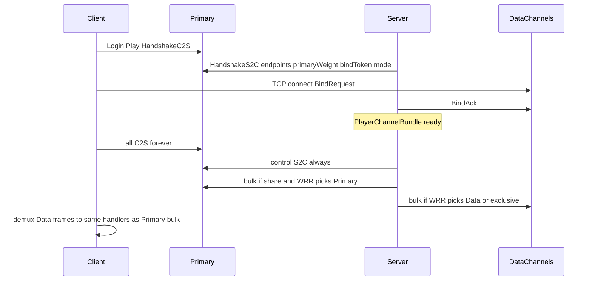

# Hassium 数据面多通道设计稿

## 1. 目标与非目标

**目标**

- 服务端为大包 S2C（区块 bulk）提供多 TCP 出口，按 weight 做 WRR
- 默认与 Primary **分流**（Primary 作为候选通道之一）
- 可配置为区块 bulk **完全不走 Primary**（exclusive）
- 客户端 C2S / 原版玩法 / 控制面小包 **始终 Primary**

**非目标**

- 不拆分原版 `Connection.send` 全量帧
- 不做第二套 MC Login / 不做客户端出站加权
- 不要求 Velocity 原生支持（副端口需直连或运维转发）

## 2. 已锁定决策

| 项 | 决策 |
|----|------|
| 协议 | Hassium 轻量数据面（非 MC 协议态机） |
| 方向 | Bind 后数据面 **仅 S2C bulk** |
| C2S | 全部 Primary（含 ChunkDataRequest 等） |
| 默认路由 | `share`：Primary + Data 一起进 WRR |
| 可选路由 | `exclusive`：区块 bulk 只走 Data，不走 Primary |
| 控制小包 | chunkHash / Dict / Index / 握手 → 始终 Primary |

## 3. 总体时序



## 4. 配置（server.toml）

挂在现有 `network` 段下（[`HassiumConfigSpec`](common/src/main/java/io/github/limuqy/mc/hassium/config/HassiumConfigSpec.java)）：

```toml
[network.dataPlane]
enabled = false                    # 总开关；false = 行为与今日一致
bulkRouteMode = "share"            # share | exclusive
primaryWeight = 100                # share 模式下 Primary 参与 WRR 的权重
maxDataChannelsPerPlayer = 4       # 客户端最多建几条副连接
bindTokenTtlMs = 30000
bindTimeoutMs = 5000               # 客户端建连+Bind 超时
exclusiveWaitMs = 2000             # exclusive 且暂无 Data 时，排队等待上限
# exclusive 超时策略：queue_then_drop（默认）——不回退 Primary；超时丢弃该次 bulk，靠客户端后续请求重试

# endpoint：宣告（客户端可达）与监听（服务端 bind）分离；监听端口可单独定制
[[network.dataPlane.endpoints]]
address = "play.example.com"       # 可达地址：域名 / IPv4 / IPv6（见下）
port = 25566                       # 客户端连接端口（握手下发）
weight = 100
bindHost = "0.0.0.0"               # 可选；服务端监听地址，默认 0.0.0.0（双栈视 JVM/OS）
bindPort = 25566                   # 可选；服务端监听端口，默认 = port（NAT/端口映射时可不同）

[[network.dataPlane.endpoints]]
address = "203.0.113.10"
port = 25567
weight = 50
bindPort = 25567

[[network.dataPlane.endpoints]]
address = "2001:db8::10"           # IPv6 字面量；握手 Utf 原样下发
port = 25566
weight = 80
bindHost = "::"                    # 仅 IPv6 监听示例
bindPort = 25566
```

**endpoint 字段**

| 字段 | 谁用 | 说明 |
|------|------|------|
| `address` | 握手 → 客户端 | 可达主机：DNS 域名、IPv4、IPv6 字面量（建议裸写 `2001:db8::1`，勿加 `[]`；实现侧解析时兼容 `[2001:db8::1]`） |
| `port` | 握手 → 客户端 | 客户端 `connect(address, port)` 的目标端口 |
| `weight` | 服务端 WRR | 该入口权重 |
| `bindHost` | 仅服务端 | 实际 `ServerBootstrap.bind` 地址；默认 `0.0.0.0` |
| `bindPort` | 仅服务端 | 实际监听端口，**可定制**；默认等于 `port`。用于本机监听与对外映射不一致（如监听 25566、对外 443） |

**语义**

- `share`：候选集 = `{Primary(primaryWeight)} ∪ {已 Bind 且 writable 的 Data(channel.weight)}`，WRR 选一写出
- `exclusive`：候选集 = 仅 Data；**禁止**把 CompressedPayload / SectionDelta 写到 Primary
- `enabled=false` 或客户端无 `multiChannelSupported`：不建 Data，bulk 全走 Primary（兼容）

**客户端解析 `address`**

- 使用 `InetAddress.getAllByName(address)`（或 Netty `DnsNameResolver`）：域名 → A/AAAA；IPv4/IPv6 字面量直接解析
- 多地址时：优先尝试与当前 Primary 同族（已是 IPv6 则优先 AAAA），失败再试其余；全部失败记 Bind 失败
- 握手线格式只传 Utf 字符串 + port，不区分地址族（IPv6 靠字面量/DNS）

## 5. 握手扩展

### 5.1 HandshakeC2S

新增能力位：`multiChannelSupported`（bool）。

### 5.2 HandshakeS2C（在现有 accepted / globalCompression / compactHeader 之后）

```
useDataPlane: bool
bulkRouteMode: VarInt enum (0=share, 1=exclusive)
primaryWeight: VarInt          # 仅 share 有意义；仍下发便于客户端展示/日志
bindToken: byte[16]
bindTokenExpireEpochMs: long
maxDataChannels: VarInt
endpointCount: VarInt
repeat endpointCount:
  address: Utf              # 域名 / IPv4 / IPv6 字面量（与配置 address 一致）
  port: unsigned short      # 客户端连接端口（配置 port，非 bindPort）
  weight: VarInt
```

- 握手**不下发** `bindHost` / `bindPort`（仅服务端本地监听）
- `useDataPlane = enabled && client.multiChannelSupported && endpointCount>0`
- token 绑定 `playerUUID + connectionEpoch`；过期作废；主连接断开立即作废
- 配置校验：`address` 非空；`port`/`bindPort` ∈ 1–65535；IPv6 `bindHost` 与 `address` 族可不一致（NAT64/分开宣告），由运维负责可达性

协议版本：`CURRENT_PROTOCOL_VERSION`  bump（建议 1→2），旧客户端无字段则服务端视为不支持。

## 6. 数据面线协议

### 6.1 帧封装（明文长度前缀；加密见 6.4）

所有帧：

```
frameLen: VarInt          # 后续字节数（含 type）
type: unsigned byte
payload: (frameLen-1) bytes
```

### 6.2 帧类型

| type | 方向 | 名称 | payload |
|------|------|------|---------|
| 1 | C→S | `BindRequest` | `token[16] + channelId:VarInt + protocol:VarInt` |
| 2 | S→C | `BindAck` | `ok:bool + reason:Utf(空=成功)` |
| 3 | S→C | `BulkCompressedChunk` | 与现有 `CompressedPayloadPacket.encode()` 体一致 |
| 4 | S→C | `BulkSectionDelta` | 与现有 `SectionDeltaS2CPacket` 体一致 |
| 5 | S→C | `KeepAlive` | `nonce:long`（可选；防中间设备掐空闲） |
| 6 | C→S | `KeepAliveAck` | `nonce:long`（唯一允许的 Bind 后 C→S） |
| 7 | S→C | `Close` | `reason:Utf` |

Bind 成功前：服务端只接受 type=1；成功后服务端忽略业务 C→S（KeepAliveAck 除外），客户端忽略向 Data 写 bulk。

### 6.3 连接生命周期

1. 服务端启动：对每个 endpoint `bind(bindHost, bindPort)`（`bindPort` 默认 = 配置 `port`），共享 MC Netty EventLoopGroup（或独立 group，配置默认共享）
2. 客户端收 HandshakeS2C：`useDataPlane` 时解析各 `address`（域名 / IPv4 / IPv6）并 `connect(resolved, port)`，数量 ≤ `maxDataChannels`（可按 weight 优先）
3. 每条连接发 `BindRequest` → 等 `BindAck`
4. Bind 成功：加入 `PlayerChannelBundle`
5. 主连接 disconnect / token 作废：关闭该玩家全部 Data，并 `Close`
6. 单条 Data 断开：从 bundle 移除；`share` 继续用剩余+Primary；`exclusive` 见 §8

### 6.4 加密与压缩（v1 定稿）

**加密（v1）**：Bind 成功后启用对称流加密，密钥派生：

```
dataKey = HKDF-SHA256(
  ikm = bindToken,
  salt = playerUUID bytes,
  info = "hassium-dataplane-v1" || channelId
)[16]
```

算法与 MC 一致可用 AES/CFB8（实现简单、无额外依赖）；帧在 encrypt 之前组好 `type||payload`，再整体加密（`frameLen` 仍明文，与常见 length-prefixed TLS-like 简化一致）。**禁止**复用主连接 Cipher 状态。

**压缩（v1）**：Data 通道 **不做第二层管线 ZSTD**。Bulk 帧 payload 已是应用层压缩体（字典 ZSTD 等），与今日经 Primary 自定义通道发送的内容一致。避免 Data 与 Primary 双路径压缩语义分叉。

（若未来要对非压缩控制帧加压，另开版本位。）

## 7. 服务端路由：`BulkRouter`

接入点：[`ChunkSender`](common/src/main/java/io/github/limuqy/mc/hassium/network/ChunkSender.java) 与 SectionDelta 发送路径；[`ServerChunkPushManager`](common/src/main/java/io/github/limuqy/mc/hassium/network/ServerChunkPushManager.java) 语义不变。

```text
sendBulk(player, frameType, bytes):
  bundle = PlayerChannelBundle.get(player)
  if !dataPlaneActive(player):
    sendViaPrimary(...)
    return

  candidates = []
  if mode == share:
    candidates += PrimaryCandidate(primaryWeight)  // 可写则加入
  for ch in bundle.dataChannels:
    if ch.active && ch.writable:
      candidates += DataCandidate(ch, ch.endpoint.weight)

  if candidates empty:
    handleNoCandidate(mode)   // 见 §8
    return

  ch = weightedRoundRobin(candidates)  // 可叠加：跳过 !isWritable 或高水位
  ch.write(frame)
```

**WRR**：标准加权轮询（当前权重累加，选最大，再减 totalWeight）；per-player 独立调度器状态。

**背压**：Data Channel `isWritable==false` 时本轮跳过；若 `share` 且仅 Primary 可写，允许打到 Primary；若 `exclusive` 且全部不可写 → 走 §8 排队。

## 8. 无候选 / 失败策略

| 模式 | 无 Data / 全不可写 | 行为 |
|------|-------------------|------|
| `share` | 无任何候选 | 直接 Primary（与今日一致） |
| `share` | 仅 Primary 可写 | Primary |
| `exclusive` | 无 Data 或全不可写 | **不**写 Primary；进入 per-player 短队列，最长 `exclusiveWaitMs`；超时 **drop** 该 bulk（记指标）；客户端可再经 Primary 发请求拉取 |
| 任一 | Data 写失败 | 移出 bundle，按上表重选；`share` 可落到 Primary |

`exclusive` 启动窗口：握手后 Data 尚未 Bind 完成时，bulk 一律排队（不写 Primary），避免「配置了独占却短暂打满主连接」。若 `bindTimeoutMs` 内零通道成功 → 对该玩家 **降级**：记 warn，本会话后续 bulk 强制 Primary（或踢回 `share` 行为），避免永久卡死；具体实现用 `PlayerChannelBundle.degraded=true`。

## 9. 客户端行为

1. Primary 收 HandshakeS2C → 若 `useDataPlane`，异步解析 `address`（支持域名与 IPv6）并建 Data
2. Bind 成功后：只读 demux
   - `BulkCompressedChunk` → 现有 `ClientChunkHandler.handleCompressedChunk`
   - `BulkSectionDelta` → 现有 `ClientMetadataHandler.handleSectionDeltaPacket`
3. **不**改 C2S 发送路径
4. 所有 Data 失败且模式为 `share`：无感知（服务端会走 Primary）
5. `exclusive` + 服务端 drop：客户端侧表现为「请求了但数据晚到/需再请求」——保持现有超时/重试逻辑即可，不新增客户端路由

## 10. 类与模块落点

| 组件 | 位置 | 职责 |
|------|------|------|
| `DataPlaneConfig` | common config | endpoints / mode / weights |
| `DataPlaneServer` | common + 服务端启动钩子 | bind 多端口、accept、Bind 校验 |
| `DataPlaneClient` | common client | connect、Bind、demux |
| `PlayerChannelBundle` | common | per-player Data 列表 + WRR 状态 + degraded |
| `BulkRouter` | common | share/exclusive 选路 |
| `DataPlaneFrames` | common | 编解码 type 1–7 |
| Handshake 字段 | `HassiumHandshake` + 三端 NetworkManager | 下发 endpoints/token/mode |
| `ChunkSender` 实现 | fabric/forge/neoforge | 调 `BulkRouter` 而非写死 Primary |

**禁止**：改 [`MixinConnection`](common/src/main/java/io/github/limuqy/mc/hassium/mixin/MixinConnection.java) 做全包分流。

## 11. 指标

[`NetworkStats`](common/src/main/java/io/github/limuqy/mc/hassium/metrics/NetworkStats.java) 增加：

- `bulkBytesPrimary` / `bulkBytesData`
- `bulkFramesPrimary` / `bulkFramesData`
- `dataBindSuccess` / `dataBindFail`
- `exclusiveDrop` / `exclusiveQueueWaitMs`（直方图或累计）
- `bundleDegraded`

`/hassium stats`、`/hassiumc stats` 各打一行汇总。

## 12. 安全与运维

- Token 16 字节 CSPRNG；TTL 默认 30s；单 token 最多 `maxDataChannels` 次成功 Bind
- 未 Bind 连接：读超时短（如 5s）断开；Bind 失败立即关
- 防火墙需放行 data ports；代理未转发时客户端 Bind 失败 → `share` 无感，`exclusive` 依赖 §8 降级
- 文档注明：多通道收益主要来自多路径/多 NIC；同机同路径双 port 收益有限

## 13. 兼容与版本

- `dataPlane.enabled=false`：零行为变化
- 旧客户端无 multiChannel：服务端不发 endpoints / `useDataPlane=false`
- 协议 bump 后新旧握手字段向后兼容解码（缺省字段 = 关闭数据面）

## 14. 实现顺序

1. **PoC**：单机双 port，仅 `BulkCompressedChunk`；先实现 `share`（含 Primary weight），再测 `exclusive` 排队/降级
2. **配置 + 握手**：toml + HandshakeS2C + 能力位
3. **SectionDelta** 接入同一 `BulkRouter`
4. **指标 + 文档**（`docs/` 短文：部署与代理注意）
5. 三端 NetworkManager / 启动 bind 钩齐

## 15. 结论摘要

- 默认 **`bulkRouteMode=share`**：Primary 与 Data 按 weight 分流大包
- 可选 **`exclusive`**：区块大包完全不走 Primary；无通道则短等后 drop + 可会话降级，绝不偷偷打回 Primary（除非降级开关触发）
- C2S 与控制面始终 Primary；数据面 Bind 后只下行 bulk
