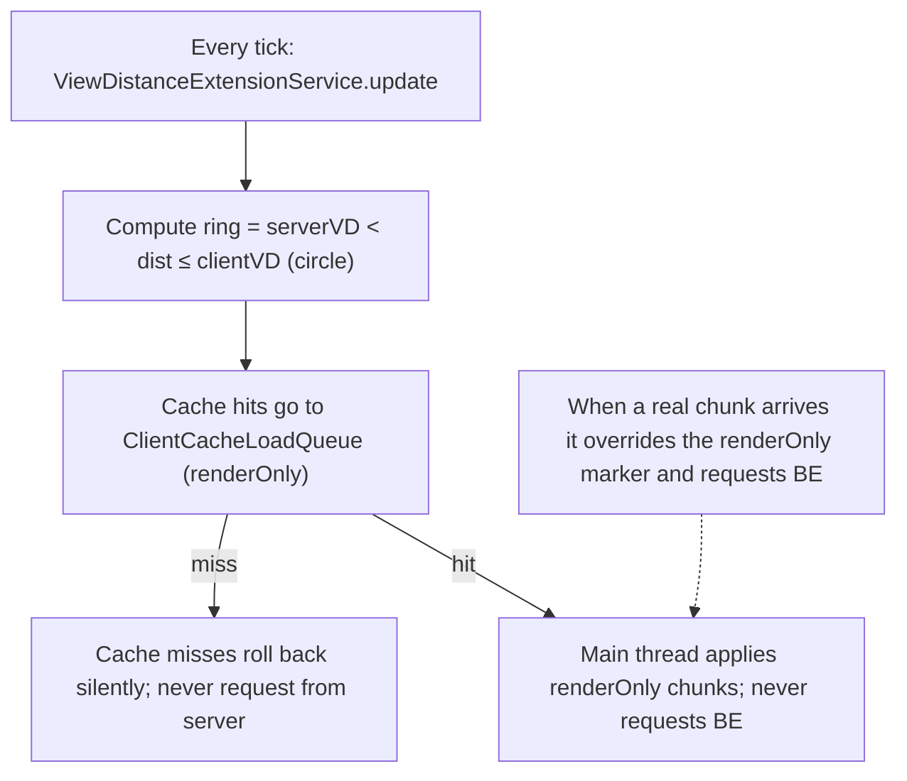

# Beyond-View Render

---

> **简体中文**: [Beyond-View-Render](Beyond-View-Render) · English

Beyond-view render lets a multiplayer client with render distance (RD) greater than the server's view distance (serverVD) fill the `serverVD < dist ≤ clientVD` ring from the local cache — **render only, not simulated**, and never asks the server for chunks or block entities beyond `serverVD`.

---

## When it applies

- **Multiplayer only** — `MixinOptions` and `ViewDistanceExtensionService` both check `mc.getSingleplayerServer() != null`; singleplayer is skipped
- Client RD greater than the server `view-distance`
- Both `chunk.enabled` and `chunk.viewDistanceExtensionEnabled` enabled (both default true)
- **Incompatible with Bobby** — Hassium ships its own beyond-view renderer; do not run Bobby alongside

---

## How it works

- Ring size depends on the gap between client RD and server view distance; lower `chunk.maxRenderDistance` to limit resource use
- Engages only when `clientVD > serverVD`; on `clientVD ≤ serverVD` it auto-clears and reverts to vanilla
- Toggling `viewDistanceExtensionEnabled = false` clears and reverts to the vanilla RD clamp

---

## Config keys

| Key | Default | Notes |
| --- | --- | --- |
| `chunk.viewDistanceExtensionEnabled` | `true` | Master switch |
| `chunk.maxRenderDistance` | `16` | Beyond-view ring and effective RD cap (range 2–64) |
| `chunk.ovdUnloadDelaySecs` | `5` | Seconds of delayed unload after leaving the ring (0 = sync) |

---

## Resource use

Ring size grows with the gap between client RD and server view distance. Hassium reuses the existing `ClientHeatIndex` cache eviction mechanism and creates no dedicated memory pool. Keeping RD ≤ 32 is recommended to avoid visual artifacts as fog distance expands.

---

## Edge cases

| Scenario | Behavior |
| --- | --- |
| Singleplayer | Skipped |
| `serverRenderDistance == 0` (not logged in) | Falls back to `simulationDistance`; if still ≤0, clears |
| `clientVD ≤ serverVD` | Cleared, vanilla behavior |
| Config off (`viewDistanceExtensionEnabled = false`) | Cleared; `MixinOptions` does not cancel the vanilla clamp |
| RenderOnly cache miss | Silent, marker rolled back, **never asks the server** |
| RD > 32 (manual `options.txt` edit) | Works; fog distance follows `getEffectiveRenderDistance` and far chunks may pop in (Fog Mixin not implemented) |
| Real chunk arrives at a renderOnly position | Overrides to normal and requests BE; no flicker or duplicate enqueue |
| Client disconnect/reconnect | `ClientLifecycleHelper.cleanupOnDisconnect` clears `loadedRenderOnly` and level markers after `ClientCacheLoadQueue.clear()` |

---

## What it does not do

- Bobby-style FakeChunk / separate `.bobby` directory
- Out-of-range `ChunkDataRequestC2S` or widened BE view checks
- Section delta for beyond-view hit paths (still hit/miss binary; miss is always silent)
- Raising the vanilla slider cap above 32 (segment signature differences; users edit `options.txt` manually)
- Fog-distance clamp Mixin (segment signatures and RenderSystem API differ too much across the seven segments; not implemented)

---

## Debugging

- In F3: beyond-view chunks should be visible; no large out-of-range `ChunkDataRequestC2S` / `BlockEntityRequestC2S` traffic
- Disable `chunk.viewDistanceExtensionEnabled` to verify the vanilla clamp returns
- Client logs: enable `debug.cacheLogging` and `debug.chunkApplyLogging`
- See [Troubleshooting](Troubleshooting-en)

---

[← Features](Features-en) · [Home](Home-en) · [→ World-Export](World-Export-en)
