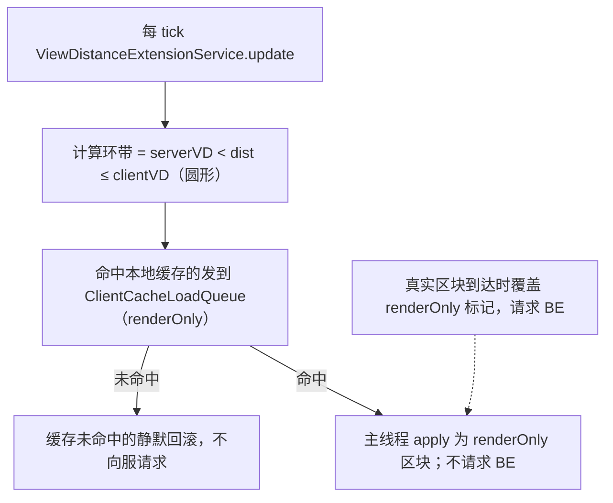

# 超视渲染

---

> **English**: [Beyond-View-Render-en](Beyond-View-Render-en) · 中文

超视渲染（beyond-view render）让多人服客户端在渲染距离（RD）大于服务端视距（serverVD）时，用本地缓存回填 `serverVD < dist ≤ clientVD` 环带的位置 —— **仅参与渲染、不参与模拟**，且不向服务器索取视距外区块或方块实体。

---

## 适用条件

- **多人服**：单人服不启用（`MixinOptions` 与 `ViewDistanceExtensionService` 都检查 `mc.getSingleptrServer() != null`）
- 客户端 RD 大于服务端 `view-distance`
- 启用 `chunk.enabled` 与 `chunk.viewDistanceExtensionEnabled`（均默认 true）
- **与 Bobby 互斥**：Hassium 自研超视渲染，勿与 Bobby 同装

---

## 工作流程

- 环带规模取决于客户端 RD 与服务端视距之差；可降低 `chunk.maxRenderDistance` 来限制资源占用
- 单客户端仅当 `clientVD > serverVD` 才进入超视渲染；进入 `clientVD ≤ serverVD` 自动 clear，恢复原版
- 配置关闭（`viewDistanceExtensionEnabled=false`）→ clear，恢复原版 RD 钳制

---

## 配置项

| 键 | 默认 | 说明 |
| --- | --- | --- |
| `chunk.viewDistanceExtensionEnabled` | `true` | 总开关 |
| `chunk.maxRenderDistance` | `16` | 超视渲染环带与有效 RD 上限（范围 2–64） |
| `chunk.ovdUnloadDelaySecs` | `5` | 离开环带后延迟卸载秒数（0=同步卸载） |

---

## 资源占用

环带规模随客户端 RD 与服务端视距差增大。Hassium 复用现有 `ClientHeatIndex` 缓存淘汰机制，不额外创建专用内存池。建议保持 RD ≤ 32，以避免雾距扩大时的显示异常。

---

## 边界条件

| 场景 | 处理 |
| --- | --- |
| 单人游戏 | 跳过超视渲染 |
| `serverRenderDistance == 0`（未登录） | fallback 到 `simulationDistance`；仍 ≤0 则 clear |
| `clientVD ≤ serverVD` | clear，恢复原版 |
| 配置关（`viewDistanceExtensionEnabled=false`） | clear；`MixinOptions` 不 cancel 原版钳制 |
| 缓存 miss（renderOnly） | 静默 + 回滚标记，**不向服请求** |
| RD > 32（手改 `options.txt`） | 可工作；雾距跟随 `getEffectiveRenderDistance` 扩大可能远端穿帮（Fog Mixin 未实现） |
| 真实区块到达 renderOnly 位置 | 覆盖为正常区块并请求 BE；无闪烁或重复 enqueue |
| 客户端断连重连 | `ClientLifecycleHelper.cleanupOnDisconnect` 在 `ClientCacheLoadQueue.clear()` 后清空 `loadedRenderOnly` 与 level 标记 |

---

## 不做

- Bobby 风格 FakeChunk / 独立 `.bobby` 目录
- 视距外向服务器请求 `ChunkDataRequestC2S` 或放宽 BE 视距校验
- 分段增量接回超视渲染（仍是 hit/miss 二分；miss 永远静默回滚）
- 抬高 vanilla 滑块上限 > 32（跨段签名差异大；用户自行编辑 `options.txt`）
- 雾距钳制 Mixin（Fog Mixin 跨七段签名差异与 RenderSystem API 变化大，未实现）

---

## 排查

- F3 观察：超视渲染激活时环带区块应可见；无大量视距外 `ChunkDataRequestC2S` / `BlockEntityRequestC2S`
- 关闭 `chunk.viewDistanceExtensionEnabled` 验证恢复原版钳制
- 客户端日志可开 `debug.cacheLogging` 与 `debug.chunkApplyLogging`
- 见 [Troubleshooting](Troubleshooting)

---

[← Features](Features) · [Home](Home) · [→ World-Export](World-Export)
